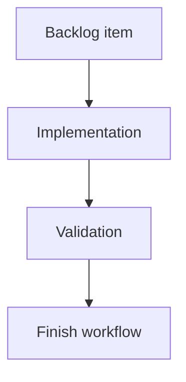

## task_182_add_local_viewer_git_status_summary - Add local viewer Git status summary
> From version: 2.3.3+viewer-delivery
> Schema version: 1.0
> Status: Done
> Understanding: 100
> Confidence: 95
> Progress: 100%
> Complexity: Medium
> Theme: Developer experience
> Reminder: Update status/understanding/confidence/progress and linked request/backlog references when you edit this doc.

# Definition of Done (DoD)
- [x] The backlog scope is implemented.
- [x] Acceptance criteria are covered.
- [x] Validation passes.

# Backlog
- `item_381_add_local_viewer_git_status_summary`

# Acceptance criteria
- AC1: The local viewer topbar shows `Auto`, `Refresh`, `Git`, `Insights`, and `Health` in that order.
- AC2: Clicking `Git` opens a read-only Git status screen in the same secondary viewer surface used by Insights and Health.
- AC3: When Git is available and the viewer root is inside a worktree, the screen shows branch, tracking branch when available, ahead/behind counts when available, clean/dirty state, staged count, modified/deleted count, untracked count, and latest commit summary.
- AC4: File changes are grouped by useful operator categories such as staged, modified, deleted, renamed, and untracked, with long paths wrapping safely.
- AC5: A clean repository renders an explicit clean state and does not show empty or confusing file sections.
- AC6: Git unavailable, non-Git repository, and command failure states render safely with short user-facing messages and no stack trace.
- AC7: Remote URLs or tracking details are sanitized so credentials, tokens, or embedded secrets are not displayed.
- AC8: The backend uses only read-only Git commands and never performs network or mutating Git operations.
- AC9: Existing Auto, Refresh, Insights, Health, focus/read URLs, and packaged PyPI/pipx assets continue to work.
- AC10: Python tests cover the Git payload collector states, and browser-host tests cover the Git screen rendering and topbar placement.

# Implementation plan
1. Add a read-only Git status collector in `logics_manager/viewer.py` with bounded subprocess calls and sanitized outputs.
2. Expose the collector through a local viewer API endpoint, returning structured states for available, unavailable, non-repo, and command-failure cases.
3. Add the `Git` topbar button between `Refresh` and `Insights` in source and packaged viewer HTML.
4. Render Git status in the existing document panel with first-viewport summary cards, grouped file-change sections, clean state, and safe wrapping for long paths.
5. Add Python collector tests and browser-host rendering tests, including unavailable/non-repo/error states and topbar order.
6. Validate that no mutating or network Git commands are used and existing viewer controls still work.

# Validation
- Run `python3 -m logics_manager lint --require-status`.
- Run `python3 -m logics_manager flow finish task task_182_add_local_viewer_git_status_summary.md` after implementation.
- Finish workflow executed on 2026-06-08.
- Linked backlog/request close verification passed.

# Report
- Added a read-only Git status collector and `/api/git-status` endpoint in `logics_manager/viewer.py`.
- Added the `Git` topbar control between `Refresh` and `Insights`, rendering branch, tracking, ahead/behind, clean/dirty state, counts, latest commit, and grouped file changes in the shared secondary viewer surface.
- Git unavailable, non-worktree, and command-failure states render short safe messages; remote/tracking strings are sanitized and only read-only Git commands are used.
- Python and browser-host tests cover collector states, topbar order, Git screen rendering, and packaged viewer assets.
- Finished on 2026-06-08.
- Linked backlog item(s): `item_381_add_local_viewer_git_status_summary`
- Related request(s): `req_217_add_local_viewer_git_status_summary`

# AI Context
- Summary: Implement add local viewer git status summary.
- Keywords: task, implementation, backlog, runtime, python
- Use when: You need a bounded implementation task for a backlog item.
- Skip when: The work is still at the request or backlog shaping stage.

# Links
- Request: `req_217_add_local_viewer_git_status_summary`
- Product brief(s): (none yet)
- Architecture decision(s): (none yet)

# AC Traceability
- request-AC1 -> This task. Proof: The task requires adding the Git topbar button between Refresh and Insights.
- request-AC2 -> This task. Proof: The task requires opening Git status in the same secondary viewer surface as Insights and Health.
- request-AC3 -> This task. Proof: The task requires branch, tracking, ahead/behind, dirty state, file counts, and latest commit summary.
- request-AC4 -> This task. Proof: The task requires grouped file-change sections with safely wrapping long paths.
- request-AC5 -> This task. Proof: The task requires an explicit clean repository state.
- request-AC6 -> This task. Proof: The task requires safe unavailable, non-repo, and command-failure states without stack traces.
- request-AC7 -> This task. Proof: The task requires sanitized remote or tracking details without credentials or tokens.
- request-AC8 -> This task. Proof: The task requires only read-only, non-network, non-mutating Git commands.
- request-AC9 -> This task. Proof: The task requires preserving existing viewer controls and packaged assets.
- request-AC10 -> This task. Proof: The task requires Python collector tests and browser-host rendering/topbar tests.
