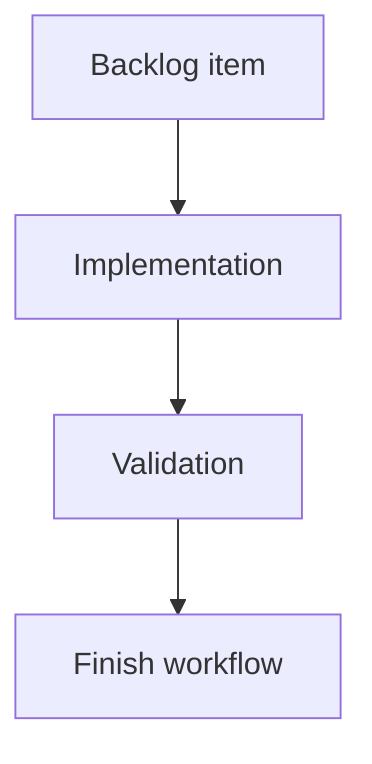

## task_183_add_a_git_cockpit_to_the_local_viewer - Add a Git cockpit to the local viewer
> From version: 2.4.0
> Schema version: 1.0
> Status: Ready
> Understanding: 90%
> Confidence: 85%
> Progress: 0%
> Complexity: Medium
> Theme: Operator workflow
> Reminder: Update status/understanding/confidence/progress and linked request/backlog references when you edit this doc.

# Context
- Execute the first read-only Git cockpit slice for `logics-manager view`.
- The task should make repository state inspectable from the local viewer while preserving the CLI as the authority for mutating Git operations.
- The linked product brief and backlog intentionally defer commit, push, reset, checkout, stash, and conflict-resolution actions.

# Plan
- [ ] 1. Add a read-only Git status hydration path for the viewer server, using structured Git output where practical.
- [ ] 2. Add a Git cockpit entrypoint in the viewer UI with a compact status band and grouped changed-file list.
- [ ] 3. Render selected-file diff details with safe truncation or explicit unsupported-state messaging.
- [ ] 4. Add Logics document markers for changed files under `logics/`.
- [ ] 5. Preserve existing viewer flows and add focused regression coverage.
- [ ] 6. Validate, update the linked Logics docs if scope changes, and checkpoint the implementation.
- [ ] GATE: do not close a wave or step until the relevant automated tests and quality checks have been run successfully.

# Backlog
- `item_382_add_a_git_cockpit_to_the_local_viewer`

# Definition of Done (DoD)
- [ ] Git cockpit entrypoint is reachable in the local viewer.
- [ ] Status band shows branch, dirty state, staged/unstaged counts, and upstream ahead/behind when available.
- [ ] Changed files are grouped by Git state and Logics workflow files are marked.
- [ ] Selected file diff preview renders or shows a clear truncation/unsupported-state message.
- [ ] No mutating Git actions are exposed in the first slice.
- [ ] Validation passes and linked docs remain synchronized.

# AC Traceability
- request-AC1 -> Plan 2, DoD 1. Proof: the task adds a dedicated Git cockpit entrypoint.
- request-AC2 -> Plan 1, Plan 2, DoD 2. Proof: status hydration and band cover the requested orientation signals.
- request-AC3 -> Plan 2, Plan 3, DoD 3, DoD 4. Proof: grouped file state and selected diff preview are core task outputs.
- request-AC4 -> Plan 4, DoD 3. Proof: Logics workflow files get compact markers.
- request-AC5 -> DoD 5. Proof: mutating Git actions stay out of scope.
- request-AC6 -> Plan 5, DoD 6. Proof: existing viewer flows and tests are preserved.
- backlog-AC1 -> Plan 2, DoD 1. Proof: the viewer exposes the cockpit without replacing existing views.
- backlog-AC2 -> Plan 1, Plan 2, DoD 2. Proof: repository status is hydrated and displayed.
- backlog-AC3 -> Plan 2, Plan 4, DoD 3. Proof: grouped changed files include Logics markers.
- backlog-AC4 -> Plan 3, DoD 4. Proof: selecting a file renders diff or explicit fallback messaging.
- backlog-AC5 -> DoD 5. Proof: first slice stays read-only.
- backlog-AC6 -> Plan 5, DoD 6. Proof: focused and regression tests are required.

# Validation
- Run `logics-manager lint --require-status`.
- Run `logics-manager product-consistency`.
- Run focused viewer server/UI tests that cover Git status hydration, grouped changes, and diff selection.
- Run existing viewer regression tests touched by the implementation.

# Report
- Not started.

# AI Context
- Summary: Implement the first read-only Git cockpit for the local viewer.
- Keywords: local-viewer, git-cockpit, git-status, diff-preview, browser-host, viewer-tests
- Use when: You need to build or review the first Git cockpit implementation slice.
- Skip when: The work is about future Git mutation actions or unrelated Logics workflow docs.

# Links
- Request: `req_218_add_a_git_cockpit_to_the_local_viewer`
- Product brief(s): `prod_021_git_cockpit_for_the_local_viewer`
- Architecture decision(s): (none yet)

# References
- `logics/product/prod_021_git_cockpit_for_the_local_viewer.md`
- `logics/request/req_218_add_a_git_cockpit_to_the_local_viewer.md`
- `logics/backlog/item_382_add_a_git_cockpit_to_the_local_viewer.md`
- `logics_manager/viewer.py`
- `clients/viewer/index.html`
- `clients/viewer/browser-host.js`
- `clients/viewer/viewer.css`
- `clients/shared-web/media/webviewChrome.js`
- `tests/viewer.browser-host.test.ts`
- `tests/webview.harness-core.test.ts`
