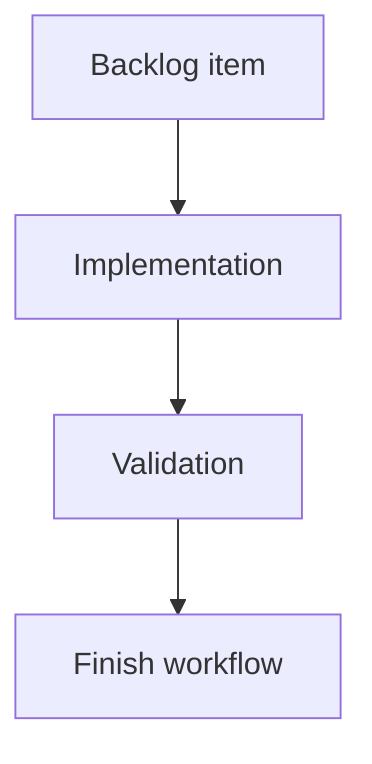

## task_184_add_a_cdx_status_cockpit_to_the_local_viewer - Add a CDX status cockpit to the local viewer
> From version: 2.4.0
> Schema version: 1.0
> Status: Ready
> Understanding: 90%
> Confidence: 85%
> Progress: 0%
> Complexity: Medium
> Theme: Operator workflow
> Reminder: Update status/understanding/confidence/progress and linked request/backlog references when you edit this doc.

# Context
- Execute the first optional, read-only CDX status cockpit slice for `logics-manager view`.
- The implementation should consume `cdx status --json` when available, render the state semantically, and leave all CDX mutations in the CLI.
- CDX must remain optional: missing or broken CDX state should not prevent normal Logics viewer usage.

# Plan
- [ ] 1. Add backend CDX detection and a bounded read-only status collector for `cdx status --json`.
- [ ] 2. Add `/api/cdx-status` with unavailable, timeout, failed-command, invalid-JSON, and ok payload states.
- [ ] 3. Add the `CDX` topbar button next to `Git` in source and packaged viewer assets.
- [ ] 4. Render the CDX status screen with summary cards, provider/session lists, and safe command suggestions.
- [ ] 5. Integrate manual and automatic refresh when the CDX screen is open.
- [ ] 6. Add focused Python and browser-host tests, then run viewer regression validation.
- [ ] 7. Update linked Logics docs if implementation scope changes and checkpoint the completed slice.
- [ ] GATE: do not close a wave or step until the relevant automated tests and quality checks have been run successfully.

# Backlog
- `item_383_add_a_cdx_status_cockpit_to_the_local_viewer`

# Definition of Done (DoD)
- [ ] Backend CDX status collection is read-only, timeout-bounded, and optional.
- [ ] The local viewer exposes a `CDX` button next to `Git` without breaking non-CDX environments.
- [ ] The CDX screen renders structured status as cards/lists, not pasted terminal text.
- [ ] Missing/failed/timeout/invalid JSON states render safely.
- [ ] Refresh updates the CDX screen when it is open.
- [ ] No mutating CDX controls are exposed.
- [ ] Validation passes and linked docs remain synchronized.

# AC Traceability
- request-AC1 -> Plan 1, Plan 2, DoD 1. Proof: CDX detection and optional backend state are task outputs.
- request-AC2 -> Plan 3, DoD 2. Proof: the `CDX` button is added next to `Git`.
- request-AC3 -> Plan 1, Plan 2, Plan 4, DoD 3. Proof: the screen is based on structured status output.
- request-AC4 -> Plan 4, DoD 3. Proof: UI renders cards/lists and safe commands.
- request-AC5 -> Plan 2, DoD 4. Proof: backend and UI cover unavailable/error states.
- request-AC6 -> Plan 5, DoD 5. Proof: refresh integration is required.
- request-AC7 -> DoD 6. Proof: no mutating controls are exposed.
- request-AC8 -> Plan 6, DoD 7. Proof: tests and validation are required.
- backlog-AC1 -> Plan 1, DoD 1. Proof: backend reports CDX availability safely.
- backlog-AC2 -> Plan 2, DoD 4. Proof: endpoint covers all safe payload states.
- backlog-AC3 -> Plan 3, DoD 2. Proof: button is in source and packaged assets.
- backlog-AC4 -> Plan 4, DoD 3. Proof: status screen is semantic.
- backlog-AC5 -> Plan 4, DoD 3. Proof: provider/session status and commands are rendered.
- backlog-AC6 -> Plan 5, DoD 5. Proof: open CDX refresh is required.
- backlog-AC7 -> DoD 6. Proof: no mutating controls are exposed.
- backlog-AC8 -> Plan 6, DoD 7. Proof: tests cover backend/UI/assets.

# Validation
- Run `python3 -m pytest tests/python/test_logics_manager_cli.py`.
- Run `npm test -- tests/viewer.browser-host.test.ts`.
- Run `npm run test:viewer-smoke`.
- Run `logics-manager lint --require-status`.
- Run `logics-manager audit` before closeout.

# Report
- Not started.

# AI Context
- Summary: Implement optional read-only CDX status visibility in the local viewer.
- Keywords: cdx, local-viewer, cdx-status, provider-readiness, sessions, json, browser-host
- Use when: You need to build or review the CDX cockpit implementation.
- Skip when: The work is still product framing or involves mutating CDX actions.

# Links
- Request: `req_219_add_a_cdx_status_cockpit_to_the_local_viewer`
- Product brief(s): `prod_022_cdx_status_cockpit_for_the_local_viewer`
- Architecture decision(s): (none yet)

# References
- `logics/product/prod_022_cdx_status_cockpit_for_the_local_viewer.md`
- `logics/request/req_219_add_a_cdx_status_cockpit_to_the_local_viewer.md`
- `logics/backlog/item_383_add_a_cdx_status_cockpit_to_the_local_viewer.md`
- `logics_manager/viewer.py`
- `clients/viewer/index.html`
- `clients/viewer/browser-host.js`
- `clients/viewer/viewer.css`
- `logics_manager/viewer_assets/viewer/index.html`
- `logics_manager/viewer_assets/viewer/browser-host.js`
- `tests/python/test_logics_manager_cli.py`
- `tests/viewer.browser-host.test.ts`
