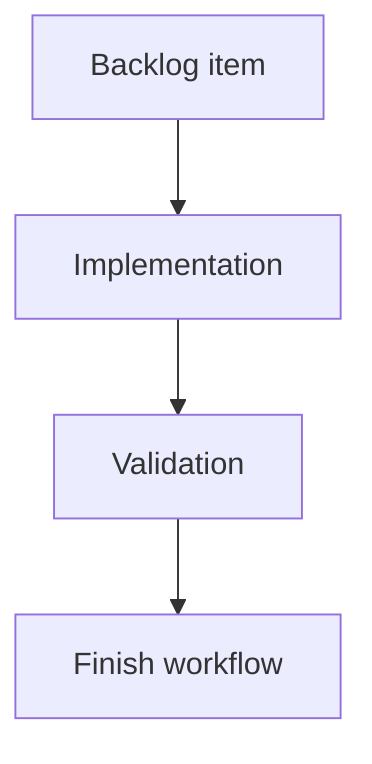

## task_185_count_local_commits_not_pushed_to_upstream - Count local commits not pushed to upstream
> From version: 2.4.0
> Schema version: 1.0
> Status: Ready
> Understanding: 95%
> Confidence: 90%
> Progress: 0%
> Complexity: Medium
> Theme: Git workflow visibility
> Reminder: Update status/understanding/confidence/progress and linked request/backlog references when you edit this doc.

# Definition of Done (DoD)
- [ ] The refresh path can count commits in `HEAD` that are absent from the configured upstream.
- [ ] Missing upstream configuration is handled without a blocking refresh failure.
- [ ] The implementation follows existing Git helper/error patterns.
- [ ] Validation passes.

# Backlog
- `item_384_compute_git_badge_counters_on_refresh`

# Acceptance criteria
- AC1: With an upstream configured, the count matches the equivalent of `git rev-list --count @{u}..HEAD`.
- AC2: With no upstream configured, refresh continues and the badge data is safe to consume.
- AC3: The count is branch-aware and uses the current checked-out branch.

# Validation
- Add or update focused tests for upstream-present and upstream-missing cases.
- Run `python3 -m logics_manager lint --require-status`.
- Run the relevant Git refresh test suite.

# Report
- Implementation pending.

# AI Context
- Summary: Count local commits not pushed to upstream for Git badge data.
- Keywords: git, upstream, unpushed commits, refresh
- Use when: Implementing the unpushed commit counter.
- Skip when: Work is only about UI badge rendering.

# Links
- Request: `req_220_add_git_notification_badges_for_unpushed_commits_and_uncommitted_changes`
- Backlog: `item_384_compute_git_badge_counters_on_refresh`
