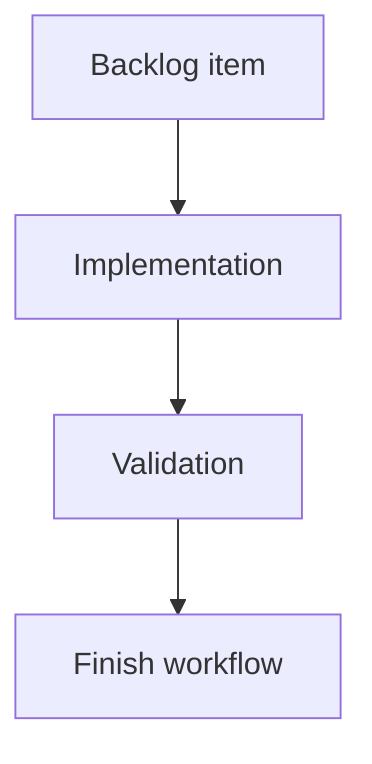

## task_186_count_modified_and_uncommitted_files_consistently_with_git_status - Count modified and uncommitted files consistently with Git status
> From version: 2.4.0
> Schema version: 1.0
> Status: Ready
> Understanding: 95%
> Confidence: 90%
> Progress: 0%
> Complexity: Medium
> Theme: Git workflow visibility
> Reminder: Update status/understanding/confidence/progress and linked request/backlog references when you edit this doc.

# Definition of Done (DoD)
- [ ] Refresh reports a count of files with uncommitted changes.
- [ ] The count uses the same status semantics as the existing Git screen.
- [ ] Untracked files are included only if the existing Git status surface treats them as visible changes.
- [ ] Validation passes.

# Backlog
- `item_384_compute_git_badge_counters_on_refresh`

# Acceptance criteria
- AC1: Modified, staged, deleted, renamed, added, and untracked files are counted consistently with the current app behavior.
- AC2: Multiple status entries for the same path do not inflate the displayed file count.
- AC3: A clean repository reports zero.

# Validation
- Add or update focused tests for clean, modified, staged, deleted, renamed, and untracked cases as supported by the existing test harness.
- Run `python3 -m logics_manager lint --require-status`.
- Run the relevant Git status tests.

# Report
- Implementation pending.

# AI Context
- Summary: Count uncommitted file changes for Git badge data.
- Keywords: git, status, uncommitted files, modified files, refresh
- Use when: Implementing the uncommitted file counter.
- Skip when: Work is only about seen/unseen badge state.

# Links
- Request: `req_220_add_git_notification_badges_for_unpushed_commits_and_uncommitted_changes`
- Backlog: `item_384_compute_git_badge_counters_on_refresh`
