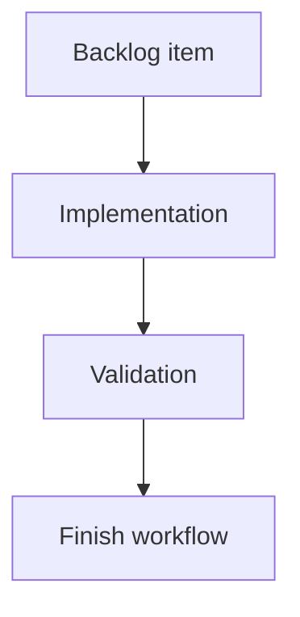

## task_186_count_modified_and_uncommitted_files_consistently_with_git_status - Count modified and uncommitted files consistently with Git status
> From version: 2.4.0
> Schema version: 1.0
> Status: Done
> Understanding: 95%
> Confidence: 90%
> Progress: 100%
> Complexity: Medium
> Theme: Git workflow visibility
> Reminder: Update status/understanding/confidence/progress and linked request/backlog references when you edit this doc.

# Definition of Done (DoD)
- [x] Refresh reports a count of files with uncommitted changes.
- [x] The count uses the same status semantics as the existing Git screen.
- [x] Untracked files are included only if the existing Git status surface treats them as visible changes.
- [x] Validation passes.

# Backlog
- `item_384_compute_git_badge_counters_on_refresh`

# Acceptance criteria
- AC1: Modified, staged, deleted, renamed, added, and untracked files are counted consistently with the current app behavior.
- AC2: Multiple status entries for the same path do not inflate the displayed file count.
- AC3: A clean repository reports zero.

# Validation
- Add or update focused tests for clean, modified, staged, deleted, renamed, and untracked cases as supported by the existing test harness.
- Run `python3 -m logics_manager lint --require-status`.
- Run the relevant Git status tests.
- pytest passed: python3 -m pytest tests/python/test_logics_manager_cli.py -k viewer_git_status_payload. vitest passed: npm test -- tests/viewer.browser-host.test.ts. compile passed: npm run compile.
- Finish workflow executed on 2026-06-09.
- Linked backlog/request close verification passed.

# Report
- Implementation pending.
- Finished on 2026-06-09.
- Linked backlog item(s): `item_384_compute_git_badge_counters_on_refresh`
- Related request(s): `req_220_add_git_notification_badges_for_unpushed_commits_and_uncommitted_changes`

# AI Context
- Summary: Count uncommitted file changes for Git badge data.
- Keywords: git, status, uncommitted files, modified files, refresh
- Use when: Implementing the uncommitted file counter.
- Skip when: Work is only about seen/unseen badge state.

# Links
- Request: `req_220_add_git_notification_badges_for_unpushed_commits_and_uncommitted_changes`
- Backlog: `item_384_compute_git_badge_counters_on_refresh`

# AC Traceability
- request-AC1 -> This task. Proof: After refresh, the main Git button can show a badge with the count of local commits not pushed to the configured upstream branch.
- request-AC2 -> This task. Proof: After refresh, the main Git button can show a second badge with the count of modified/uncommitted files.
- request-AC3 -> This task. Proof: Each badge is hidden when its count is zero.
- request-AC4 -> This task. Proof: Opening the Git window marks badges on the main Git button as seen and hides them there without implying the Git state is resolved.
- request-AC5 -> This task. Proof: The unpushed commits badge remains visible on the Git History control until History is opened.
- request-AC6 -> This task. Proof: The uncommitted files badge remains visible on the relevant changes surface/control, when one exists, until that surface is opened.
- request-AC7 -> This task. Proof: A subsequent refresh can show the badges again when counts greater than zero are detected.
- request-AC8 -> This task. Proof: Each badge has its own color, compact placement, and a hover tooltip explaining the count.
- request-AC9 -> This task. Proof: Missing upstream configuration, unavailable Git, or Git command failures are handled without blocking the rest of the refresh.
