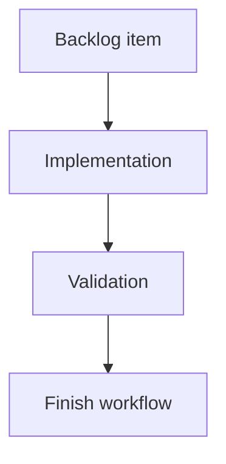

## task_187_expose_badge_counters_through_the_refresh_result - Expose badge counters through the refresh result
> From version: 2.4.0
> Schema version: 1.0
> Status: Ready
> Understanding: 95%
> Confidence: 90%
> Progress: 0%
> Complexity: Medium
> Theme: Git workflow visibility
> Reminder: Update status/understanding/confidence/progress and linked request/backlog references when you edit this doc.

# Definition of Done (DoD)
- [ ] Refresh exposes both badge counters in a stable data contract.
- [ ] The UI can consume the counters without issuing separate Git commands.
- [ ] Errors or unavailable counts are represented consistently with existing refresh payload patterns.
- [ ] Validation passes.

# Backlog
- `item_384_compute_git_badge_counters_on_refresh`

# Acceptance criteria
- AC1: The refresh result includes `unpushedCommits` and `uncommittedFiles` or equivalent clearly named fields.
- AC2: Zero counts are represented explicitly so UI badge visibility can be derived safely.
- AC3: The contract is documented through tests or typed interfaces where the codebase already uses them.

# Validation
- Add or update tests covering the refresh payload shape.
- Run `python3 -m logics_manager lint --require-status`.
- Run the relevant refresh/API tests.

# Report
- Implementation pending.

# AI Context
- Summary: Expose Git badge counters through the refresh state consumed by the UI.
- Keywords: git, refresh payload, badge counters, api contract
- Use when: Wiring computed Git counters into refresh output.
- Skip when: Work is only about visual styling.

# Links
- Request: `req_220_add_git_notification_badges_for_unpushed_commits_and_uncommitted_changes`
- Backlog: `item_384_compute_git_badge_counters_on_refresh`
