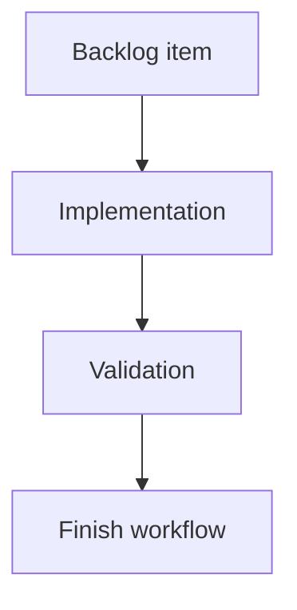

## task_188_persist_viewed_state_for_the_main_git_button - Persist viewed state for the main Git button
> From version: 2.4.0
> Schema version: 1.0
> Status: Ready
> Understanding: 95%
> Confidence: 90%
> Progress: 0%
> Complexity: Medium
> Theme: Git workflow visibility
> Reminder: Update status/understanding/confidence/progress and linked request/backlog references when you edit this doc.

# Definition of Done (DoD)
- [ ] Opening the Git window marks main Git button badges as viewed.
- [ ] Viewed main-button badges are hidden there without clearing Git counters.
- [ ] State follows existing UI state management patterns.
- [ ] Validation passes.

# Backlog
- `item_385_track_git_badge_visibility_and_viewed_state`

# Acceptance criteria
- AC1: The main Git button hides both badge types after the Git window is opened.
- AC2: Hidden main-button badges do not imply commits were pushed or files were committed.
- AC3: The real Git state remains visible in the Git screen.

# Validation
- Add or update UI/state tests for opening the Git window.
- Run `python3 -m logics_manager lint --require-status`.
- Run the relevant frontend tests.

# Report
- Implementation pending.

# AI Context
- Summary: Track viewed state for the main Git button badges.
- Keywords: git, badge, viewed state, main button
- Use when: Implementing main Git button badge dismissal.
- Skip when: Work is only about History or changes subview badges.

# Links
- Request: `req_220_add_git_notification_badges_for_unpushed_commits_and_uncommitted_changes`
- Backlog: `item_385_track_git_badge_visibility_and_viewed_state`
