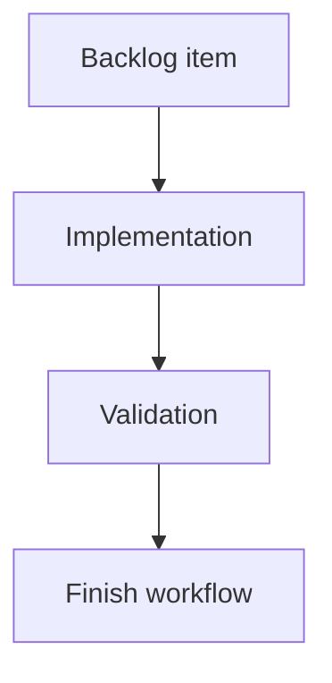

## task_189_persist_viewed_state_for_git_history_and_changes_subviews - Persist viewed state for Git History and changes subviews
> From version: 2.4.0
> Schema version: 1.0
> Status: Ready
> Understanding: 95%
> Confidence: 90%
> Progress: 0%
> Complexity: Medium
> Theme: Git workflow visibility
> Reminder: Update status/understanding/confidence/progress and linked request/backlog references when you edit this doc.

# Definition of Done (DoD)
- [ ] Opening History marks the unpushed commits badge as viewed for History.
- [ ] Opening the local changes surface marks the uncommitted files badge as viewed when that surface exists.
- [ ] Subview viewed state is independent from the main Git button viewed state.
- [ ] Validation passes.

# Backlog
- `item_385_track_git_badge_visibility_and_viewed_state`

# Acceptance criteria
- AC1: The History badge remains visible after opening the Git window until History itself is opened.
- AC2: The changes badge remains visible on its target surface/control until that surface is opened.
- AC3: If no dedicated changes surface exists, the implementation documents the fallback behavior.

# Validation
- Add or update UI/state tests for opening History and the changes surface.
- Run `python3 -m logics_manager lint --require-status`.
- Run the relevant frontend tests.

# Report
- Implementation pending.

# AI Context
- Summary: Track viewed state for Git subview badges.
- Keywords: git, history, changes, badge, viewed state
- Use when: Implementing History or changes badge dismissal.
- Skip when: Work is only about computing counters.

# Links
- Request: `req_220_add_git_notification_badges_for_unpushed_commits_and_uncommitted_changes`
- Backlog: `item_385_track_git_badge_visibility_and_viewed_state`
