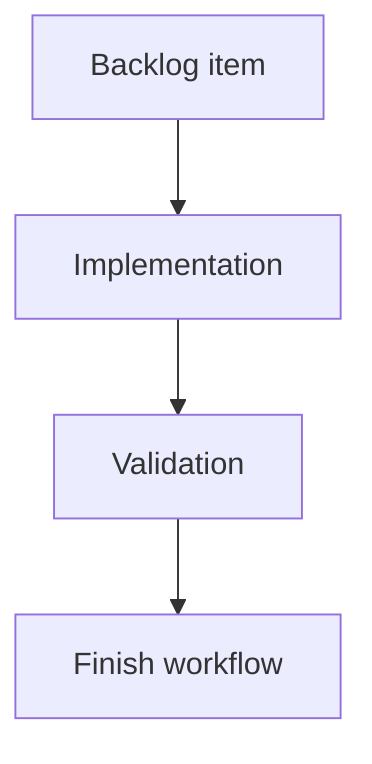

## task_189_persist_viewed_state_for_git_history_and_changes_subviews - Persist viewed state for Git History and changes subviews
> From version: 2.4.0
> Schema version: 1.0
> Status: Done
> Understanding: 95%
> Confidence: 90%
> Progress: 100%
> Complexity: Medium
> Theme: Git workflow visibility
> Reminder: Update status/understanding/confidence/progress and linked request/backlog references when you edit this doc.

# Definition of Done (DoD)
- [x] Opening History marks the unpushed commits badge as viewed for History.
- [x] Opening the local changes surface marks the uncommitted files badge as viewed when that surface exists.
- [x] Subview viewed state is independent from the main Git button viewed state.
- [x] Validation passes.

# Backlog
- `item_385_track_git_badge_visibility_and_viewed_state`

# Acceptance criteria
- AC1: The History badge remains visible after opening the Git window until History itself is opened.
- AC2: The changes badge remains visible on its target surface/control until that surface is opened.
- AC3: If no dedicated changes surface exists, the implementation documents the fallback behavior.

# Validation
- Add or update UI/state tests for opening History and the changes surface.
- Run `python3 -m logics_manager lint --require-status`.
- Run the relevant frontend tests.
- pytest passed: python3 -m pytest tests/python/test_logics_manager_cli.py -k viewer_git_status_payload. vitest passed: npm test -- tests/viewer.browser-host.test.ts. compile passed: npm run compile.
- Finish workflow executed on 2026-06-09.
- Linked backlog/request close verification passed.

# Report
- Implementation pending.
- Finished on 2026-06-09.
- Linked backlog item(s): `item_385_track_git_badge_visibility_and_viewed_state`
- Related request(s): `req_220_add_git_notification_badges_for_unpushed_commits_and_uncommitted_changes`

# AI Context
- Summary: Track viewed state for Git subview badges.
- Keywords: git, history, changes, badge, viewed state
- Use when: Implementing History or changes badge dismissal.
- Skip when: Work is only about computing counters.

# Links
- Request: `req_220_add_git_notification_badges_for_unpushed_commits_and_uncommitted_changes`
- Backlog: `item_385_track_git_badge_visibility_and_viewed_state`

# AC Traceability
- request-AC1 -> This task. Proof: After refresh, the main Git button can show a badge with the count of local commits not pushed to the configured upstream branch.
- request-AC2 -> This task. Proof: After refresh, the main Git button can show a second badge with the count of modified/uncommitted files.
- request-AC3 -> This task. Proof: Each badge is hidden when its count is zero.
- request-AC4 -> This task. Proof: Opening the Git window marks badges on the main Git button as seen and hides them there without implying the Git state is resolved.
- request-AC5 -> This task. Proof: The unpushed commits badge remains visible on the Git History control until History is opened.
- request-AC6 -> This task. Proof: The uncommitted files badge remains visible on the relevant changes surface/control, when one exists, until that surface is opened.
- request-AC7 -> This task. Proof: A subsequent refresh can show the badges again when counts greater than zero are detected.
- request-AC8 -> This task. Proof: Each badge has its own color, compact placement, and a hover tooltip explaining the count.
- request-AC9 -> This task. Proof: Missing upstream configuration, unavailable Git, or Git command failures are handled without blocking the rest of the refresh.
