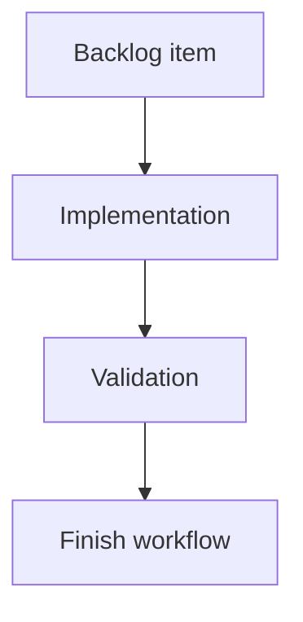

## task_190_reset_badge_visibility_when_refresh_detects_counts - Reset badge visibility when refresh detects counts
> From version: 2.4.0
> Schema version: 1.0
> Status: Ready
> Understanding: 95%
> Confidence: 90%
> Progress: 0%
> Complexity: Medium
> Theme: Git workflow visibility
> Reminder: Update status/understanding/confidence/progress and linked request/backlog references when you edit this doc.

# Definition of Done (DoD)
- [ ] A refresh with counts greater than zero can make badges visible again.
- [ ] A refresh with zero counts keeps corresponding badges hidden.
- [ ] Reset logic does not erase actual Git state.
- [ ] Validation passes.

# Backlog
- `item_385_track_git_badge_visibility_and_viewed_state`

# Acceptance criteria
- AC1: After a badge is viewed, a later refresh with a positive count shows it again.
- AC2: A zero count suppresses the corresponding badge even if previous viewed state was false.
- AC3: Main button and subview visibility rules remain independent.

# Validation
- Add or update tests for refresh-after-viewed and refresh-with-zero cases.
- Run `python3 -m logics_manager lint --require-status`.
- Run the relevant UI/state tests.

# Report
- Implementation pending.

# AI Context
- Summary: Reset Git badge visibility from refresh counts.
- Keywords: git, refresh, badge visibility, notification reset
- Use when: Implementing refresh-driven badge reappearance.
- Skip when: Work is only about Git command counting.

# Links
- Request: `req_220_add_git_notification_badges_for_unpushed_commits_and_uncommitted_changes`
- Backlog: `item_385_track_git_badge_visibility_and_viewed_state`
