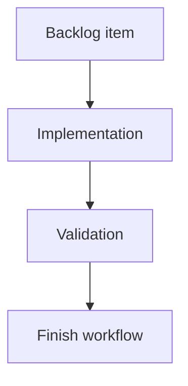

## task_191_render_two_compact_badges_on_the_main_git_button - Render two compact badges on the main Git button
> From version: 2.4.0
> Schema version: 1.0
> Status: Ready
> Understanding: 95%
> Confidence: 90%
> Progress: 0%
> Complexity: Medium
> Theme: Git workflow visibility
> Reminder: Update status/understanding/confidence/progress and linked request/backlog references when you edit this doc.

# Definition of Done (DoD)
- [ ] The main Git button can show the unpushed commits badge and uncommitted files badge together.
- [ ] Badges are compact and do not obscure the existing button label/icon.
- [ ] Hidden badges do not reserve awkward empty space.
- [ ] Validation passes.

# Backlog
- `item_386_render_git_notification_badges_in_the_ui`

# Acceptance criteria
- AC1: The main Git button shows both badges when both visible states are true.
- AC2: The main Git button shows only the relevant badge when one visible state is true.
- AC3: The layout remains stable across supported viewport sizes.

# Validation
- Add or update component tests or visual smoke coverage for the main Git button.
- Run `python3 -m logics_manager lint --require-status`.
- Run the relevant frontend tests.

# Report
- Implementation pending.

# AI Context
- Summary: Render compact dual badges on the main Git button.
- Keywords: git button, badge, ui, compact layout
- Use when: Implementing main Git button badge UI.
- Skip when: Work is only about History or changes surface badges.

# Links
- Request: `req_220_add_git_notification_badges_for_unpushed_commits_and_uncommitted_changes`
- Backlog: `item_386_render_git_notification_badges_in_the_ui`
