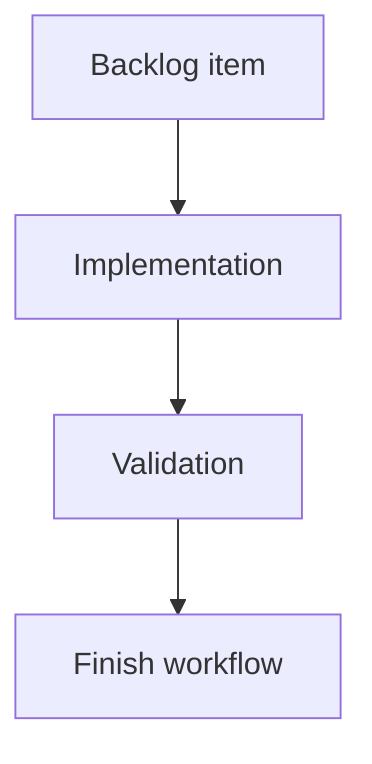

## task_192_render_the_unpushed_commits_badge_on_the_git_history_control - Render the unpushed commits badge on the Git History control
> From version: 2.4.0
> Schema version: 1.0
> Status: Ready
> Understanding: 95%
> Confidence: 90%
> Progress: 0%
> Complexity: Medium
> Theme: Git workflow visibility
> Reminder: Update status/understanding/confidence/progress and linked request/backlog references when you edit this doc.

# Definition of Done (DoD)
- [ ] The Git History control can show the unpushed commits badge.
- [ ] The badge remains visible until History is opened.
- [ ] The badge uses the same count source as the main Git button.
- [ ] Validation passes.

# Backlog
- `item_386_render_git_notification_badges_in_the_ui`

# Acceptance criteria
- AC1: History displays the unpushed commits count when its visible state is true.
- AC2: History hides the badge when the count is zero or History has been viewed.
- AC3: Opening the main Git window alone does not hide the History badge.

# Validation
- Add or update component/state tests for the History control.
- Run `python3 -m logics_manager lint --require-status`.
- Run the relevant frontend tests.

# Report
- Implementation pending.

# AI Context
- Summary: Render unpushed commits badge on Git History.
- Keywords: git, history, unpushed commits, badge
- Use when: Implementing the History badge UI.
- Skip when: Work is about uncommitted file badges only.

# Links
- Request: `req_220_add_git_notification_badges_for_unpushed_commits_and_uncommitted_changes`
- Backlog: `item_386_render_git_notification_badges_in_the_ui`
