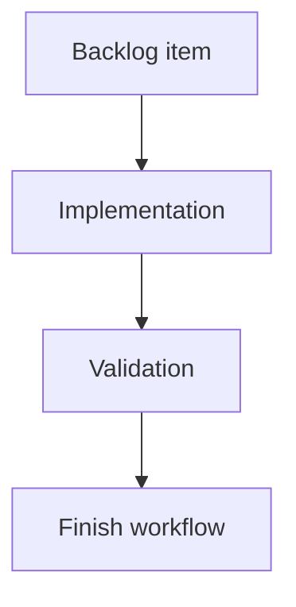

## task_193_render_the_uncommitted_changes_badge_on_the_changes_surface_when_available - Render the uncommitted changes badge on the changes surface when available
> From version: 2.4.0
> Schema version: 1.0
> Status: Ready
> Understanding: 95%
> Confidence: 90%
> Progress: 0%
> Complexity: Medium
> Theme: Git workflow visibility
> Reminder: Update status/understanding/confidence/progress and linked request/backlog references when you edit this doc.

# Definition of Done (DoD)
- [ ] A local changes control/surface shows the uncommitted files badge when such a surface exists.
- [ ] If no dedicated surface exists, the fallback behavior is documented in implementation notes.
- [ ] The badge uses the same count source as the main Git button.
- [ ] Validation passes.

# Backlog
- `item_386_render_git_notification_badges_in_the_ui`

# Acceptance criteria
- AC1: The changes badge displays the uncommitted file count when its visible state is true.
- AC2: The badge hides when the count is zero or the changes surface has been viewed.
- AC3: The badge is not added to an unrelated surface if there is no matching changes control.

# Validation
- Add or update component/state tests for the changes badge or documented fallback.
- Run `python3 -m logics_manager lint --require-status`.
- Run the relevant frontend tests.

# Report
- Implementation pending.

# AI Context
- Summary: Render uncommitted files badge on the local changes surface when available.
- Keywords: git, uncommitted files, changes, badge
- Use when: Implementing the changes badge UI.
- Skip when: Work is only about unpushed commit badges.

# Links
- Request: `req_220_add_git_notification_badges_for_unpushed_commits_and_uncommitted_changes`
- Backlog: `item_386_render_git_notification_badges_in_the_ui`
