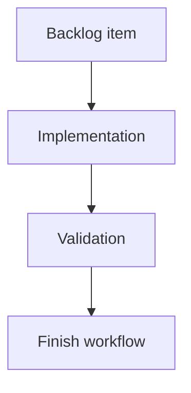

## task_194_add_badge_colors_placement_and_hover_tooltips - Add badge colors, placement, and hover tooltips
> From version: 2.4.0
> Schema version: 1.0
> Status: Ready
> Understanding: 95%
> Confidence: 90%
> Progress: 0%
> Complexity: Medium
> Theme: Git workflow visibility
> Reminder: Update status/understanding/confidence/progress and linked request/backlog references when you edit this doc.

# Definition of Done (DoD)
- [ ] The unpushed commits badge and uncommitted files badge have distinct colors.
- [ ] Badges are visually present but not oversized.
- [ ] Hover tooltips explain the count in clear French copy.
- [ ] Validation passes.

# Backlog
- `item_386_render_git_notification_badges_in_the_ui`

# Acceptance criteria
- AC1: The unpushed commits badge uses a dedicated color distinct from the uncommitted files badge.
- AC2: The uncommitted files badge uses a dedicated color distinct from the commits badge.
- AC3: Tooltip text distinguishes `commits locaux non pushés` from `fichiers modifiés non commités`.
- AC4: Badge placement does not overlap neighboring controls or button content.

# Validation
- Add or update visual/component tests for color, tooltip copy, and compact placement where practical.
- Run `python3 -m logics_manager lint --require-status`.
- Run the relevant frontend tests.

# Report
- Implementation pending.

# AI Context
- Summary: Style Git badges and provide hover tooltips.
- Keywords: git, badge color, tooltip, placement, ui
- Use when: Implementing final badge styling and tooltip copy.
- Skip when: Work is only about Git counters or viewed state.

# Links
- Request: `req_220_add_git_notification_badges_for_unpushed_commits_and_uncommitted_changes`
- Backlog: `item_386_render_git_notification_badges_in_the_ui`

# AC Traceability
- request-AC1 -> This task. Proof: After refresh, the main Git button can show a badge with the count of local commits not pushed to the configured upstream branch.
- request-AC2 -> This task. Proof: After refresh, the main Git button can show a second badge with the count of modified/uncommitted files.
- request-AC3 -> This task. Proof: Each badge is hidden when its count is zero.
- request-AC4 -> This task. Proof: Opening the Git window marks badges on the main Git button as seen and hides them there without implying the Git state is resolved.
- request-AC5 -> This task. Proof: The unpushed commits badge remains visible on the Git History control until History is opened.
- request-AC6 -> This task. Proof: The uncommitted files badge remains visible on the relevant changes surface/control, when one exists, until that surface is opened.
- request-AC7 -> This task. Proof: A subsequent refresh can show the badges again when counts greater than zero are detected.
- request-AC8 -> This task. Proof: Each badge has its own color, compact placement, and a hover tooltip explaining the count.
- request-AC9 -> This task. Proof: Missing upstream configuration, unavailable Git, or Git command failures are handled without blocking the rest of the refresh.
