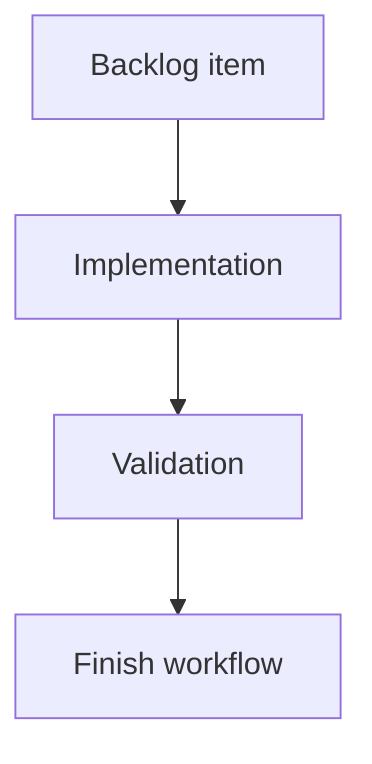

## task_194_add_badge_colors_placement_and_hover_tooltips - Add badge colors, placement, and hover tooltips
> From version: 2.4.0
> Schema version: 1.0
> Status: Ready
> Understanding: 95%
> Confidence: 90%
> Progress: 0%
> Complexity: Medium
> Theme: Git workflow visibility
> Reminder: Update status/understanding/confidence/progress and linked request/backlog references when you edit this doc.

# Definition of Done (DoD)
- [ ] The unpushed commits badge and uncommitted files badge have distinct colors.
- [ ] Badges are visually present but not oversized.
- [ ] Hover tooltips explain the count in clear French copy.
- [ ] Validation passes.

# Backlog
- `item_386_render_git_notification_badges_in_the_ui`

# Acceptance criteria
- AC1: The unpushed commits badge uses a dedicated color distinct from the uncommitted files badge.
- AC2: The uncommitted files badge uses a dedicated color distinct from the commits badge.
- AC3: Tooltip text distinguishes `commits locaux non pushés` from `fichiers modifiés non commités`.
- AC4: Badge placement does not overlap neighboring controls or button content.

# Validation
- Add or update visual/component tests for color, tooltip copy, and compact placement where practical.
- Run `python3 -m logics_manager lint --require-status`.
- Run the relevant frontend tests.

# Report
- Implementation pending.

# AI Context
- Summary: Style Git badges and provide hover tooltips.
- Keywords: git, badge color, tooltip, placement, ui
- Use when: Implementing final badge styling and tooltip copy.
- Skip when: Work is only about Git counters or viewed state.

# Links
- Request: `req_220_add_git_notification_badges_for_unpushed_commits_and_uncommitted_changes`
- Backlog: `item_386_render_git_notification_badges_in_the_ui`
