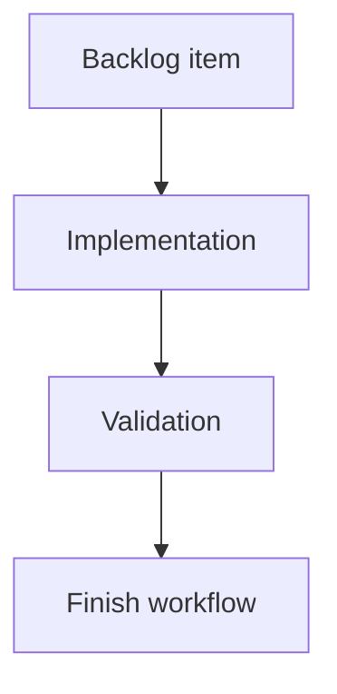

## task_195_redesign_local_viewer_insights_screen - Redesign local viewer Insights screen
> From version: 2.5.2
> Schema version: 1.0
> Status: Ready
> Understanding: 90%
> Confidence: 85%
> Progress: 0%
> Complexity: Medium
> Theme: Implementation delivery
> Reminder: Update status/understanding/confidence/progress and linked request/backlog references when you edit this doc.

# Definition of Done (DoD)
- [ ] The backlog scope is implemented.
- [ ] Acceptance criteria are covered.
- [ ] Validation passes.

# Backlog
- `item_387_redesign_local_viewer_insights_screen`

# Acceptance criteria
- AC1: Insights opens with a compact "Now" summary that highlights the most important corpus signals before secondary detail.
- AC2: Operator actions are visible near the top of the screen and each action clearly applies a filter, opens Health, or opens a relevant document preview.
- AC3: Overview metrics are reduced to a small set of meaningful tiles and do not dominate the screen.
- AC4: Corpus shape is shown with a readable, theme-native visual treatment such as compact horizontal bars by document type.
- AC5: Flow health rows explain the document, status, reason, and next action without relying on comma-separated text blobs.
- AC6: Activity uses a short timeline or grouped rows for recent, stale, and quiet docs, with bounded lists and reveal behavior where needed.
- AC7: Traceability prioritizes broken references and unlinked documents before lower-priority inventory such as most-referenced docs.
- AC8: Quality signals summarize lint/audit health and route detailed findings to the Health screen rather than duplicating the full Health view.
- AC9: The redesigned layout remains consistent with the viewer theme, uses existing CSS variables and controls, and avoids decorative dashboard filler.
- AC10: Focused browser-host or viewer tests cover the new layout structure, action wiring, and at least one dense-data readability case.

# Validation
- Run `python3 -m logics_manager lint --require-status`.
- Run `python3 -m logics_manager flow finish task task_195_redesign_local_viewer_insights_screen.md` after implementation.

# Report
- Implementation complete.

# AI Context
- Summary: Implement redesign local viewer insights screen.
- Keywords: task, implementation, backlog, runtime, python
- Use when: You need a bounded implementation task for a backlog item.
- Skip when: The work is still at the request or backlog shaping stage.

# Links
- Request: `req_221_redesign_local_viewer_insights_screen`
- Product brief(s): (none yet)
- Architecture decision(s): (none yet)

# AC Traceability
- request-AC1 -> This task. Proof: Insights opens with a compact "Now" summary that highlights the most important corpus signals before secondary detail.
- request-AC2 -> This task. Proof: Operator actions are visible near the top of the screen and each action clearly applies a filter, opens Health, or opens a relevant document preview.
- request-AC3 -> This task. Proof: Overview metrics are reduced to a small set of meaningful tiles and do not dominate the screen.
- request-AC4 -> This task. Proof: Corpus shape is shown with a readable, theme-native visual treatment such as compact horizontal bars by document type.
- request-AC5 -> This task. Proof: Flow health rows explain the document, status, reason, and next action without relying on comma-separated text blobs.
- request-AC6 -> This task. Proof: Activity uses a short timeline or grouped rows for recent, stale, and quiet docs, with bounded lists and reveal behavior where needed.
- request-AC7 -> This task. Proof: Traceability prioritizes broken references and unlinked documents before lower-priority inventory such as most-referenced docs.
- request-AC8 -> This task. Proof: Quality signals summarize lint/audit health and route detailed findings to the Health screen rather than duplicating the full Health view.
- request-AC9 -> This task. Proof: The redesigned layout remains consistent with the viewer theme, uses existing CSS variables and controls, and avoids decorative dashboard filler.
- request-AC10 -> This task. Proof: Focused browser-host or viewer tests cover the new layout structure, action wiring, and at least one dense-data readability case.
