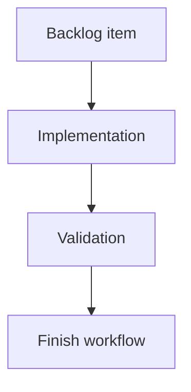

## task_196_add_github_and_folder_shortcuts_to_viewer_topbar - Add GitHub and folder shortcuts to viewer topbar
> From version: 2.5.2
> Schema version: 1.0
> Status: Done
> Understanding: 90%
> Confidence: 85%
> Progress: 100%
> Complexity: Medium
> Theme: Implementation delivery
> Reminder: Update status/understanding/confidence/progress and linked request/backlog references when you edit this doc.

# Definition of Done (DoD)
- [x] The backlog scope is implemented.
- [x] Acceptance criteria are covered.
- [x] Validation passes.

# Backlog
- `item_388_add_github_and_folder_shortcuts_to_viewer_topbar`

# Acceptance criteria
- AC1: The viewer topbar renders compact repository shortcut buttons immediately beside the workspace/repository pill.
- AC2: The GitHub shortcut is visible only when a valid GitHub remote URL can be resolved for the current repository.
- AC3: GitHub SSH and HTTPS remote formats are normalized to the canonical web URL before opening.
- AC4: Clicking the GitHub shortcut opens the repository page externally without changing the current viewer state.
- AC5: The local folder shortcut opens the resolved repository root in the operating system file browser.
- AC6: If the repository folder cannot be opened, the viewer reports a discreet failure message in the existing status/meta surface.
- AC7: Shortcut buttons use icon-first controls with accessible labels and tooltips, and no disabled empty states are shown.
- AC8: The controls remain aligned with the workspace pill and do not collide with the topbar action cluster on narrow viewports.
- AC9: Tests cover GitHub remote detection, hidden GitHub state for non-GitHub repos, and the folder-open action path.

# Validation
- Run `python3 -m logics_manager lint --require-status`.
- Run `python3 -m logics_manager flow finish task task_196_add_github_and_folder_shortcuts_to_viewer_topbar.md` after implementation.
- Finish workflow executed on 2026-06-11.
- Linked backlog/request close verification passed.

# Report
- Implementation complete.
- Finished on 2026-06-11.
- Linked backlog item(s): `item_388_add_github_and_folder_shortcuts_to_viewer_topbar`
- Related request(s): `req_222_add_github_and_folder_shortcuts_to_viewer_topbar`

# AI Context
- Summary: Implement add github and folder shortcuts to viewer topbar.
- Keywords: task, implementation, backlog, runtime, python
- Use when: You need a bounded implementation task for a backlog item.
- Skip when: The work is still at the request or backlog shaping stage.

# Links
- Request: `req_222_add_github_and_folder_shortcuts_to_viewer_topbar`
- Product brief(s): (none yet)
- Architecture decision(s): (none yet)

# AC Traceability
- request-AC1 -> This task. Proof: The viewer topbar renders compact repository shortcut buttons immediately beside the workspace/repository pill.
- request-AC2 -> This task. Proof: The GitHub shortcut is visible only when a valid GitHub remote URL can be resolved for the current repository.
- request-AC3 -> This task. Proof: GitHub SSH and HTTPS remote formats are normalized to the canonical web URL before opening.
- request-AC4 -> This task. Proof: Clicking the GitHub shortcut opens the repository page externally without changing the current viewer state.
- request-AC5 -> This task. Proof: The local folder shortcut opens the resolved repository root in the operating system file browser.
- request-AC6 -> This task. Proof: If the repository folder cannot be opened, the viewer reports a discreet failure message in the existing status/meta surface.
- request-AC7 -> This task. Proof: Shortcut buttons use icon-first controls with accessible labels and tooltips, and no disabled empty states are shown.
- request-AC8 -> This task. Proof: The controls remain aligned with the workspace pill and do not collide with the topbar action cluster on narrow viewports.
- request-AC9 -> This task. Proof: Tests cover GitHub remote detection, hidden GitHub state for non-GitHub repos, and the folder-open action path.
