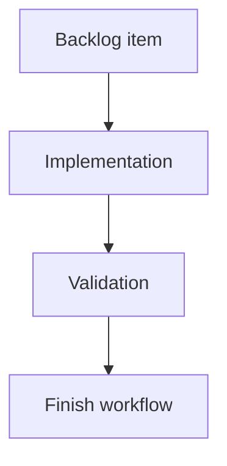

## task_197_fix_bottom_details_panel_width_in_narrow_breakdown_layout - Fix bottom details panel width in narrow breakdown layout
> From version: 2.5.2
> Schema version: 1.0
> Status: Ready
> Understanding: 90%
> Confidence: 85%
> Progress: 0%
> Complexity: Medium
> Theme: Implementation delivery
> Reminder: Update status/understanding/confidence/progress and linked request/backlog references when you edit this doc.

# Definition of Done (DoD)
- [ ] The backlog scope is implemented.
- [ ] Acceptance criteria are covered.
- [ ] Validation passes.

# Backlog
- `item_389_fix_bottom_details_panel_width_in_narrow_breakdown_layout`

# Acceptance criteria
- AC1: When the layout places the details panel below the board/list, the details panel takes the full available width of the view/content area.
- AC2: Bottom-positioned details do not inherit the right-side panel width, max-width, flex-basis, or persisted resize value.
- AC3: Wide layouts continue to render the details panel on the right with the existing resizable width behavior.
- AC4: Collapsed details in bottom/stacked mode remain compact and do not re-enable splitter resizing while collapsed.
- AC5: Switching between wide and narrow layouts restores the correct width contract for each placement without requiring a reload.
- AC6: Board/list content remains visible and aligned after the details panel moves to the bottom.
- AC7: Regression coverage or a visual smoke case verifies the bottom-details full-width state at the relevant narrow breakpoint.

# Validation
- Run `python3 -m logics_manager lint --require-status`.
- Run `python3 -m logics_manager flow finish task task_197_fix_bottom_details_panel_width_in_narrow_breakdown_layout.md` after implementation.

# Report
- Implementation complete.

# AI Context
- Summary: Implement fix bottom details panel width in narrow breakdown layout.
- Keywords: task, implementation, backlog, runtime, python
- Use when: You need a bounded implementation task for a backlog item.
- Skip when: The work is still at the request or backlog shaping stage.

# Links
- Request: `req_223_fix_bottom_details_panel_width_in_narrow_breakdown_layout`
- Product brief(s): (none yet)
- Architecture decision(s): (none yet)

# AC Traceability
- request-AC1 -> This task. Proof: When the layout places the details panel below the board/list, the details panel takes the full available width of the view/content area.
- request-AC2 -> This task. Proof: Bottom-positioned details do not inherit the right-side panel width, max-width, flex-basis, or persisted resize value.
- request-AC3 -> This task. Proof: Wide layouts continue to render the details panel on the right with the existing resizable width behavior.
- request-AC4 -> This task. Proof: Collapsed details in bottom/stacked mode remain compact and do not re-enable splitter resizing while collapsed.
- request-AC5 -> This task. Proof: Switching between wide and narrow layouts restores the correct width contract for each placement without requiring a reload.
- request-AC6 -> This task. Proof: Board/list content remains visible and aligned after the details panel moves to the bottom.
- request-AC7 -> This task. Proof: Regression coverage or a visual smoke case verifies the bottom-details full-width state at the relevant narrow breakpoint.
