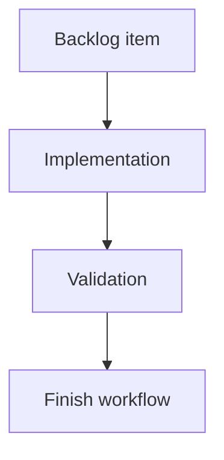

## task_198_add_progressive_reveal_to_git_history_commits - Add progressive reveal to Git history commits
> From version: 2.5.2
> Schema version: 1.0
> Status: Done
> Understanding: 90%
> Confidence: 85%
> Progress: 100%
> Complexity: Medium
> Theme: Implementation delivery
> Reminder: Update status/understanding/confidence/progress and linked request/backlog references when you edit this doc.

# Definition of Done (DoD)
- [x] The backlog scope is implemented.
- [x] Acceptance criteria are covered.
- [x] Validation passes.

# Backlog
- `item_390_add_progressive_reveal_to_git_history_commits`

# Acceptance criteria
- AC1: Git History renders 10 commit rows by default when at least 10 commits are available.
- AC2: When more than 10 commits are available, the History list shows a clear in-flow `Show 10 more` control after the rendered rows.
- AC3: Each activation of the reveal control displays the next 10 commits without reordering or duplicating existing rows.
- AC4: The reveal control disappears when all available commits in the current payload are visible.
- AC5: The History domain count continues to represent the available recent commit count, while the list itself can show a smaller visible subset.
- AC6: Refreshing or receiving a materially different Git payload reconciles the visible limit predictably and avoids stale expansion state.
- AC7: The empty-history and single-commit fallback states remain unchanged.
- AC8: Focused tests cover the initial 10-row render, one or more reveal clicks, and the absence of the reveal control when no hidden commits remain.

# Validation
- Run `python3 -m logics_manager lint --require-status`.
- Run `python3 -m logics_manager flow finish task task_198_add_progressive_reveal_to_git_history_commits.md` after implementation.
- Finish workflow executed on 2026-06-11.
- Linked backlog/request close verification passed.

# Report
- Implementation complete.
- Finished on 2026-06-11.
- Linked backlog item(s): `item_390_add_progressive_reveal_to_git_history_commits`
- Related request(s): `req_224_add_progressive_reveal_to_git_history_commits`

# AI Context
- Summary: Implement add progressive reveal to git history commits.
- Keywords: task, implementation, backlog, runtime, python
- Use when: You need a bounded implementation task for a backlog item.
- Skip when: The work is still at the request or backlog shaping stage.

# Links
- Request: `req_224_add_progressive_reveal_to_git_history_commits`
- Product brief(s): (none yet)
- Architecture decision(s): (none yet)

# AC Traceability
- request-AC1 -> This task. Proof: Git History renders 10 commit rows by default when at least 10 commits are available.
- request-AC2 -> This task. Proof: When more than 10 commits are available, the History list shows a clear in-flow `Show 10 more` control after the rendered rows.
- request-AC3 -> This task. Proof: Each activation of the reveal control displays the next 10 commits without reordering or duplicating existing rows.
- request-AC4 -> This task. Proof: The reveal control disappears when all available commits in the current payload are visible.
- request-AC5 -> This task. Proof: The History domain count continues to represent the available recent commit count, while the list itself can show a smaller visible subset.
- request-AC6 -> This task. Proof: Refreshing or receiving a materially different Git payload reconciles the visible limit predictably and avoids stale expansion state.
- request-AC7 -> This task. Proof: The empty-history and single-commit fallback states remain unchanged.
- request-AC8 -> This task. Proof: Focused tests cover the initial 10-row render, one or more reveal clicks, and the absence of the reveal control when no hidden commits remain.
