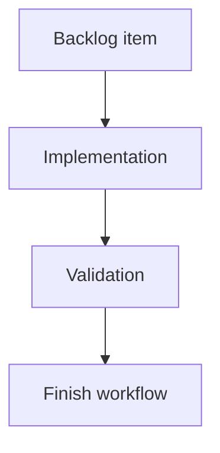

## task_199_show_local_viewer_server_connection_status - Show local viewer server connection status
> From version: 2.5.2
> Schema version: 1.0
> Status: Ready
> Understanding: 90%
> Confidence: 85%
> Progress: 0%
> Complexity: Medium
> Theme: Implementation delivery
> Reminder: Update status/understanding/confidence/progress and linked request/backlog references when you edit this doc.

# Definition of Done (DoD)
- [ ] The backlog scope is implemented.
- [ ] Acceptance criteria are covered.
- [ ] Validation passes.

# Backlog
- `item_391_show_local_viewer_server_connection_status`

# Implementation plan
1. Confirm the existing viewer refresh flow and update banner structure in `clients/viewer/`.
2. Add persistent connection state to `browser-host.js`, including last successful sync time.
3. Add a disconnected banner to `index.html` and matching CSS using existing viewer chrome patterns.
4. Update refresh success and failure paths so auto-refresh and manual refresh set the same connection state.
5. Mirror the source viewer changes into `logics_manager/viewer_assets/viewer/`.
6. Validate by simulating server shutdown and restart while the browser tab remains open.

# Acceptance criteria
- AC1: The local viewer displays a persistent disconnected banner when its data refresh cannot reach the local server.
- AC2: The banner makes clear that the currently displayed data may be stale and that the viewer is waiting for reconnection.
- AC3: The disconnected state clears automatically after the local server is restarted and a viewer refresh succeeds.
- AC4: Existing auto-refresh behavior is reused for reconnection attempts unless a dedicated health endpoint is justified during implementation.
- AC5: Manual refresh also retries the connection and updates the connection banner state consistently.
- AC6: The implementation preserves the existing corpus display while disconnected instead of replacing it with a blank or fatal error screen.
- AC7: The UI treatment reuses existing viewer chrome patterns such as the update banner styling, with an appropriate warning/error tone.
- AC8: Both source viewer assets and packaged viewer assets remain in sync.

# AC Traceability
- request-AC1 -> This task. Proof: AC1: The local viewer displays a persistent disconnected banner when its data refresh cannot reach the local server.
- request-AC2 -> This task. Proof: AC2: The banner makes clear that the currently displayed data may be stale and that the viewer is waiting for reconnection.
- request-AC3 -> This task. Proof: AC3: The disconnected state clears automatically after the local server is restarted and a viewer refresh succeeds.
- request-AC4 -> This task. Proof: AC4: Existing auto-refresh behavior is reused for reconnection attempts unless a dedicated health endpoint is justified during implementation.
- request-AC5 -> This task. Proof: AC5: Manual refresh also retries the connection and updates the connection banner state consistently.
- request-AC6 -> This task. Proof: AC6: The implementation preserves the existing corpus display while disconnected instead of replacing it with a blank or fatal error screen.
- request-AC7 -> This task. Proof: AC7: The UI treatment reuses existing viewer chrome patterns such as the update banner styling, with an appropriate warning/error tone.
- request-AC8 -> This task. Proof: AC8: Both source viewer assets and packaged viewer assets remain in sync.

# Validation
- Run `logics-manager lint --require-status`.
- Run `logics-manager audit --legacy-cutoff-version 1.1.0 --group-by-doc`.
- Run the relevant viewer test/build command if one exists.
- Manually verify that stopping the local viewer server shows the disconnected banner and restarting it clears the banner after refresh.
- Run `logics-manager flow finish task logics/tasks/task_199_show_local_viewer_server_connection_status.md` after implementation.

# Report
- Pending implementation.

# AI Context
- Summary: Implement show local viewer server connection status.
- Keywords: task, implementation, local-viewer, disconnected-banner, auto-refresh, browser-host
- Use when: You need a bounded implementation task for a backlog item.
- Skip when: The work is still at the request or backlog shaping stage.

# Links
- Request: `logics/request/req_225_show_local_viewer_server_connection_status.md`
- Product brief(s): (none yet)
- Architecture decision(s): (none yet)
