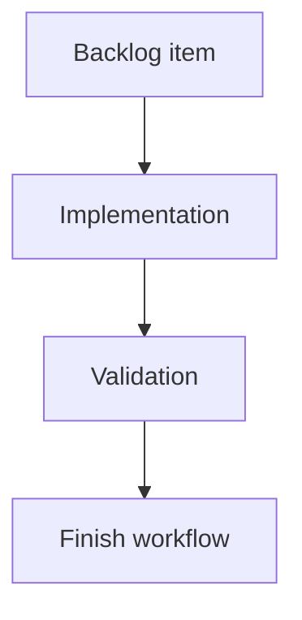

## task_200_show_github_actions_ci_status_in_local_viewer - Show GitHub Actions CI status in local viewer
> From version: 2.5.2
> Schema version: 1.0
> Status: Ready
> Understanding: 90%
> Confidence: 85%
> Progress: 0%
> Complexity: Medium
> Theme: Implementation delivery
> Reminder: Update status/understanding/confidence/progress and linked request/backlog references when you edit this doc.

# Definition of Done (DoD)
- [ ] The backlog scope is implemented.
- [ ] Acceptance criteria are covered.
- [ ] Validation passes.

# Backlog
- `item_392_show_github_actions_ci_status_in_local_viewer`

# Implementation plan
1. Confirm existing local viewer topbar, Git/CDX status panel patterns, and backend route conventions.
2. Add backend CI detection for GitHub remote and `.github/workflows/*.yml` or `.yaml`.
3. Add a local CI status endpoint that retrieves GitHub Actions run state without exposing credentials to browser code.
4. Add the conditional `CI` topbar action between `Git` and `CDX`, including quick status badge states.
5. Add the CI detail panel with latest relevant run and job information when available.
6. Wire non-blocking CI refresh into existing load and manual refresh paths.
7. Mirror source viewer changes into packaged viewer assets.
8. Validate hidden, unavailable, running, failing, and passing states.

# Acceptance criteria
- AC1: The viewer has a `CI` action positioned between `Git` and `CDX` when GitHub Actions support is available for the repository.
- AC2: The `CI` action is hidden when the repository has no GitHub remote or no configured GitHub Actions workflows.
- AC3: The `CI` action displays a compact status badge for passing, failing, running, queued, cancelled, unavailable, or unknown CI state.
- AC4: Clicking `CI` opens a dedicated viewer panel with the latest relevant GitHub Actions run details.
- AC5: CI status prioritizes the current branch or current HEAD and uses a documented fallback when exact matching data is unavailable.
- AC6: The backend provides the CI data through a local endpoint and does not expose GitHub credentials to browser code.
- AC7: If GitHub Actions is configured but authentication is unavailable, the UI reports that state clearly instead of showing a misleading success or failure.
- AC8: CI status refresh does not block normal corpus rendering or existing Git, CDX, Health, and viewer refresh behavior.
- AC9: Both source viewer assets and packaged viewer assets remain in sync.

# AC Traceability
- request-AC1 -> This task. Proof: AC1: The viewer has a `CI` action positioned between `Git` and `CDX` when GitHub Actions support is available for the repository.
- request-AC2 -> This task. Proof: AC2: The `CI` action is hidden when the repository has no GitHub remote or no configured GitHub Actions workflows.
- request-AC3 -> This task. Proof: AC3: The `CI` action displays a compact status badge for passing, failing, running, queued, cancelled, unavailable, or unknown CI state.
- request-AC4 -> This task. Proof: AC4: Clicking `CI` opens a dedicated viewer panel with the latest relevant GitHub Actions run details.
- request-AC5 -> This task. Proof: AC5: CI status prioritizes the current branch or current HEAD and uses a documented fallback when exact matching data is unavailable.
- request-AC6 -> This task. Proof: AC6: The backend provides the CI data through a local endpoint and does not expose GitHub credentials to browser code.
- request-AC7 -> This task. Proof: AC7: If GitHub Actions is configured but authentication is unavailable, the UI reports that state clearly instead of showing a misleading success or failure.
- request-AC8 -> This task. Proof: AC8: CI status refresh does not block normal corpus rendering or existing Git, CDX, Health, and viewer refresh behavior.
- request-AC9 -> This task. Proof: AC9: Both source viewer assets and packaged viewer assets remain in sync.

# Validation
- Run `logics-manager lint --require-status`.
- Run `logics-manager audit --legacy-cutoff-version 1.1.0 --group-by-doc`.
- Run relevant backend and viewer tests once the implementation exists.
- Manually verify CI button hidden when no workflows are configured.
- Manually verify CI button visible with badge when GitHub Actions is configured.
- Run `logics-manager flow finish task logics/tasks/task_200_show_github_actions_ci_status_in_local_viewer.md` after implementation.

# Report
- Pending implementation.

# AI Context
- Summary: Implement show github actions ci status in local viewer.
- Keywords: task, implementation, local-viewer, github-actions, ci-status, status-badge, backend-endpoint
- Use when: You need a bounded implementation task for a backlog item.
- Skip when: The work is still at the request or backlog shaping stage.

# Links
- Request: `logics/request/req_226_show_github_actions_ci_status_in_local_viewer.md`
- Product brief(s): (none yet)
- Architecture decision(s): (none yet)
