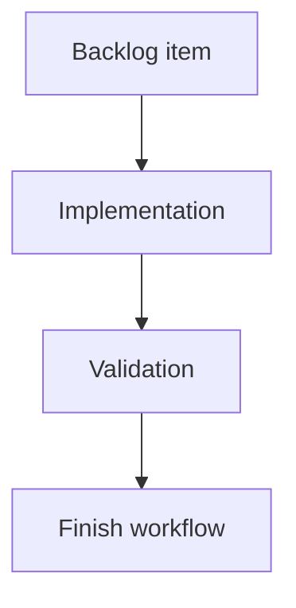

## task_201_group_viewer_utility_actions_under_settings_menu - Group viewer utility actions under settings menu
> From version: 2.5.2
> Schema version: 1.0
> Status: Done
> Understanding: 90%
> Confidence: 85%
> Progress: 100%
> Complexity: Medium
> Theme: Implementation delivery
> Reminder: Update status/understanding/confidence/progress and linked request/backlog references when you edit this doc.

# Definition of Done (DoD)
- [x] The backlog scope is implemented.
- [x] Acceptance criteria are covered.
- [x] Validation passes.

# Backlog
- `item_393_group_viewer_utility_actions_under_settings_menu`

# Implementation plan
1. Confirm current topbar ordering and refresh menu behavior in `clients/viewer/`.
2. Replace the visible refresh, insights, and health peer buttons with one `Settings` menu.
3. Move manual refresh, auto-refresh toggle, interval selection, `Insights`, and `Health` into the menu.
4. Preserve outside-click and Escape close behavior.
5. Mirror source viewer changes into packaged viewer assets.
6. Validate desktop and narrow topbar layouts.

# Acceptance criteria
- AC1: `Git`, conditional `CI`, and `CDX` remain visible as first-level topbar status actions.
- AC2: `Refresh`, `Insights`, and `Health` are accessible from a right-side `Settings` menu instead of separate topbar peer buttons.
- AC3: Manual refresh, auto-refresh toggle, and refresh interval selection continue to work from the new menu.
- AC4: `Insights` and `Health` continue to open their existing viewer panels from the new menu.
- AC5: The settings menu closes on outside click and Escape with behavior consistent with existing viewer menus.
- AC6: The topbar remains readable and non-overlapping on narrow and desktop widths.
- AC7: Both source viewer assets and packaged viewer assets remain in sync.

# AC Traceability
- request-AC1 -> This task. Proof: AC1: `Git`, conditional `CI`, and `CDX` remain visible as first-level topbar status actions.
- request-AC2 -> This task. Proof: AC2: `Refresh`, `Insights`, and `Health` are accessible from a right-side `Settings` menu instead of separate topbar peer buttons.
- request-AC3 -> This task. Proof: AC3: Manual refresh, auto-refresh toggle, and refresh interval selection continue to work from the new menu.
- request-AC4 -> This task. Proof: AC4: `Insights` and `Health` continue to open their existing viewer panels from the new menu.
- request-AC5 -> This task. Proof: AC5: The settings menu closes on outside click and Escape with behavior consistent with existing viewer menus.
- request-AC6 -> This task. Proof: AC6: The topbar remains readable and non-overlapping on narrow and desktop widths.
- request-AC7 -> This task. Proof: AC7: Both source viewer assets and packaged viewer assets remain in sync.

# Validation
- Run `logics-manager lint --require-status`.
- Run `logics-manager audit --legacy-cutoff-version 1.1.0 --group-by-doc`.
- Run relevant viewer syntax/tests once implemented.
- Manually verify settings menu access to refresh, insights, and health actions.
- Run `logics-manager flow finish task logics/tasks/task_201_group_viewer_utility_actions_under_settings_menu.md` after implementation.
- Finish workflow executed on 2026-06-11.
- Linked backlog/request close verification passed.

# Report
- Pending implementation.
- Finished on 2026-06-11.
- Linked backlog item(s): `item_393_group_viewer_utility_actions_under_settings_menu`
- Related request(s): `req_227_group_viewer_utility_actions_under_settings_menu`

# AI Context
- Summary: Implement group viewer utility actions under settings menu.
- Keywords: task, implementation, local-viewer, settings-menu, refresh, insights, health, topbar
- Use when: You need a bounded implementation task for a backlog item.
- Skip when: The work is still at the request or backlog shaping stage.

# Links
- Request: `logics/request/req_227_group_viewer_utility_actions_under_settings_menu.md`
- Product brief(s): (none yet)
- Architecture decision(s): (none yet)
