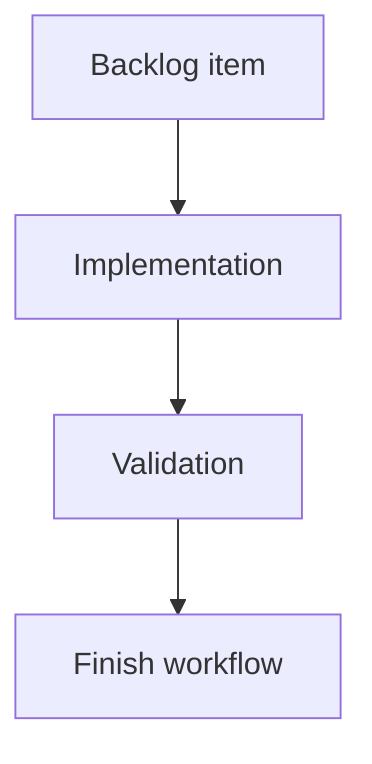

## task_202_show_active_assistant_indicator_on_cdx_button - Show active assistant indicator on CDX button
> From version: 2.5.2
> Schema version: 1.0
> Status: Ready
> Understanding: 90%
> Confidence: 85%
> Progress: 0%
> Complexity: Medium
> Theme: Implementation delivery
> Reminder: Update status/understanding/confidence/progress and linked request/backlog references when you edit this doc.

# Definition of Done (DoD)
- [ ] The backlog scope is implemented.
- [ ] Acceptance criteria are covered.
- [ ] Validation passes.

# Backlog
- `item_394_show_active_assistant_indicator_on_cdx_button`

# Implementation plan
1. Inspect current CDX status payload normalization in `clients/viewer/browser-host.js`.
2. Define the active assistant/session signal from existing CDX rows, sessions, or provider data.
3. Add a compact badge to the `CDX` button only when active count is greater than zero.
4. Refresh the badge through the same CDX status path used by the detail panel.
5. Preserve existing CDX button click behavior.
6. Mirror source viewer changes into packaged viewer assets.
7. Validate active, inactive, and unavailable CDX states.

# Acceptance criteria
- AC1: The `CDX` topbar button displays a compact badge when at least one assistant/session is active.
- AC2: The badge is hidden when CDX reports no active assistants/sessions.
- AC3: The badge is hidden or neutral when CDX status is unavailable, so it does not imply active work incorrectly.
- AC4: The indicator uses the existing CDX status data path and does not introduce a separate assistant polling API unless implementation proves it necessary.
- AC5: Clicking `CDX` continues to open the existing CDX status panel without behavior regression.
- AC6: The badge remains readable and non-overlapping in the topbar, including after the Settings menu request is implemented.
- AC7: Both source viewer assets and packaged viewer assets remain in sync.

# AC Traceability
- request-AC1 -> This task. Proof: AC1: The `CDX` topbar button displays a compact badge when at least one assistant/session is active.
- request-AC2 -> This task. Proof: AC2: The badge is hidden when CDX reports no active assistants/sessions.
- request-AC3 -> This task. Proof: AC3: The badge is hidden or neutral when CDX status is unavailable, so it does not imply active work incorrectly.
- request-AC4 -> This task. Proof: AC4: The indicator uses the existing CDX status data path and does not introduce a separate assistant polling API unless implementation proves it necessary.
- request-AC5 -> This task. Proof: AC5: Clicking `CDX` continues to open the existing CDX status panel without behavior regression.
- request-AC6 -> This task. Proof: AC6: The badge remains readable and non-overlapping in the topbar, including after the Settings menu request is implemented.
- request-AC7 -> This task. Proof: AC7: Both source viewer assets and packaged viewer assets remain in sync.

# Validation
- Run `logics-manager lint --require-status`.
- Run `logics-manager audit --legacy-cutoff-version 1.1.0 --group-by-doc`.
- Run relevant viewer syntax/tests once implemented.
- Manually verify active, inactive, and unavailable CDX badge states.
- Run `logics-manager flow finish task logics/tasks/task_202_show_active_assistant_indicator_on_cdx_button.md` after implementation.

# Report
- Pending implementation.

# AI Context
- Summary: Implement show active assistant indicator on cdx button.
- Keywords: task, implementation, local-viewer, cdx, assistant-active, status-badge, topbar
- Use when: You need a bounded implementation task for a backlog item.
- Skip when: The work is still at the request or backlog shaping stage.

# Links
- Request: `logics/request/req_228_show_active_assistant_indicator_on_cdx_button.md`
- Product brief(s): (none yet)
- Architecture decision(s): (none yet)
