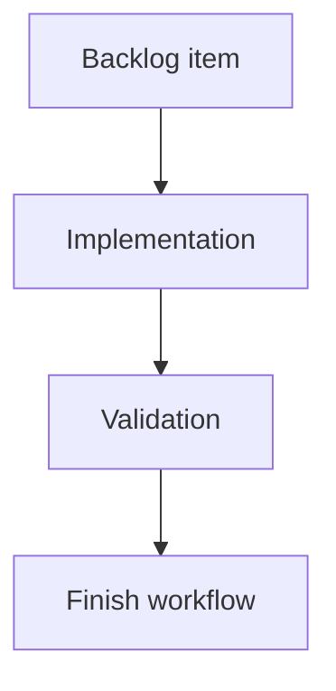

## task_203_fix_collapsed_bottom_details_panel_empty_space - Fix collapsed bottom details panel empty space
> From version: 2.5.2
> Schema version: 1.0
> Status: Done
> Understanding: 90%
> Confidence: 85%
> Progress: 100%
> Complexity: Medium
> Theme: Implementation delivery
> Reminder: Update status/understanding/confidence/progress and linked request/backlog references when you edit this doc.

# Definition of Done (DoD)
- [x] The backlog scope is implemented.
- [x] Acceptance criteria are covered.
- [x] Validation passes.

# Backlog
- `item_395_fix_collapsed_bottom_details_panel_empty_space`

# Implementation plan
1. Reproduce and inspect the bottom-details collapsed layout state.
2. Identify whether reserved empty space is controlled by CSS grid rows, split ratio state, or collapsed details classes.
3. Apply a targeted layout fix so the board expands when details content is collapsed.
4. Preserve chevron aria-expanded state and expand restoration behavior.
5. Mirror any viewer asset changes into packaged assets.
6. Validate collapse/expand after resize and view-mode changes.

# Acceptance criteria
- AC1: Collapsing the bottom details panel removes the visible empty reserved area below the main board.
- AC2: Expanding the details panel restores the details area without overlapping board content.
- AC3: The chevron toggle remains accessible and keeps accurate expanded/collapsed state.
- AC4: The fix works after viewport resize and view-mode changes.
- AC5: The change is limited to viewer layout behavior and does not alter details content semantics.
- AC6: Source viewer assets and packaged viewer assets remain in sync if viewer assets are changed.

# AC Traceability
- request-AC1 -> This task. Proof: AC1: Collapsing the bottom details panel removes the visible empty reserved area below the main board.
- request-AC2 -> This task. Proof: AC2: Expanding the details panel restores the details area without overlapping board content.
- request-AC3 -> This task. Proof: AC3: The chevron toggle remains accessible and keeps accurate expanded/collapsed state.
- request-AC4 -> This task. Proof: AC4: The fix works after viewport resize and view-mode changes.
- request-AC5 -> This task. Proof: AC5: The change is limited to viewer layout behavior and does not alter details content semantics.
- request-AC6 -> This task. Proof: AC6: Source viewer assets and packaged viewer assets remain in sync if viewer assets are changed.

# Validation
- Run `logics-manager lint --require-status`.
- Run `logics-manager audit --legacy-cutoff-version 1.1.0 --group-by-doc`.
- Run relevant viewer syntax/tests once implemented.
- Manually verify collapse and expand behavior in bottom-details layout.
- Run `logics-manager flow finish task logics/tasks/task_203_fix_collapsed_bottom_details_panel_empty_space.md` after implementation.
- Finish workflow executed on 2026-06-11.
- Linked backlog/request close verification passed.

# Report
- Pending implementation.
- Finished on 2026-06-11.
- Linked backlog item(s): `item_395_fix_collapsed_bottom_details_panel_empty_space`
- Related request(s): `req_229_fix_collapsed_bottom_details_panel_empty_space`

# AI Context
- Summary: Implement fix collapsed bottom details panel empty space.
- Keywords: task, implementation, local-viewer, details-panel, collapsed-layout, bottom-panel, empty-space
- Use when: You need a bounded implementation task for a backlog item.
- Skip when: The work is still at the request or backlog shaping stage.

# Links
- Request: `logics/request/req_229_fix_collapsed_bottom_details_panel_empty_space.md`
- Product brief(s): (none yet)
- Architecture decision(s): (none yet)
