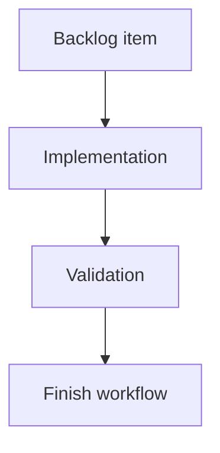

## task_204_add_logics_assistant_runs_cockpit_and_report_to_workflow_actions - Add Logics assistant runs cockpit and report-to-workflow actions
> From version: 2.6.0
> Schema version: 1.0
> Status: Ready
> Understanding: 90%
> Confidence: 85%
> Progress: 0%
> Complexity: Medium
> Theme: Implementation delivery
> Reminder: Update status/understanding/confidence/progress and linked request/backlog references when you edit this doc.

# Definition of Done (DoD)
- [ ] The backlog scope is implemented.
- [ ] Acceptance criteria are covered.
- [ ] Validation passes.

# Backlog
- `item_396_add_logics_assistant_runs_cockpit_and_report_to_workflow_actions`

# Acceptance criteria
- AC1: The viewer exposes an assistant runs cockpit or sub-screen that lists recent and active CDX runs from a stable JSON source.
- AC2: Active and terminal run states are visually distinct and include enough metadata to understand what is running, where, and through which provider/session.
- AC3: The cockpit can refresh or poll run state so a run visibly moves from running to a terminal state without restarting the viewer.
- AC4: A completed run can be opened as a report with summary, structured output, artifact paths, and errors when present.
- AC5: Code-review reports render normalized findings with severity, title, file/line references when available, and recommendation text.
- AC6: Operators can draft a Logics request from code-review findings with traceability back to the CDX `run_id` and report artifact.
- AC7: Report-to-workflow actions keep an operator review boundary before writing docs by default.
- AC8: The implementation degrades clearly when CDX does not yet expose run status/report commands or when a run has only raw artifacts.
- AC9: Tests cover CDX payload mapping, active/terminal rendering, refresh behavior, report rendering, and request draft/create behavior.

# Validation
- Run `python3 -m logics_manager lint --require-status`.
- Run `python3 -m logics_manager flow finish task task_204_add_logics_assistant_runs_cockpit_and_report_to_workflow_actions.md` after implementation.

# Report
- Implementation complete.

# AI Context
- Summary: Implement add logics assistant runs cockpit and report-to-workflow actions.
- Keywords: task, implementation, backlog, runtime, python
- Use when: You need a bounded implementation task for a backlog item.
- Skip when: The work is still at the request or backlog shaping stage.

# Links
- Request: `req_230_add_logics_assistant_runs_cockpit_and_report_to_workflow_actions`
- Product brief(s): (none yet)
- Architecture decision(s): (none yet)
