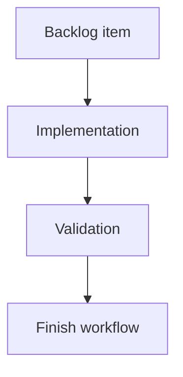

## task_205_add_multi_project_navigation_to_the_logics_viewer - Add multi-project navigation to the Logics viewer
> From version: 2.6.0
> Schema version: 1.0
> Status: Ready
> Understanding: 91%
> Confidence: 86%
> Progress: 0%
> Complexity: Medium
> Theme: Implementation delivery
> Reminder: Update status/understanding/confidence/progress and linked request/backlog references when you edit this doc.

# Definition of Done (DoD)
- [ ] The backlog scope is implemented.
- [ ] Acceptance criteria are covered.
- [ ] Validation passes.

# Backlog
- `item_397_add_multi_project_navigation_to_the_logics_viewer`

# Acceptance criteria
- AC1: The viewer exposes a project navigation control in the left-side identity/context area of the topbar, replacing or extending the repository pill.
- AC2: Selecting a project changes the active viewer context and reloads the board/document data from that project's Logics corpus.
- AC3: Git, CI, CDX, and activity/status panels use the selected project context after a switch rather than the original launch repository.
- AC4: The backend rejects switching to paths that are not in the known/allowed project registry.
- AC5: The viewer clearly handles projects with no Logics corpus, missing Git metadata, unavailable CDX status, or inaccessible paths.
- AC6: The selected project can be restored or shown as the current context after refresh.
- AC7: The implementation provides a stable JSON surface for listing projects and switching/inspecting the active project.
- AC8: The topbar keeps project context visually separate from right-side actions such as Git, CI, CDX, and Settings.
- AC9: Tests cover backend allowlist behavior, project registry payloads, switching success/failure, UI rendering, and data refresh after switching.

# Validation
- Run `python3 -m logics_manager lint --require-status`.
- Run `python3 -m logics_manager flow finish task task_205_add_multi_project_navigation_to_the_logics_viewer.md` after implementation.

# Report
- Implementation complete.

# AI Context
- Summary: Implement add multi-project navigation to the logics viewer.
- Keywords: task, implementation, backlog, runtime, python
- Use when: You need a bounded implementation task for a backlog item.
- Skip when: The work is still at the request or backlog shaping stage.

# Links
- Request: `req_231_add_multi_project_navigation_to_the_logics_viewer`
- Product brief(s): (none yet)
- Architecture decision(s): (none yet)

# AC Traceability
- request-AC1 -> This task. Proof: planned task acceptance criterion covers: The viewer exposes a project navigation control in the left-side identity/context area of the topbar, replacing or extending the repository pill.
- request-AC2 -> This task. Proof: planned task acceptance criterion covers: Selecting a project changes the active viewer context and reloads the board/document data from that project's Logics corpus.
- request-AC3 -> This task. Proof: planned task acceptance criterion covers: Git, CI, CDX, and activity/status panels use the selected project context after a switch rather than the original launch repository.
- request-AC4 -> This task. Proof: planned task acceptance criterion covers: The backend rejects switching to paths that are not in the known/allowed project registry.
- request-AC5 -> This task. Proof: planned task acceptance criterion covers: The viewer clearly handles projects with no Logics corpus, missing Git metadata, unavailable CDX status, or inaccessible paths.
- request-AC6 -> This task. Proof: planned task acceptance criterion covers: The selected project can be restored or shown as the current context after refresh.
- request-AC7 -> This task. Proof: planned task acceptance criterion covers: The implementation provides a stable JSON surface for listing projects and switching/inspecting the active project.
- request-AC8 -> This task. Proof: planned task acceptance criterion covers: The topbar keeps project context visually separate from right-side actions such as Git, CI, CDX, and Settings.
- request-AC9 -> This task. Proof: planned task acceptance criterion covers: Tests cover backend allowlist behavior, project registry payloads, switching success/failure, UI rendering, and data refresh after switching.
