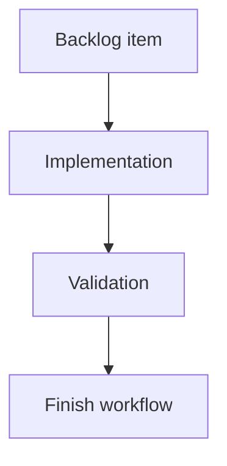

## task_206_stop_generating_generic_task_mermaid_diagrams - Stop generating generic task Mermaid diagrams
> From version: 2.6.1
> Schema version: 1.0
> Status: Done
> Understanding: 91%
> Confidence: 86%
> Progress: 100%
> Complexity: Medium
> Theme: Implementation delivery
> Reminder: Update status/understanding/confidence/progress and linked request/backlog references when you edit this doc.

# Definition of Done (DoD)
- [x] The backlog scope is implemented.
- [x] Acceptance criteria are covered.
- [x] Validation passes.

# Backlog
- `item_398_stop_generating_generic_task_mermaid_diagrams`

# Diagram
- None. This task intentionally omits the generic Logics lifecycle Mermaid diagram because the requested change is to stop generating that default block.

# Acceptance criteria
- AC1: Newly generated task documents do not include the generic Logics lifecycle Mermaid diagram by default.
- AC2: Task documents without Mermaid still pass Logics lint and closeout validation.
- AC3: The generator still permits task-specific Mermaid when a caller/template explicitly provides meaningful task behavior or architecture.
- AC4: Request and backlog Mermaid behavior is unchanged.
- AC5: Tests cover task generation without Mermaid and protect against the old generic `Backlog -> Build -> Validate -> Close` diagram returning by default.
- AC6: Documentation or examples that describe generated task structure are updated to match the new default.

# Validation
- Run `python3 -m logics_manager lint --require-status`.
- Run `python3 -m logics_manager flow finish task task_206_stop_generating_generic_task_mermaid_diagrams.md` after implementation.
- Finish workflow executed on 2026-06-11.
- Linked backlog/request close verification passed.

# Report
- Implementation complete.
- Finished on 2026-06-11.
- Linked backlog item(s): `item_398_stop_generating_generic_task_mermaid_diagrams`
- Related request(s): `req_232_stop_generating_generic_task_mermaid_diagrams`

# AI Context
- Summary: Implement stop generating generic task mermaid diagrams.
- Keywords: task, implementation, backlog, runtime, python
- Use when: You need a bounded implementation task for a backlog item.
- Skip when: The work is still at the request or backlog shaping stage.

# Links
- Request: `req_232_stop_generating_generic_task_mermaid_diagrams`
- Product brief(s): (none yet)
- Architecture decision(s): (none yet)

# AC Traceability
- request-AC1 -> This task. Proof: planned task acceptance criterion covers: Newly generated task documents do not include the generic Logics lifecycle Mermaid diagram by default.
- request-AC2 -> This task. Proof: planned task acceptance criterion covers: Task documents without Mermaid still pass Logics lint and closeout validation.
- request-AC3 -> This task. Proof: planned task acceptance criterion covers: The generator still permits task-specific Mermaid when a caller/template explicitly provides meaningful task behavior or architecture.
- request-AC4 -> This task. Proof: planned task acceptance criterion covers: Request and backlog Mermaid behavior is unchanged.
- request-AC5 -> This task. Proof: planned task acceptance criterion covers: Tests cover task generation without Mermaid and protect against the old generic `Backlog -> Build -> Validate -> Close` diagram returning by default.
- request-AC6 -> This task. Proof: planned task acceptance criterion covers: Documentation or examples that describe generated task structure are updated to match the new default.
