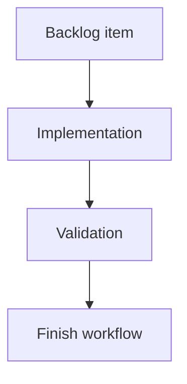

## task_207_add_project_capability_detection_for_viewer_features - Add project capability detection for viewer features
> From version: 2.6.1
> Schema version: 1.0
> Status: Ready
> Understanding: 91%
> Confidence: 86%
> Progress: 0%
> Complexity: Medium
> Theme: Implementation delivery
> Reminder: Update status/understanding/confidence/progress and linked request/backlog references when you edit this doc.

# Definition of Done (DoD)
- [ ] The backlog scope is implemented.
- [ ] Acceptance criteria are covered.
- [ ] Validation passes.

# Backlog
- `item_399_add_project_capability_detection_for_viewer_features`

# Acceptance criteria
- AC1: The backend exposes a project capability snapshot for the active viewer project.
- AC2: The snapshot includes Logics, Git, CI, CDX, and CDX runs capabilities with state and human-readable reason fields.
- AC3: Capability states distinguish absent/unconfigured/unauthorized/unsupported cases from unexpected errors where possible.
- AC4: Capability detection runs when the viewer loads and when a project switch occurs.
- AC5: The browser host can consume the snapshot without calling every feature endpoint first.
- AC6: Tests cover representative project states: full project, no Git, no Logics corpus, no CDX, CI unavailable/private, and CDX runs unsupported.

# Validation
- Run `python3 -m logics_manager lint --require-status`.
- Run `python3 -m logics_manager flow finish task task_207_add_project_capability_detection_for_viewer_features.md` after implementation.

# Report
- Implementation complete.

# AI Context
- Summary: Implement add project capability detection for viewer features.
- Keywords: task, implementation, backlog, runtime, python
- Use when: You need a bounded implementation task for a backlog item.
- Skip when: The work is still at the request or backlog shaping stage.

# Links
- Request: `req_233_add_project_capability_detection_for_viewer_features`
- Product brief(s): (none yet)
- Architecture decision(s): (none yet)

# AC Traceability
- request-AC1 -> This task. Proof: planned task acceptance criterion covers: The backend exposes a project capability snapshot for the active viewer project.
- request-AC2 -> This task. Proof: planned task acceptance criterion covers: The snapshot includes Logics, Git, CI, CDX, and CDX runs capabilities with state and human-readable reason fields.
- request-AC3 -> This task. Proof: planned task acceptance criterion covers: Capability states distinguish absent/unconfigured/unauthorized/unsupported cases from unexpected errors where possible.
- request-AC4 -> This task. Proof: planned task acceptance criterion covers: Capability detection runs when the viewer loads and when a project switch occurs.
- request-AC5 -> This task. Proof: planned task acceptance criterion covers: The browser host can consume the snapshot without calling every feature endpoint first.
- request-AC6 -> This task. Proof: planned task acceptance criterion covers: Tests cover representative project states: full project, no Git, no Logics corpus, no CDX, CI unavailable/private, and CDX runs unsupported.
