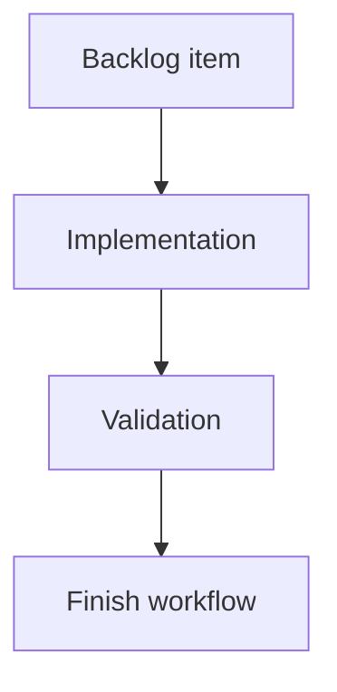

## task_208_add_new_project_onboarding_and_bootstrap_states_to_the_viewer - Add new project onboarding and bootstrap states to the viewer
> From version: 2.6.1
> Schema version: 1.0
> Status: Ready
> Understanding: 90%
> Confidence: 85%
> Progress: 0%
> Complexity: Medium
> Theme: Implementation delivery
> Reminder: Update status/understanding/confidence/progress and linked request/backlog references when you edit this doc.

# Definition of Done (DoD)
- [ ] The backlog scope is implemented.
- [ ] Acceptance criteria are covered.
- [ ] Validation passes.

# Backlog
- `item_400_add_new_project_onboarding_and_bootstrap_states_to_the_viewer`

# Acceptance criteria
- AC1: The viewer shows clear onboarding states when the selected project has no Logics corpus or incomplete Logics setup.
- AC2: The viewer can show missing Git as a normal project state and does not render Git-specific controls as if they work.
- AC3: Bootstrap/init actions are only shown when supported by capability state and require explicit user action.
- AC4: Mutating onboarding actions explain what will be created or changed before execution.
- AC5: Onboarding actions apply only to the active selected project.
- AC6: Progress, success, and failure states are visible after bootstrap/environment actions.
- AC7: Tests cover no-Logics, no-Git, missing runtime, failed bootstrap, successful bootstrap, and project-switch safety.

# Validation
- Run `python3 -m logics_manager lint --require-status`.
- Run `python3 -m logics_manager flow finish task task_208_add_new_project_onboarding_and_bootstrap_states_to_the_viewer.md` after implementation.

# Report
- Implementation complete.

# AI Context
- Summary: Implement add new project onboarding and bootstrap states to the viewer.
- Keywords: task, implementation, backlog, runtime, python
- Use when: You need a bounded implementation task for a backlog item.
- Skip when: The work is still at the request or backlog shaping stage.

# Links
- Request: `req_234_add_new_project_onboarding_and_bootstrap_states_to_the_viewer`
- Product brief(s): (none yet)
- Architecture decision(s): (none yet)
