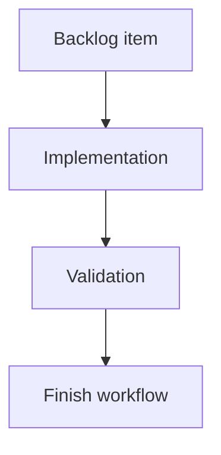

## task_209_gate_viewer_git_ci_cdx_and_runs_actions_by_project_availability - Gate viewer Git CI CDX and Runs actions by project availability
> From version: 2.6.1
> Schema version: 1.0
> Status: Ready
> Understanding: 90%
> Confidence: 85%
> Progress: 0%
> Complexity: Medium
> Theme: Implementation delivery
> Reminder: Update status/understanding/confidence/progress and linked request/backlog references when you edit this doc.

# Definition of Done (DoD)
- [ ] The backlog scope is implemented.
- [ ] Acceptance criteria are covered.
- [ ] Validation passes.

# Backlog
- `item_401_gate_viewer_git_ci_cdx_and_runs_actions_by_project_availability`

# Acceptance criteria
- AC1: Git controls are disabled, hidden, or replaced with a clear unavailable state when the selected project is not a Git repository.
- AC2: Git-specific refs such as branch, history, staged files, and diff preview are not shown as active content for non-Git projects.
- AC3: CI controls clearly handle unconfigured, private, unauthorized, unsupported, and unavailable CI states.
- AC4: CDX controls clearly handle missing CDX, unavailable CDX, and unsupported CDX project/runtime states.
- AC5: The CDX `Runs` view is disabled or marked unsupported when CDX run registry/status/report commands are not available.
- AC6: The viewer avoids automatic calls to endpoints for capabilities marked unavailable, except for explicit refresh/check actions.
- AC7: Tooltips, labels, or empty states explain why each unavailable action cannot run and what the operator can do next when applicable.
- AC8: Tests cover no Git, private/unavailable CI, missing CDX, old CDX without Runs, and recovery after capability refresh.

# Validation
- Run `python3 -m logics_manager lint --require-status`.
- Run `python3 -m logics_manager flow finish task task_209_gate_viewer_git_ci_cdx_and_runs_actions_by_project_availability.md` after implementation.

# Report
- Implementation complete.

# AI Context
- Summary: Implement gate viewer git ci cdx and runs actions by project availability.
- Keywords: task, implementation, backlog, runtime, python
- Use when: You need a bounded implementation task for a backlog item.
- Skip when: The work is still at the request or backlog shaping stage.

# Links
- Request: `req_235_gate_viewer_git_ci_cdx_and_runs_actions_by_project_availability`
- Product brief(s): (none yet)
- Architecture decision(s): (none yet)
