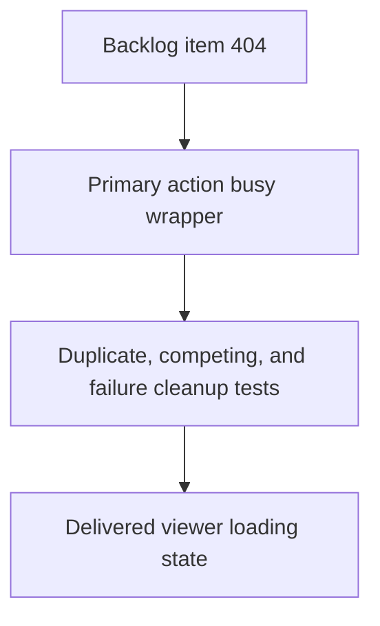

## task_212_block_concurrent_viewer_actions_and_show_loading_state - Block concurrent viewer actions and show loading state
> From version: 2.7.1
> Schema version: 1.0
> Status: Done
> Understanding: 91%
> Confidence: 86%
> Progress: 100%
> Complexity: Medium
> Theme: Implementation delivery
> Reminder: Update status/understanding/confidence/progress and linked request/backlog references when you edit this doc.

# Definition of Done (DoD)
- [x] The backlog scope is implemented.
- [x] Acceptance criteria are covered.
- [x] Validation passes.

# Backlog
- `item_404_block_concurrent_viewer_actions_and_show_loading_state`

# Acceptance criteria
- AC1: Starting a primary async viewer action marks that action as loading and shows visible feedback before the awaited work completes.
- AC2: While a primary async action is loading, competing primary async actions are disabled or ignored so double-clicks and rapid cross-action clicks do not start duplicate/conflicting requests.
- AC3: The busy state is always cleared after success or failure, and errors leave the viewer interactive again.
- AC4: Local-only interactions that do not fetch or replace active content remain usable while safe, or are explicitly documented if they are intentionally blocked.
- AC5: The loading feedback identifies either the active action or a generic viewer loading state so users can tell that the click was accepted.
- AC6: Tests cover duplicate-click prevention for at least one network-backed action and competing-action prevention between two primary actions.
- AC7: Tests cover error cleanup so a failed async action does not leave buttons disabled or the loader visible.
- AC8: Existing action-specific guards such as Git history reveal busy handling continue to work and are not replaced by a less precise global lock.

# Implementation plan
- Inventory primary async action handlers in `clients/viewer/browser-host.js`: refresh, Git, CI, CDX, Health, project switching, CDX runs/report actions, and request creation.
- Introduce a small busy-state wrapper that records the active action key, disables or ignores competing primary async actions, and always clears in `finally`.
- Add restrained loading UI: action-level loading class/text where practical and a generic viewer busy affordance for shared surfaces.
- Keep local-only interactions usable where safe, including already-rendered row reveal and simple client-side controls.
- Preserve existing narrow guards such as Git history reveal busy handling.
- Mirror browser-host and CSS changes into `logics_manager/viewer_assets/viewer`.
- Add browser-host tests for double-click prevention, cross-action blocking, visible loader state, and cleanup after a rejected fetch/action.

# Validation
- Run `npx vitest run tests/viewer.browser-host.test.ts`.
- Run `python3 -m logics_manager lint --require-status`.
- Run `python3 -m logics_manager flow finish task task_212_block_concurrent_viewer_actions_and_show_loading_state.md` after implementation.

# Report
- Implementation complete.
- Added a primary async action busy wrapper that disables competing network-backed viewer actions, exposes body busy attributes, and shows immediate meta feedback.
- Kept local-only interactions such as panel toggles, Git history reveal, and local filters outside the primary action lock.
- Validation: `npx vitest run tests/viewer.browser-host.test.ts` and `python3 -m logics_manager lint --require-status`.

# AI Context
- Summary: Add visible loading state and concurrency guards for primary async local viewer actions.
- Keywords: viewer busy state, async action guard, loading indicator, duplicate click prevention, error cleanup
- Use when: You need a bounded implementation task for a backlog item.
- Skip when: The work is still at the request or backlog shaping stage.

# Links
- Request: `req_238_block_concurrent_viewer_actions_and_show_loading_state`
- Product brief(s): (none yet)
- Architecture decision(s): (none yet)

# AC Traceability
- request-AC1 -> This task. Proof: planned task acceptance criterion covers: Starting a primary async viewer action marks that action as loading and shows visible feedback before the awaited work completes.
- request-AC2 -> This task. Proof: planned task acceptance criterion covers: While a primary async action is loading, competing primary async actions are disabled or ignored so double-clicks and rapid cross-action clicks do not start duplicate/conflicting requests.
- request-AC3 -> This task. Proof: planned task acceptance criterion covers: The busy state is always cleared after success or failure, and errors leave the viewer interactive again.
- request-AC4 -> This task. Proof: planned task acceptance criterion covers: Local-only interactions that do not fetch or replace active content remain usable while safe, or are explicitly documented if they are intentionally blocked.
- request-AC5 -> This task. Proof: planned task acceptance criterion covers: The loading feedback identifies either the active action or a generic viewer loading state so users can tell that the click was accepted.
- request-AC6 -> This task. Proof: planned task acceptance criterion covers: Tests cover duplicate-click prevention for at least one network-backed action and competing-action prevention between two primary actions.
- request-AC7 -> This task. Proof: planned task acceptance criterion covers: Tests cover error cleanup so a failed async action does not leave buttons disabled or the loader visible.
- request-AC8 -> This task. Proof: planned task acceptance criterion covers: Existing action-specific guards such as Git history reveal busy handling continue to work and are not replaced by a less precise global lock.
