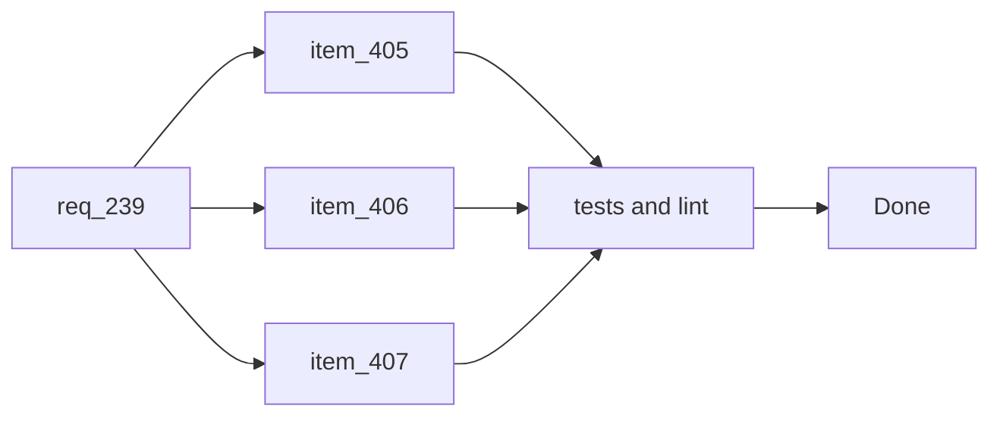

## task_213_orchestrate_guided_cdx_mission_launch_delivery - Orchestrate guided CDX mission launch delivery
> From version: 2.7.0
> Schema version: 1.0
> Status: Done
> Understanding: 90%
> Confidence: 85%
> Progress: 100%
> Complexity: Medium
> Theme: CDX run orchestration
> Reminder: Update status/understanding/confidence/progress and linked request/backlog references when you edit this doc.

# Context
- Deliver the guided CDX mission launch experience from the Logics viewer.
- This task covers three linked backlog slices: mission catalog/setup UI, constrained mission execution with usage reporting, and plan-first corpus preparation.
- Keep CDX execution constrained to known templates and keep deterministic Logics workflow mutations behind explicit operator confirmation.

# Plan
- [x] 1. Confirm existing CDX status/runs endpoints, viewer rendering patterns, and available CDX command surfaces.
- [x] 2. Add the guided mission catalog and setup UI in the CDX screen, including session, strength, scope, and preview states.
- [x] 3. Add constrained backend mission templates and execution endpoints with validation against arbitrary browser command input.
- [x] 4. Render run lifecycle, bounded output, failure states, and usage metadata including token counts when available.
- [x] 5. Implement `Prepare corpus ready for dev` as plan-first, then apply deterministic `logics-manager flow` commands only after confirmation.
- [x] 6. Add focused Python and browser-host tests for mission setup, command generation, guardrails, usage rendering, and corpus plan confirmation.
- [x] 7. Checkpoint the wave in a commit-ready state, validate it, and update the linked Logics docs.
- [x] GATE: do not close a wave or step until the relevant automated tests and quality checks have been run successfully.

# Backlog
- `item_405_define_guided_cdx_mission_catalog_and_setup_ui`
- `item_406_add_constrained_cdx_mission_execution_and_run_usage_reporting`
- `item_407_make_corpus_preparation_a_plan_first_cdx_and_logics_workflow`

# Definition of Done (DoD)
- [x] Code is implemented and reviewed.
- [x] Validation passes.
- [x] Linked docs are synchronized.

# AC Traceability
- request-AC1 -> This task. Proof: planned task step 2 adds the CDX screen launch entry point.
- request-AC2 -> This task. Proof: planned task step 2 defines the initial mission catalog.
- request-AC3 -> This task. Proof: planned task step 2 covers session and strength selection.
- request-AC4 -> This task. Proof: planned task step 2 covers repository, latest-release, and workflow-doc scopes.
- request-AC5 -> This task. Proof: planned task step 2 covers command/plan preview and warning states.
- request-AC6 -> This task. Proof: planned task step 3 constrains execution to known backend templates.
- request-AC7 -> This task. Proof: planned task step 4 renders status, output, and usage metadata.
- request-AC8 -> This task. Proof: planned task step 5 keeps corpus preparation plan-first with confirmation.
- request-AC9 -> This task. Proof: planned task steps 2, 4, and 5 cover missing capability, launch failure, and blocked-plan states.
- request-AC10 -> This task. Proof: planned task step 6 covers the requested automated tests.
- backlog-item_405-AC1..AC7 -> This task. Proof: planned task step 2 covers the guided mission catalog and setup UI.
- backlog-item_406-AC1..AC6 -> This task. Proof: planned task steps 3 and 4 cover constrained execution and usage reporting.
- backlog-item_407-AC1..AC6 -> This task. Proof: planned task step 5 covers plan-first corpus preparation and deterministic application.

# Validation
- Run `python3 -m logics_manager lint --require-status`.
- Run `python3 -m pytest tests/python/test_logics_manager_cli.py -q -k "cdx"`.
- Run `npx vitest run tests/viewer.browser-host.test.ts`.
- Run the task-specific automated tests added for the backend mission planner/executor.

# Report
- Implemented constrained backend endpoints for CDX mission preview, execution, and plan application.
- Added the CDX `Missions` viewer tab with mission selection, session selection, strength controls, command preview, run output, token usage rendering, and corpus plan apply.
- Added Python coverage for mission command generation, guardrails, usage extraction, and allowlisted Logics flow application.
- Added browser-host coverage for the guided mission setup, preview, launch, usage display, and corpus apply path.
- Validation:
  - `python -m pytest tests/python/test_logics_manager_cli.py -q -k cdx`
  - `npx vitest run tests/viewer.browser-host.test.ts`

# AI Context
- Summary: Implement guided CDX mission launch from the Logics viewer, including setup UI, constrained execution, run usage reporting, and plan-first corpus preparation.
- Keywords: CDX missions, guided run, session selection, execution strength, token usage, corpus preparation, plan-first workflow
- Use when: You need a bounded implementation task for a backlog item.
- Skip when: The work is still at the request or backlog shaping stage.

# Links
- Request: `req_239_launch_guided_cdx_missions_from_the_logics_viewer`
- Product brief(s): (none yet)
- Architecture decision(s): (none yet)
