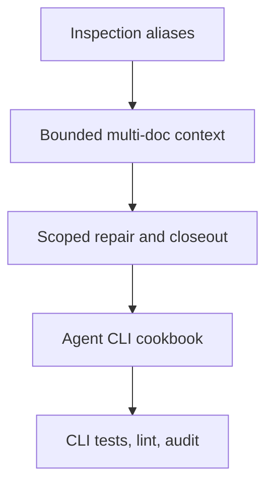

## task_214_implement_agent_friendly_logics_cli_workflow_improvements - Implement agent-friendly Logics CLI workflow improvements
> From version: 2.7.0
> Schema version: 1.0
> Status: Done
> Understanding: 91%
> Confidence: 85%
> Progress: 100%
> Complexity: High
> Theme: Agent workflow ergonomics
> Reminder: Update status/understanding/confidence/progress and linked request/backlog references when you edit this doc.

# Context
- Implement the coherent first delivery wave for `req_240_make_logics_manager_cli_agent_friendly_for_workflow_inspection_and_closeout`.
- The task spans four linked backlog items because the CLI behavior, scoped repair behavior, and cookbook examples should be delivered together to avoid documenting commands that do not exist or shipping commands without guidance.

# Plan
- [x] 1. Confirm exact current command parser surfaces for `flow`, `sync read-doc`, `sync context-pack`, Mermaid refresh, and closeout/repair.
- [x] 2. Add discoverable inspection aliases and helpful unsupported-command suggestions.
- [x] 3. Make bounded read/context commands agent-friendly while preserving existing machine-readable modes.
- [x] 4. Add scoped Mermaid refresh and deterministic closeout repair behavior with clear reporting.
- [x] 5. Add or update agent CLI cookbook examples and align help text.
- [x] 6. Add focused Python tests for command behavior, scoped changes, and closeout repairs.
- [x] 7. Validate with CLI tests, `logics-manager lint`, and `logics-manager audit`, then update linked workflow docs.
- [x] GATE: do not close a wave or step until the relevant automated tests and quality checks have been run successfully.

# Backlog
- `item_408_add_discoverable_workflow_inspection_aliases`
- `item_409_make_bounded_document_context_commands_agent_friendly`
- `item_410_scope_mermaid_signature_refresh_and_deterministic_closeout_repairs`
- `item_411_document_and_clarify_agent_cli_workflows`

# Definition of Done (DoD)
- [x] CLI behavior is implemented and reviewed.
- [x] Documentation/cookbook updates are synchronized with implemented syntax.
- [x] Validation passes.
- [x] Linked docs are synchronized.

# AC Traceability
- request-AC1 -> item_408 / this task. Proof: implement workflow inspection alias and command guidance.
- request-AC2 -> item_409 / this task. Proof: implement useful bounded read-doc and multi-ref context behavior.
- request-AC3 -> item_410 / this task. Proof: implement scoped Mermaid refresh.
- request-AC4 -> item_410 / this task. Proof: implement deterministic closeout repair/reporting.
- request-AC5 -> item_408 and item_411 / this task. Proof: improve unsupported-command and help guidance.
- request-AC6 -> item_411 / this task. Proof: add agent CLI cookbook examples.
- request-AC7 -> all linked items / this task. Proof: add focused command tests.

# Validation
- Run `python3 -m logics_manager lint --require-status`.
- Run `logics-manager audit`.
- Run the task-specific automated tests.
- command: `python3 -m pytest tests/python/test_logics_manager_cli.py -q` | result: passed | date: 2026-06-12 | note: 221 passed in 7.26s
- Finish workflow executed on 2026-06-12.
- Linked backlog/request close verification passed.

# Report
- Implementation complete.
- Finished on 2026-06-12.
- Linked backlog item(s): `item_408_add_discoverable_workflow_inspection_aliases`, `item_409_make_bounded_document_context_commands_agent_friendly`, `item_410_scope_mermaid_signature_refresh_and_deterministic_closeout_repairs`, `item_411_document_and_clarify_agent_cli_workflows`
- Related request(s): `req_240_make_logics_manager_cli_agent_friendly_for_workflow_inspection_and_closeout`

# AI Context
- Summary: Implement the first delivery wave for agent-friendly `logics-manager` workflow inspection, bounded context, scoped repair/closeout, and cookbook guidance.
- Keywords: flow show, read-doc, context-pack, mermaid signatures, closeout repair, agent cookbook, CLI tests
- Use when: Implementing `logics-manager` CLI ergonomics for agent workflow operations.
- Skip when: Work is limited to creating the planning docs only.

# Links
- Request: `req_240_make_logics_manager_cli_agent_friendly_for_workflow_inspection_and_closeout`
- Product brief(s): (none yet)
- Architecture decision(s): (none yet)
