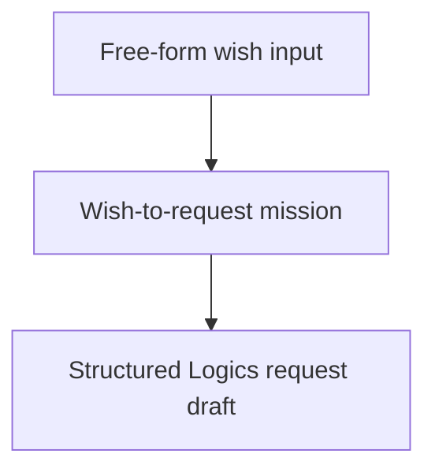

## task_215_add_wish_to_request_guided_cdx_mission - Add wish-to-request guided CDX mission
> From version: 2.7.0
> Schema version: 1.0
> Status: Ready
> Understanding: 90%
> Confidence: 85%
> Progress: 0%
> Complexity: Medium
> Theme: Implementation delivery
> Reminder: Update status/understanding/confidence/progress and linked request/backlog references when you edit this doc.

# Definition of Done (DoD)
- [ ] The backlog scope is implemented.
- [ ] Acceptance criteria are covered.
- [ ] Validation passes.

# Backlog
- `item_412_add_wish_to_request_guided_cdx_mission`

# Acceptance criteria
- AC1: The viewer exposes a `wish-to-request` guided mission with a free-form input for the user's wish or intent.
- AC2: The `wish-to-request` mission produces a structured Logics request draft with needs, context, acceptance criteria, DoR state, references when available, and clear questions/open assumptions when the wish is under-specified.
- AC3: The `wish-to-request` mission remains read/write bounded to request creation or preview and does not promote backlog/tasks automatically unless explicitly added in a future request.
- AC4: Backend mission payloads are path-safe, command-bounded, and auditable; any generated request file is reported back to the viewer with ID/path.
- AC5: Existing guided missions continue to work and remain visible after adding the new mission.

# AC Traceability
- request-AC1 -> This task. Proof: AC1 covers exposing the `wish-to-request` guided mission with free-form input.
- request-AC2 -> This task. Proof: AC2 covers producing a structured Logics request draft with assumptions and questions.
- request-AC3 -> This task. Proof: AC3 covers keeping the mission bounded to request creation or preview.
- request-AC7 -> This task. Proof: AC4 covers path-safe, command-bounded backend payloads and generated request reporting.
- request-AC8 -> This task. Proof: validation will cover catalog rendering, wish input payload handling, and request draft generation path.
- request-AC9 -> This task. Proof: AC5 covers preserving existing guided missions.

# Validation
- Run `python3 -m logics_manager lint --require-status`.
- Run `python3 -m logics_manager flow finish task task_215_add_wish_to_request_guided_cdx_mission.md` after implementation.

# Report
- Not started; task is ready for implementation.

# AI Context
- Summary: Implement add wish-to-request guided cdx mission.
- Keywords: task, implementation, backlog, runtime, python
- Use when: You need a bounded implementation task for a backlog item.
- Skip when: The work is still at the request or backlog shaping stage.

# Links
- Request: `req_241_add_wish_to_request_and_guided_pre_release_cdx_missions`
- Product brief(s): (none yet)
- Architecture decision(s): (none yet)
