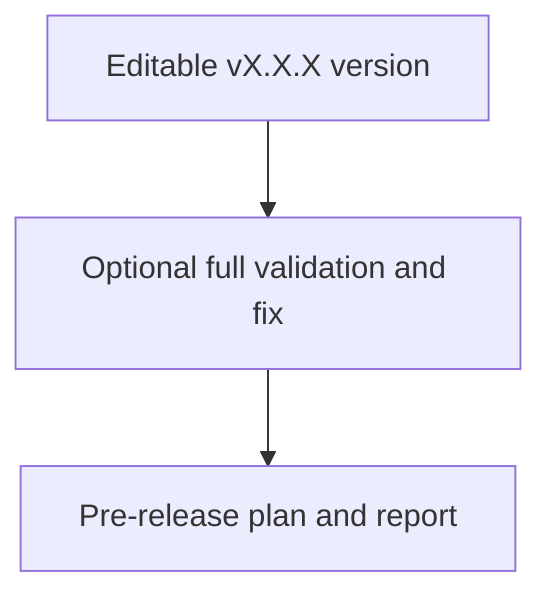

## task_216_add_guarded_pre_release_guided_cdx_mission - Add guarded pre-release guided CDX mission
> From version: 2.7.0
> Schema version: 1.0
> Status: Done
> Understanding: 90%
> Confidence: 85%
> Progress: 100%
> Complexity: Medium
> Theme: Implementation delivery
> Reminder: Update status/understanding/confidence/progress and linked request/backlog references when you edit this doc.

# Definition of Done (DoD)
- [x] The backlog scope is implemented.
- [x] Acceptance criteria are covered.
- [x] Validation passes.

# Backlog
- `item_413_add_guarded_pre_release_guided_cdx_mission`

# Acceptance criteria
- AC1: The viewer exposes a guarded `pre-release` guided mission with an editable version field that validates `vX.X.X`-style semantic versions and rejects empty or malformed values.
- AC2: The `pre-release` mission includes an explicit checkbox for running full validation and fixing before pre-release; the UI and payload make the selected validation behavior unambiguous.
- AC3: The initial `pre-release` scope generates a pre-release plan/report, validation evidence, and actionable fixes or generated workflow docs when problems are found, without creating tags, publishing releases, pushing branches, or changing package versions.
- AC4: Backend mission payloads are path-safe, command-bounded, and auditable; any generated files are reported back to the viewer with IDs/paths.
- AC5: Existing guided missions continue to work and remain visible after adding the new mission.

# AC Traceability
- request-AC4 -> This task. Proof: AC1 covers exposing the guarded pre-release mission and editable semantic version field.
- request-AC5 -> This task. Proof: AC2 covers the explicit full-validation-and-fix checkbox and payload behavior.
- request-AC6 -> This task. Proof: AC3 covers pre-release report generation and no tag/publish/push/version mutation guarantees.
- request-AC7 -> This task. Proof: AC4 covers path-safe, command-bounded backend payloads and generated file reporting.
- request-AC8 -> This task. Proof: validation will cover version validation, checkbox payload handling, report generation, and no-publish guarantees.
- request-AC9 -> This task. Proof: AC5 covers preserving existing guided missions.

# Validation
- Run `python3 -m logics_manager lint --require-status`.
- Run `python3 -m logics_manager flow finish task task_216_add_guarded_pre_release_guided_cdx_mission.md` after implementation.
- python3 -m pytest tests/python/test_logics_manager_cli.py -q passed: 223 passed in 6.77s; npm test -- tests/viewer.browser-host.test.ts passed: 59 passed in 1.36s
- Finish workflow executed on 2026-06-12.
- Linked backlog/request close verification passed.

# Report
- Implemented the guarded `pre-release` guided CDX mission with semantic version validation, explicit full-validation checkbox payload, read-only pre-release report prompting, no-publish safeguards, and regression coverage.
- Finished on 2026-06-12.
- Linked backlog item(s): `item_413_add_guarded_pre_release_guided_cdx_mission`
- Related request(s): `req_241_add_wish_to_request_and_guided_pre_release_cdx_missions`

# AI Context
- Summary: Implement add guarded pre-release guided cdx mission.
- Keywords: task, implementation, backlog, runtime, python
- Use when: You need a bounded implementation task for a backlog item.
- Skip when: The work is still at the request or backlog shaping stage.

# Links
- Request: `req_241_add_wish_to_request_and_guided_pre_release_cdx_missions`
- Product brief(s): (none yet)
- Architecture decision(s): (none yet)
