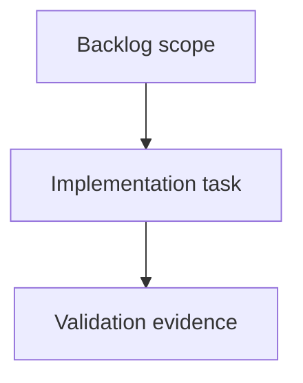

## task_217_address_full_audit_validation_and_documentation_drift - Address full audit validation and documentation drift
> From version: 2.8.0
> Schema version: 1.0
> Status: Ready
> Understanding: 90%
> Confidence: 85%
> Progress: 0%
> Complexity: Medium
> Theme: Implementation delivery
> Reminder: Update status/understanding/confidence/progress and linked request/backlog references when you edit this doc.

# Definition of Done (DoD)
- [ ] The backlog scope is implemented.
- [ ] Acceptance criteria are covered.
- [ ] Validation passes.

# Backlog
- `item_414_address_full_audit_validation_and_documentation_drift`

# Acceptance criteria
- AC1: Failed audit payloads produce nonzero process exits across `logics-manager audit`, `python -m logics_manager audit`, npm wrapper invocation, and relevant npm scripts, with tests covering JSON and text modes.
- AC2: Strict governance/token-hygiene debt is either reduced or explicitly separated from release-blocking standard audit gates so operators can see when strict mode is advisory versus mandatory.
- AC3: README and release-facing badges/docs are refreshed from current repository metadata or validated by a drift check so version/test-tooling badges do not lag releases.
- AC4: Dependency audit and package validation scripts document or implement local-cache and offline behavior clearly, distinguishing unreachable registry results from clean advisory status.
- AC5: Viewer smoke skips are visible in validation summaries and CI expectations, with at least one non-skipped CI lane or documented fallback proving the local viewer shell/API path.
- AC6: High-risk oversized runtime/viewer/test files have an actionable decomposition and coverage plan focused on correctness-critical surfaces rather than cosmetic refactors.
- AC7: Follow-up validation evidence includes standard audit/lint, strict audit exit behavior, npm package dry run, dependency audit outcome, and targeted tests for the changed validation contracts.

# AC Traceability
- request-AC1 -> This task. Proof: Planned validation hardening covers failed audit process exits for CLI, module, npm wrapper, and npm scripts in text and JSON modes.
- request-AC2 -> This task. Proof: Planned governance work separates strict token-hygiene debt from release-blocking standard audit behavior.
- request-AC3 -> This task. Proof: Planned documentation drift work refreshes or validates release-facing README metadata.
- request-AC4 -> This task. Proof: Planned dependency/package validation work covers local cache and offline registry behavior.
- request-AC5 -> This task. Proof: Planned viewer smoke work makes skipped local socket runs visible and preserves a non-skipped CI or fallback proof path.
- request-AC6 -> This task. Proof: Planned maintenance work targets decomposition and coverage for oversized correctness-critical files.
- request-AC7 -> This task. Proof: Planned closeout evidence includes audit/lint, strict audit exit behavior, npm package dry run, dependency audit outcome, and targeted validation tests.

# Validation
- Run `python3 -m logics_manager lint --require-status`.
- Run `python3 -m logics_manager flow finish task task_217_address_full_audit_validation_and_documentation_drift.md` after implementation.

# Report
- Implementation complete.

# AI Context
- Summary: Implement address full audit validation and documentation drift.
- Keywords: task, implementation, backlog, runtime, python
- Use when: You need a bounded implementation task for a backlog item.
- Skip when: The work is still at the request or backlog shaping stage.

# Links
- Request: `req_242_address_full_audit_validation_and_documentation_drift`
- Product brief(s): (none yet)
- Architecture decision(s): (none yet)
