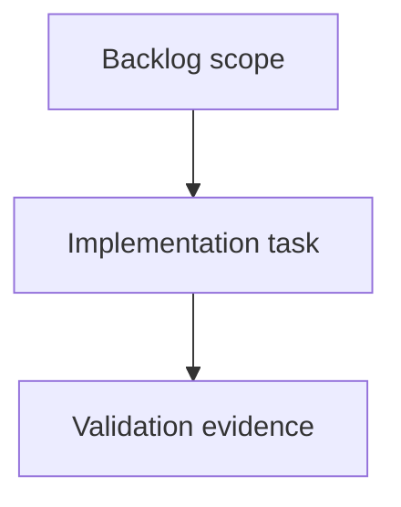

## task_217_address_full_audit_validation_and_documentation_drift - Address full audit validation and documentation drift
> From version: 2.8.0
> Schema version: 1.0
> Status: Done
> Understanding: 100%
> Confidence: 95%
> Progress: 100%
> Complexity: Medium
> Theme: Implementation delivery
> Reminder: Update status/understanding/confidence/progress and linked request/backlog references when you edit this doc.

# Definition of Done (DoD)
- [x] The backlog scope is implemented.
- [x] Acceptance criteria are covered.
- [x] Validation passes.

# Backlog
- `item_414_address_full_audit_validation_and_documentation_drift`

# Acceptance criteria
- AC1: Failed audit payloads produce nonzero process exits across `logics-manager audit`, `python -m logics_manager audit`, npm wrapper invocation, and relevant npm scripts, with tests covering JSON and text modes.
- AC2: Strict governance/token-hygiene debt is either reduced or explicitly separated from release-blocking standard audit gates so operators can see when strict mode is advisory versus mandatory.
- AC3: README and release-facing badges/docs are refreshed from current repository metadata or validated by a drift check so version/test-tooling badges do not lag releases.
- AC4: Dependency audit and package validation scripts document or implement local-cache and offline behavior clearly, distinguishing unreachable registry results from clean advisory status.
- AC5: Viewer smoke skips are visible in validation summaries and CI expectations, with at least one non-skipped CI lane or documented fallback proving the local viewer shell/API path.
- AC6: High-risk oversized runtime/viewer/test files have an actionable decomposition and coverage plan focused on correctness-critical surfaces rather than cosmetic refactors.
- AC7: Follow-up validation evidence includes standard audit/lint, strict audit exit behavior, npm package dry run, dependency audit outcome, and targeted tests for the changed validation contracts.

# AC Traceability
- request-AC1 -> This task. Proof: Commit `43a1a40` makes the native audit command return nonzero when `payload.ok` is false and adds text/JSON regression coverage for `main()`, `python -m logics_manager`, the npm wrapper, and `npm run audit:logics:strict`.
- request-AC2 -> This task. Proof: README validation guidance now distinguishes standard active-work audit failures from strict governance release cleanup, and `npm run audit:logics:strict` exits 1 on the current token-hygiene debt while `npm run audit:logics` stays green.
- request-AC3 -> This task. Proof: Commit `6d809ff` refreshes README version/test badges and adds `npm run docs:check` plus the `ci:check` step that validates badge metadata against `VERSION` and `package.json`.
- request-AC4 -> This task. Proof: `scripts/check-npm-audit.mjs` now reports registry unavailability as an explicit failed audit state, and README documents npm registry dependency versus local-only package validation.
- request-AC5 -> This task. Proof: README documents `artifacts/local-viewer-smoke/summary.json`, skip semantics, CI fallback coverage, and the current `npm run test:viewer-smoke` run exercised Chrome on desktop, tablet, and mobile.
- request-AC6 -> This task. Proof: README points oversized runtime/viewer/test decomposition work at `adr_020` and states the correctness-first coverage rule for future extractions.
- request-AC7 -> This task. Proof: Validation evidence below covers standard lint/audit, strict audit exit behavior, npm package dry run, dependency audit, viewer smoke, and targeted Python/Vitest tests.

# Validation
- `npm run audit:logics` -> passed; standard workflow audit inspected 872 docs with 0 blocking issues, 0 warnings, and lint passed.
- `python3 -m logics_manager audit --governance-profile strict --format json` -> exited 1 as expected with `ok: false`, `can_continue: false`, and 493 token-hygiene blocking findings.
- `npm run audit:logics:strict` -> exited 1 as expected; strict audit failed before lint because the current corpus still has 493 token-hygiene findings.
- `npm run docs:check` -> passed; README badge metadata matches `VERSION` and `package.json`.
- `npm run audit:ci` -> passed; npm advisory policy returned `Audit policy: OK`.
- `npm pack --dry-run --json` -> passed for `@grifhinz/logics-manager@2.8.0`.
- `npm run package:ci` -> passed; VSIX dry-run package produced 87 files, 2.9 MB.
- `npm run test:viewer-smoke` -> passed; `artifacts/local-viewer-smoke/summary.json` reports Chrome mode across desktop, tablet, and mobile.
- `python3 -m pytest tests/python/test_logics_manager_cli.py -q -k 'audit_returns_nonzero or module_audit_subprocess_returns_nonzero or strict_audit_blocks_companion'` -> passed, 5 tests.
- `npm test -- tests/logicsManagerNpmWrapper.test.ts` -> passed, 8 tests.
- `python3 -m pytest tests/python/test_logics_manager_cli.py -q` -> one unrelated local viewer socket/bootstrap read failed with `ConnectionResetError`; targeted audit tests passed and the dedicated viewer smoke passed afterward.

# Report
- Implemented audit exit propagation for the top-level CLI, removing the unconditional successful return for failed audit payloads.
- Added regression coverage for native CLI, module invocation, npm wrapper invocation, and strict npm script behavior across text and JSON modes.
- Refreshed release-facing README badges and added an automated metadata drift check to the CI-equivalent validation path.
- Clarified standard versus strict governance expectations, npm audit registry/offline behavior, viewer smoke skip/fallback evidence, and oversized module decomposition guidance.

# AI Context
- Summary: Implement address full audit validation and documentation drift.
- Keywords: task, implementation, backlog, runtime, python
- Use when: You need a bounded implementation task for a backlog item.
- Skip when: The work is still at the request or backlog shaping stage.

# Links
- Request: `req_242_address_full_audit_validation_and_documentation_drift`
- Product brief(s): (none yet)
- Architecture decision(s): (none yet)
