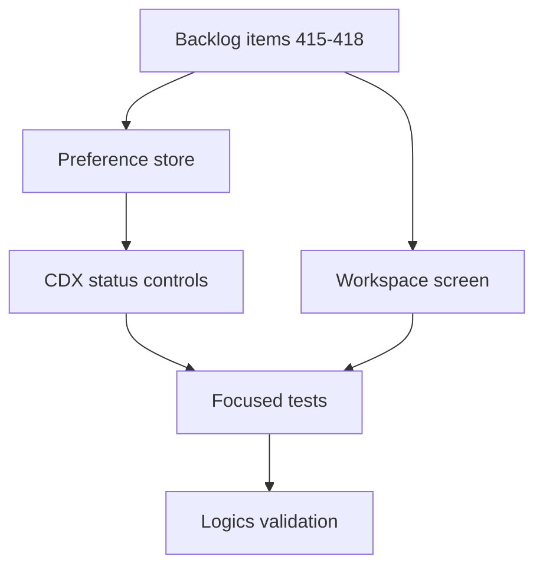

## task_218_implement_persisted_viewer_preferences_cdx_status_controls_and_workspace_file_view - Implement persisted viewer preferences CDX status controls and workspace file view
> From version: 2.8.0
> Schema version: 1.0
> Status: Ready
> Understanding: 95%
> Confidence: 85%
> Progress: 0%
> Complexity: High
> Theme: Viewer operator workflow
> Reminder: Update status/understanding/confidence/progress and linked request/backlog references when you edit this doc.

# Context
- Implement the viewer workflow improvements described by `req_243`.
- Treat this as one delivery task with four coordinated backlog slices because the preference store is shared by the refresh, column, and provider controls.
- Keep the Workspace screen read-only and capability-gated.

# Plan
- [ ] 1. Add a versioned viewer preference module and wire auto-refresh initialization/writeback.
- [ ] 2. Add CDX status column settings with persisted visibility defaults.
- [ ] 3. Add CDX status provider filtering with persisted all-provider semantics.
- [ ] 4. Add Workspace navigation, bounded workspace tree/read endpoints, and the tree plus preview UI.
- [ ] 5. Add focused tests for preference precedence, status configuration, provider filtering, workspace gating, and safe file preview behavior.
- [ ] 6. Run targeted viewer tests and Logics validation before closeout.
- [ ] GATE: do not close this task until the linked backlog acceptance criteria and validation evidence are updated.

# Backlog
- `item_415_persist_viewer_preferences_and_refresh_settings`
- `item_416_add_configurable_cdx_status_columns`
- `item_417_add_persisted_provider_filters_to_cdx_status`
- `item_418_add_workspace_file_explorer_view_to_the_viewer`

# Definition of Done (DoD)
- [ ] Versioned viewer preferences persist supported user choices and handle malformed stored data safely.
- [ ] Auto-refresh respects CLI override, stored preference, and default precedence.
- [ ] CDX status column visibility and provider filters are configurable from icon menus and persisted.
- [ ] Workspace file view is available only when capability is present and remains root-bounded/read-only.
- [ ] Automated tests cover the linked backlog acceptance criteria.
- [ ] Logics lint/audit pass after implementation docs are updated.

# Acceptance criteria
- AC1: The implementation satisfies `item_415` AC1-AC6 for persisted viewer preferences and refresh settings.
- AC2: The implementation satisfies `item_416` AC1-AC7 for configurable CDX status columns.
- AC3: The implementation satisfies `item_417` AC1-AC7 for persisted CDX provider filters.
- AC4: The implementation satisfies `item_418` AC1-AC9 for the Workspace file explorer view.
- AC5: Shared preference storage remains versioned and has a clear migration/fallback path.
- AC6: UI controls are compact, accessible icon buttons with menus that do not disrupt table layout.
- AC7: Validation evidence lists the targeted tests run and the Logics lint/audit status.

# Validation
- Run targeted viewer/unit tests for changed files, expected candidates:
  - `rtk npm test -- tests/viewer.browser-host.test.ts`
  - `rtk npm test -- tests/webview.harness-details-and-filters.test.ts`
  - additional focused tests added for workspace tree/preview behavior
- Run `rtk logics-manager lint --require-status`.
- Run `rtk logics-manager audit --group-by-doc`.

# Report
- Implementation pending.

# AI Context
- Summary: Implement persisted local viewer preferences, CDX status column/provider controls, and a read-only Workspace file view.
- Keywords: implementation-task, viewer-preferences, cdx-status, provider-filter, workspace-tree, file-preview, root-bounded
- Use when: Implementing the coordinated viewer delivery across backlog items 415-418.
- Skip when: The work is only grooming the request/backlog docs or unrelated viewer polish.

# Links
- Request: `req_243_persist_viewer_preferences_and_add_configurable_cdx_status_and_workspace_views`
- Product brief(s): (none yet)
- Architecture decision(s): (none yet)

# AC Traceability
- request-AC1 -> This task. Proof: AC1 and AC5 require versioned preference persistence.
- request-AC2 -> This task. Proof: AC1 covers refresh precedence and writeback.
- request-AC3 -> This task. Proof: AC2 covers the CDX status settings button and menu.
- request-AC4 -> This task. Proof: AC2 covers persisted column defaults, including `block` and `CR`.
- request-AC5 -> This task. Proof: AC3 covers the provider-filter button and menu.
- request-AC6 -> This task. Proof: AC3 covers persisted all-provider semantics.
- request-AC7 -> This task. Proof: AC4 covers Workspace navigation and capability gating.
- request-AC8 -> This task. Proof: AC4 covers tree and preview layout.
- request-AC9 -> This task. Proof: AC4 covers root-bounded read safety and preview fallbacks.
- request-AC10 -> This task. Proof: AC7 requires targeted validation evidence.
- backlog-item_415-AC1..AC6 -> This task. Proof: AC1 delegates to the preference backlog acceptance criteria.
- backlog-item_416-AC1..AC7 -> This task. Proof: AC2 delegates to the column configuration backlog acceptance criteria.
- backlog-item_417-AC1..AC7 -> This task. Proof: AC3 delegates to the provider filter backlog acceptance criteria.
- backlog-item_418-AC1..AC9 -> This task. Proof: AC4 delegates to the workspace explorer backlog acceptance criteria.
