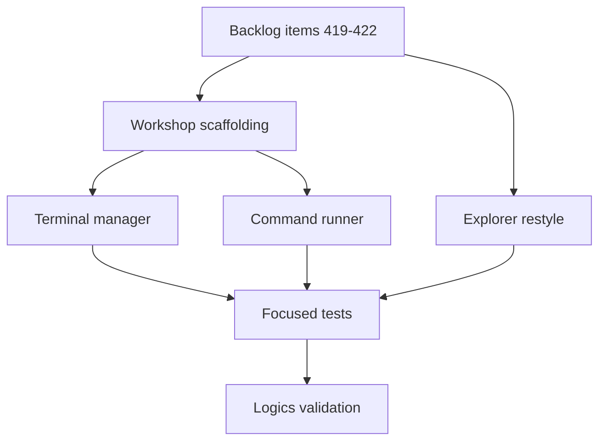

## task_219_implement_explorer_restyle_and_workshop_screen_with_terminals_and_command_runner - Implement Explorer restyle and Workshop screen with terminals and command runner
> From version: 2.8.1
> Schema version: 1.0
> Status: Ready
> Understanding: 75%
> Confidence: 65%
> Progress: 0%
> Complexity: High
> Theme: Viewer operator workflow
> Reminder: Update status/understanding/confidence/progress and linked request/backlog references when you edit this doc.

# Context
- Implement the viewer workshop and explorer polish described by `req_244`.
- Treat this as one delivery task with four coordinated backlog slices: the Explorer restyle, the Workshop navigation scaffolding, the terminal manager, and the command runner.
- The slices share the viewer topbar, the versioned preferences payload, and (for terminals and commands) the spawn/transport plumbing.
- An ADR must be authored before the terminal slice lands to record the transport choice (WebSocket vs SSE+POST), the PTY library, and the terminal emulator/bundling approach.

# Plan
- [ ] 1. Restyle the Workspace Explorer screen: icon set, breadcrumb, hover/focus/selected states, density parity with Git/CDX, empty/unavailable states.
- [ ] 2. Add the Workshop topbar entry between Explorer and Git, the two-tab Terminals/Commands layout, capability gating, and persistent active-tab preference.
- [ ] 3. Author the architecture decision for the terminal transport, PTY library, and terminal emulator/bundling.
- [ ] 4. Add the backend PTY manager and the new transport (WebSocket preferred, SSE+POST fallback), feature-gated with a clean unavailable state.
- [ ] 5. Wire the frontend terminal emulator into the Terminals sub-screen with multi-session lifecycle, ANSI/copy/paste/resize, and buffer retention across sub-tab switches.
- [ ] 6. Add the CDX and handoff launchers that open a new Workshop terminal pre-running the canonical mission/handoff metadata.
- [ ] 7. Add backend entry-point discovery for `package.json` `scripts` and `pyproject.toml` project/poetry scripts.
- [ ] 8. Add backend execution with stdout/stderr streaming, stop support, and exit-code reporting, sandboxed to the workspace root.
- [ ] 9. Wire the Commands sub-screen to the discovery and execution endpoints with grouped lists, run/stop buttons, and per-entry log panels.
- [ ] 10. Add focused tests for the Explorer restyle hooks, the Workshop navigation/persistence, the terminal session lifecycle and sandbox, the command discovery, and the command run/stop lifecycle.
- [ ] 11. Run targeted viewer tests, Logics lint, and Logics audit before closeout.
- [ ] GATE: do not close this task until the linked backlog acceptance criteria and validation evidence are updated, and the ADR for the terminal transport is linked.

# Backlog
- `item_419_restyle_the_workspace_explorer_screen`
- `item_420_add_workshop_topbar_entry_with_terminal_and_command_sub_screens`
- `item_421_add_in_app_terminal_manager_with_pty_transport_and_cdx_handoff_launchers`
- `item_422_add_command_runner_driven_by_package_json_and_pyproject_entry_points`

# Definition of Done (DoD)
- [ ] Workspace Explorer screen reaches visual parity with Git/CDX and ships the new icon set, breadcrumb, and row states.
- [ ] Workshop topbar entry is added between Explorer and Git, with Terminals and Commands sub-tabs and persistent active-tab state.
- [ ] The Workshop terminal manager runs PTY-backed sessions through the chosen transport with multi-session lifecycle, ANSI/copy/paste/resize, and workspace-root sandboxing.
- [ ] CDX and handoff launchers open a new Workshop terminal that reuses the canonical mission/handoff metadata.
- [ ] The Workshop command runner discovers `package.json` and `pyproject.toml` entry points and runs them with streamed logs, exit-code reporting, and stop support, all sandboxed to the workspace root.
- [ ] An ADR documents the transport, PTY library, and terminal emulator decisions and is linked from `item_421`.
- [ ] Automated tests cover the linked backlog acceptance criteria.
- [ ] Logics lint and audit pass after implementation docs are updated.

# Acceptance criteria
- AC1: The implementation satisfies `item_419` AC1-AC7 for the Workspace Explorer restyle.
- AC2: The implementation satisfies `item_420` AC1-AC7 for the Workshop topbar entry and sub-tab persistence.
- AC3: The implementation satisfies `item_421` AC1-AC10 for the in-app terminal manager and CDX/handoff launchers.
- AC4: The implementation satisfies `item_422` AC1-AC9 for the command runner driven by package.json and pyproject entry points.
- AC5: The terminal and command runtimes share a single feature-gated backend transport with a clean unavailable fallback.
- AC6: An ADR records the transport choice, PTY library, and terminal emulator/bundling approach and is linked from `item_421`.
- AC7: All spawned PTYs and subprocesses are bounded to the selected workspace root and refused when no workspace root is available.
- AC8: Validation evidence lists the targeted tests run and the Logics lint/audit status.

# Validation
- (pending) `rtk npm test -- tests/viewer.browser-host.test.ts`
- (pending) `rtk npm test -- tests/webview.harness-details-and-filters.test.ts`
- (pending) `rtk python3 -m pytest tests/python/test_logics_manager_cli.py -k 'workspace or workshop or terminal or command_runner'`
- (pending) `rtk logics-manager lint --require-status`
- (pending) `rtk logics-manager audit --group-by-doc`

# Report
- (pending)

# AC Traceability
- request-AC1 -> This task. Evidence needed: The Workspace/Explorer screen is restyled with file-type icons, consistent spacing, hover and focus states, a breadcrumb of the current path, and a clearly indicated selected item, reaching visual parity with the Git and CDX screens. Proof: pending — confirm via the Validation section once the linked backlog AC tests land.
- request-AC2 -> This task. Evidence needed: A new Workshop button is added to the viewer topbar, positioned between Explorer and Git, and is gated on workspace capability availability in the same way as the existing Explorer/Git/CI/CDX buttons. Proof: pending — confirm via the Validation section once the linked backlog AC tests land.
- request-AC3 -> This task. Evidence needed: The Workshop screen renders a two-tab layout with `Terminals` and `Commands` sub-screens, and the active sub-screen is remembered through the viewer preferences payload across restarts. Proof: pending — confirm via the Validation section once the linked backlog AC tests land.
- request-AC4 -> This task. Evidence needed: The Terminals sub-screen supports creating, renaming, switching between, and closing multiple terminal sessions, with the session list persistent within a viewer session and surviving sub-screen switches. Proof: pending — confirm via the Validation section once the linked backlog AC tests land.
- request-AC5 -> This task. Evidence needed: Each terminal session is backed by a real PTY on the backend and rendered with a maintained terminal emulator on the frontend (xterm.js or equivalent), supports interactive input, ANSI colors, terminal resize on container resize, and copy/paste. Proof: pending — confirm via the Validation section once the linked backlog AC tests land.
- request-AC6 -> This task. Evidence needed: A first-class affordance launches a CDX session or a handoff command directly inside a new Workshop terminal, reusing the existing CDX mission and handoff metadata instead of duplicating it. Proof: pending — confirm via the Validation section once the linked backlog AC tests land.
- request-AC7 -> This task. Evidence needed: The Commands sub-screen discovers and lists executable entry points from at least `package.json` `scripts` and `pyproject.toml` (project/poetry scripts), grouped by source, with a clear label, the underlying command line, and a run/stop button per entry. Proof: pending — confirm via the Validation section once the linked backlog AC tests land.
- request-AC8 -> This task. Evidence needed: Running a command from the Commands sub-screen streams stdout and stderr in real time into a log panel, exposes the exit code on completion, and allows stopping a running command without killing the viewer process. Proof: pending — confirm via the Validation section once the linked backlog AC tests land.
- request-AC9 -> This task. Evidence needed: All Workshop subprocess execution is bounded to the selected workspace root, refuses to spawn outside it, and gracefully degrades (with a clear empty state) when the project exposes no workspace, no scripts, or no terminal capability. Proof: pending — confirm via the Validation section once the linked backlog AC tests land.
- request-AC10 -> This task. Evidence needed: The new backend transport (WebSocket or equivalent) is feature-gated, documented in the viewer architecture notes, and falls back cleanly when the transport is unavailable so existing viewer features keep working. Proof: pending — confirm via the Validation section once the linked backlog AC tests land.
- request-AC11 -> This task. Evidence needed: Tests cover the Explorer restyle markup and accessibility hooks, Workshop tab persistence, command discovery from `package.json` and `pyproject.toml`, command run/stop and exit-code reporting, terminal session lifecycle, and workspace-root sandboxing of spawned processes. Proof: pending — confirm via the Validation section once the linked backlog AC tests land.
