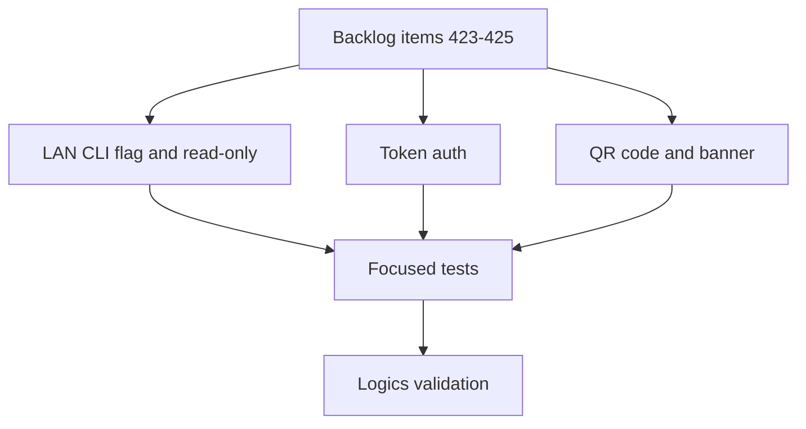

## task_220_implement_lan_exposure_with_token_auth_qr_code_and_read_only_safety - Implement LAN exposure with token auth QR code and read-only safety
> From version: 2.8.1
> Schema version: 1.0
> Status: In Progress
> Understanding: 92%
> Confidence: 88%
> Progress: 90%
> Complexity: High
> Theme: Viewer operator workflow
> Reminder: Update status/understanding/confidence/progress and linked request/backlog references when you edit this doc.

# Context
- Implement the LAN exposure feature described by `req_245`.
- Treat this as one delivery task with three coordinated backlog slices: the LAN CLI flag and HTTP-layer read-only enforcement, the per-session token auth, and the QR code launch output plus in-app banner.
- The slices share the LAN-mode runtime indicator and the HTTP request-handler hook, so they must land in order to keep the security posture coherent.
- An ADR must be authored before the auth slice lands to record the LAN auth model (per-session token, no persistence, HTTP-layer enforcement) and the contract that any future mutating endpoint must opt into the LAN gate.
- Researched defaults that the ADR is expected to ratify (cited in the linked backlog items): `secrets.token_urlsafe(32)` for token generation; `hmac.compare_digest` for constant-time comparison; first-load query-to-`sessionStorage` handoff with `history.replaceState` to scrub the token from the URL bar; `Authorization: Bearer` header on subsequent requests; `segno` (pure-Python MIT) for the launch-time ASCII QR code; a maintained `MUTATING_ROUTES` registry checked in the stdlib request handler before dispatch, so any future write endpoint must opt into the LAN gate by extending the registry.

# Plan
- [x] 1. Add the opt-in LAN CLI flag, switch the bind to all interfaces only when set, and carry a single runtime LAN-mode indicator through the viewer process.
- [x] 2. Add the HTTP-layer read-only enforcement for current and future mutating endpoints when LAN mode is active.
- [x] 3. Author the architecture decision for the LAN auth model, the read-only contract, and the QR library choice. (See `adr_024_lan_viewer_auth_model_read_only_contract_and_qr_library_choice`.)
- [x] 4. Generate a per-session token at launch using a cryptographically secure source, kept in memory only.
- [x] 5. Accept the token via a one-time query string on first load and via an HTTP header on subsequent requests, with `sessionStorage`-only client storage.
- [x] 6. Enforce token presence at the HTTP-handler level for non-loopback requests; preserve the loopback bypass.
- [x] 7. Print a scannable QR code (with plain-text URL+token fallback) in the LAN-mode launch output, using a pure-Python QR library. *(QR matrix lights up via the optional `segno` package; without it the launch banner prints a clearly-boxed plain-text URL+token fallback — this is a phase-1 deviation from `adr_024`, which proposed a vendored encoder.)*
- [x] 8. Render a permanent in-app banner in LAN mode with a copy-URL affordance and plain-language security posture; ensure the banner is absent in default mode.
- [x] 9. Add focused tests for the LAN flag, the HTTP-layer read-only enforcement, the token generation and handoff, the loopback bypass, the QR launch output, and the banner rendering.
- [x] 10. Run targeted viewer tests, Logics lint, and Logics audit before closeout.
- [ ] GATE: do not close this task until the linked backlog acceptance criteria and validation evidence are updated, and the ADR for the LAN auth model is linked.

# Backlog
- `item_423_add_lan_opt_in_cli_flag_with_http_layer_read_only_enforcement`
- `item_424_add_per_session_token_auth_with_query_to_session_handoff`
- `item_425_add_lan_qr_code_launch_output_and_in_app_banner`

# Definition of Done (DoD)
- [ ] The viewer accepts an opt-in LAN CLI flag that binds to all interfaces, distinct from the raw `--host` argument, with the default loopback behavior unchanged.
- [ ] Every mutating endpoint is refused with a clear unauthorized response in LAN mode at the HTTP-handler level.
- [ ] A per-session token is generated at every LAN launch, kept in memory only, accepted via query-to-session handoff, and required on every non-loopback request.
- [ ] Loopback requests continue to work without a token.
- [ ] The LAN-mode launch output prints a scannable QR code (with plain-text fallback) and explains the security posture in plain language.
- [ ] The viewer renders a permanent in-app banner in LAN mode with a copy-URL affordance and plain-language security posture; no banner appears in default mode.
- [ ] An ADR documents the LAN auth model, the read-only contract, and the QR library choice and is linked from `item_423`.
- [ ] Automated tests cover the linked backlog acceptance criteria.
- [ ] Logics lint and audit pass after implementation docs are updated.

# Acceptance criteria
- AC1: The implementation satisfies `item_423` AC1-AC7 for the LAN CLI flag and the HTTP-layer read-only enforcement.
- AC2: The implementation satisfies `item_424` AC1-AC7 for the per-session token auth and the query-to-session handoff.
- AC3: The implementation satisfies `item_425` AC1-AC9 for the QR launch output and the in-app banner.
- AC4: The three slices share a single LAN-mode runtime indicator and a single HTTP request-handler hook.
- AC5: An ADR records the LAN auth model, the read-only contract, and the QR library choice and is linked from `item_423`.
- AC6: Validation evidence lists the targeted tests run and the Logics lint/audit status.

# Validation
- (pending) `rtk npm test -- tests/viewer.browser-host.test.ts`
- (pending) `rtk python3 -m pytest tests/python/test_logics_manager_cli.py -k 'lan or token or qr or banner'`
- (pending) `rtk logics-manager lint --require-status`
- (pending) `rtk logics-manager audit --group-by-doc`

# Report
- (pending)

# AC Traceability
- request-AC1 -> This task. Evidence needed: The viewer CLI accepts an opt-in flag (for example `--lan`) that binds to all interfaces, distinct from the existing raw `--host` argument, and the default behavior without that flag remains loopback-only. Proof: pending — confirm via the Validation section once the linked backlog AC tests land.
- request-AC2 -> This task. Evidence needed: When the LAN flag is used, the viewer generates a fresh per-session token that is required to access any HTTP endpoint, with the token regenerated on every launch and never persisted to disk. Proof: pending — confirm via the Validation section once the linked backlog AC tests land.
- request-AC3 -> This task. Evidence needed: The launch output prints the network URL, the token, and a scannable QR code that encodes the URL with the token embedded. Proof: pending — confirm via the Validation section once the linked backlog AC tests land.
- request-AC4 -> This task. Evidence needed: The viewer accepts the token through a query string parameter on first load and through an HTTP header on subsequent requests, and stores it client-side only in the browser session. Proof: pending — confirm via the Validation section once the linked backlog AC tests land.
- request-AC5 -> This task. Evidence needed: All HTTP endpoints reject requests that arrive from non-loopback origins without a valid token. Proof: pending — confirm via the Validation section once the linked backlog AC tests land.
- request-AC6 -> This task. Evidence needed: In LAN mode, the viewer disables or hides any action that would mutate state outside the viewer process and surfaces a clear read-only indication for those actions. Proof: pending — confirm via the Validation section once the linked backlog AC tests land.
- request-AC7 -> This task. Evidence needed: The viewer renders a permanent, visually distinctive banner in the topbar whenever LAN mode is active, including a copy-URL affordance. Proof: pending — confirm via the Validation section once the linked backlog AC tests land.
- request-AC8 -> This task. Evidence needed: When LAN mode is not used, no banner, no token check, and no QR code are produced, and existing loopback workflows behave exactly as before. Proof: pending — confirm via the Validation section once the linked backlog AC tests land.
- request-AC9 -> This task. Evidence needed: The launch output and the in-app banner clearly state the security model in plain language. Proof: pending — confirm via the Validation section once the linked backlog AC tests land.
- request-AC10 -> This task. Evidence needed: Tests cover token generation and required presence, loopback bypass when LAN is not enabled, rejection of unauthorized network requests, query-to-session token handoff, banner rendering in LAN mode and absence in default mode, and read-only enforcement of mutating actions. Proof: pending — confirm via the Validation section once the linked backlog AC tests land.
