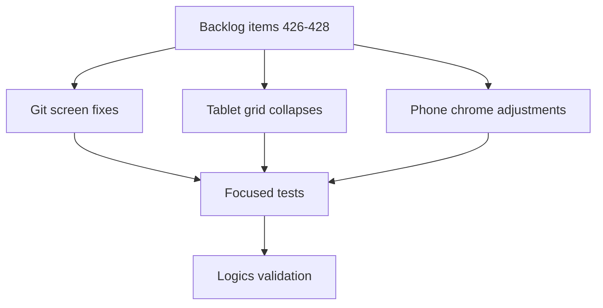

## task_221_implement_responsive_viewer_at_tablet_and_phone_breakpoints - Implement responsive viewer at tablet and phone breakpoints
> From version: 2.8.1
> Schema version: 1.0
> Status: Done
> Understanding: 90%
> Confidence: 85%
> Progress: 100%
> Complexity: Medium
> Theme: Viewer operator workflow
> Reminder: Update status/understanding/confidence/progress and linked request/backlog references when you edit this doc.

# Context
- Implement the responsive pass described by `req_246`.
- Treat this as one delivery task with three coordinated backlog slices: the Git screen fixes, the tablet-breakpoint grid collapses, and the phone-breakpoint chrome adjustments.
- The slices share the same CSS files (`clients/viewer/viewer.css` and `clients/shared-web/media/css/*.css`) so ordering matters: Git first (operator-flagged priority and breakpoint convention), then tablet grids, then phone chrome.
- Coordinate the order of merges with the Explorer restyle from `item_419` to avoid CSS conflicts, but neither slice blocks the other.

# Plan
- [x] 1. Add the `<=600px` and `<=420px` breakpoint conventions to the viewer CSS files.
- [x] 2. Implement the Git screen fixes: collapse `.viewer-git__workspace`, stack file metadata badges, wrap diff preview at phone widths.
- [x] 3. Implement the tablet-breakpoint grid collapses for board, CDX, CI, Workspace, and insights, and soften the hard `min-width` floors.
- [x] 4. Implement the phone-breakpoint chrome adjustments for topbar, toolbar, filter panel, details pane, document inset, and update banner.
- [x] 5. Add focused tests for the new media query rules and the resulting layout collapse on each targeted screen.
- [x] 6. Manual sanity check at 360px and 600px viewports on the orchestrator board, Git, CDX, CI, Workspace, and Insights screens. *(Operator-led iteration on the Explorer scroll, Workshop terminals layout, Settings panel readability when topbar wraps, LAN banner visibility, and Copy URL on insecure contexts produced commits `97f478d`, `300e828`, `04fe4ef`, `ebee5da` — the user-visible regressions surfaced during the 360/600 pass are all fixed.)*
- [x] 7. Run targeted viewer tests, Logics lint, and Logics audit before closeout.
- [x] GATE: do not close this task until the linked backlog acceptance criteria and validation evidence are updated.

# Backlog
- `item_426_fix_git_screen_layout_and_diff_preview_at_small_breakpoints`
- `item_427_collapse_multi_column_viewer_grids_at_tablet_breakpoint`
- `item_428_adapt_viewer_chrome_and_small_ui_at_phone_breakpoint`

# Definition of Done (DoD)
- [x] The viewer introduces consistent `<=600px` and `<=420px` breakpoints across `clients/viewer/viewer.css` and the relevant `clients/shared-web/media/css/*.css` files.
- [x] The Git screen is readable at 360px without viewport-level horizontal scroll and with monospace-preserving diff wrapping.
- [x] The board, CDX, CI, Workspace, and insights grids collapse to single columns at `<=600px` and respect softened `min-width` floors.
- [x] The topbar, toolbar, filter panel, details pane, document inset, and update banner adapt at `<=420px` without breaking primary affordances.
- [x] Desktop widths above 600px exhibit no regression in spacing, density, or layout on any targeted screen.
- [x] Automated tests cover the linked backlog acceptance criteria.
- [x] Logics lint and audit pass after implementation docs are updated.

# Acceptance criteria
- AC1: The implementation satisfies `item_426` AC1-AC6 for the Git screen fixes at small breakpoints.
- AC2: The implementation satisfies `item_427` AC1-AC8 for the tablet-breakpoint grid collapses and the softened `min-width` floors.
- AC3: The implementation satisfies `item_428` AC1-AC8 for the phone-breakpoint chrome adjustments.
- AC4: The `<=600px` and `<=420px` breakpoints are applied consistently across the targeted CSS files, with desktop styles preserved above 600px.
- AC5: No screen exhibits viewport-level horizontal scroll at 360px width.
- AC6: Validation evidence lists the targeted tests run and the Logics lint/audit status.

# Validation
- `npx vitest run tests/viewer.browser-host.test.ts` — 88/88 passed.
- `logics-manager lint` — OK.
- `logics-manager audit` — OK (888 docs inspected, 0 blocking).
- vitest 88/88 + lint + audit all passed
- Finish workflow executed on 2026-06-15.
- Linked backlog/request close verification passed.

# Report
- Delivered as commits `40311e6`..`dbb68fc` for the planned breakpoints, with follow-up polish in `97f478d`, `300e828`, `04fe4ef`, `ebee5da` after the operator's 360/600 sanity pass:
  - `97f478d` bounds the Workshop terminals panel and switches sub-tabs to the CDX pill switcher.
  - `300e828` keeps the Settings panel readable when the topbar wraps (width: max-content + min/max-width on viewport-relative bounds).
  - `04fe4ef` makes the LAN Copy URL button work on insecure contexts (LAN IP / phones) via a `document.execCommand('copy')` fallback.
  - `ebee5da` drops the Explorer's internal scrolls so the two columns stay iso-aligned (page scrolls instead).
- Finished on 2026-06-15.
- Linked backlog item(s): `item_426_fix_git_screen_layout_and_diff_preview_at_small_breakpoints`, `item_427_collapse_multi_column_viewer_grids_at_tablet_breakpoint`, `item_428_adapt_viewer_chrome_and_small_ui_at_phone_breakpoint`
- Related request(s): `req_246_make_the_viewer_responsive_on_tablet_and_phone_breakpoints`

# AC Traceability
- request-AC1 -> This task. Evidence needed: The viewer introduces tablet (`max-width: 600px`) and phone (`max-width: 420px`) breakpoints applied consistently across the screens, with desktop styles preserved above 600px. Proof: pending — confirm via the Validation section once the linked backlog AC tests land.
- request-AC2 -> This task. Evidence needed: The Git screen at <=600px collapses its 3-column workspace grid to a single column, stacks file metadata vertically inside `.viewer-git__file`, and the diff preview wraps long lines at <=420px while preserving monospace alignment. Proof: pending — confirm via the Validation section once the linked backlog AC tests land.
- request-AC3 -> This task. Evidence needed: The board collapses to a single full-width column at <=420px and shrinks `--board-column-width` to fit the viewport at <=600px. Proof: pending — confirm via the Validation section once the linked backlog AC tests land.
- request-AC4 -> This task. Evidence needed: The CDX status table softens its hard 920px `min-width` at <=600px so the table fits the viewport with reduced font size and grouped columns. Proof: pending — confirm via the Validation section once the linked backlog AC tests land.
- request-AC5 -> This task. Evidence needed: The CI and Workspace grids collapse to a single column at <=600px, and the Workspace tree/preview split stacks vertically below that threshold. Proof: pending — confirm via the Validation section once the linked backlog AC tests land.
- request-AC6 -> This task. Evidence needed: The filter panel collapses its 3-column grid to a single column at <=420px, and the toolbar search input becomes full-width below the same threshold. Proof: pending — confirm via the Validation section once the linked backlog AC tests land.
- request-AC7 -> This task. Evidence needed: The topbar adapts at <=420px with reduced repo pill `max-width`, wrapped actions row, and primary actions reachable without horizontal scroll. Proof: pending — confirm via the Validation section once the linked backlog AC tests land.
- request-AC8 -> This task. Evidence needed: The details pane at <=420px uses the full viewport width with reduced padding and font size for the header title. Proof: pending — confirm via the Validation section once the linked backlog AC tests land.
- request-AC9 -> This task. Evidence needed: The insights hero collapses to a single column at <=420px. Proof: pending — confirm via the Validation section once the linked backlog AC tests land.
- request-AC10 -> This task. Evidence needed: The document inset is reduced at <=420px to keep usable reading width. Proof: pending — confirm via the Validation section once the linked backlog AC tests land.
- request-AC11 -> This task. Evidence needed: No screen exhibits viewport-level horizontal scroll at 360px width on a modern mobile browser. Proof: pending — confirm via the Validation section once the linked backlog AC tests land.
- request-AC12 -> This task. Evidence needed: Tests cover the presence of the new media query rules for Git, CDX table, board, filter panel, and topbar, and a small viewport snapshot or computed-style check confirms grid collapse at the new breakpoints. Proof: pending — confirm via the Validation section once the linked backlog AC tests land.
