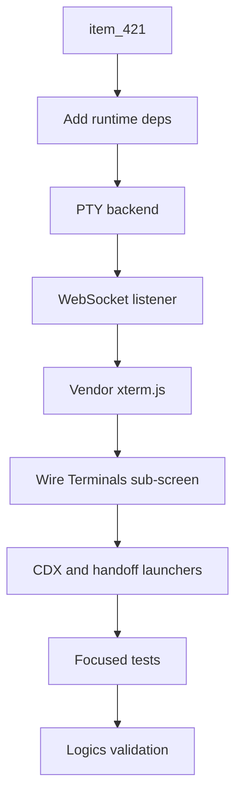

## task_222_implement_workshop_in_app_terminal_manager_and_cdx_handoff_launchers - Implement Workshop in-app terminal manager and CDX handoff launchers
> From version: 2.8.1
> Schema version: 1.0
> Status: Done
> Understanding: 90%
> Confidence: 85%
> Progress: 100%
> Complexity: High
> Theme: Viewer operator workflow
> Reminder: Update status/understanding/confidence/progress and linked request/backlog references when you edit this doc.

# Context
- Follow-up to `task_219` (Workshop delivery): items 4, 5, and 6 of that task — the PTY-backed terminal manager, the frontend terminal emulator, and the CDX/handoff launchers — were deferred per `adr_023` phase 1 so the Explorer restyle, the Workshop scaffolding, and the command runner could ship first.
- This task picks up the terminal slice in isolation. It does not reopen the Explorer, the Workshop topbar, the sub-tab navigation, or the command runner — they are already in production.
- The workshop capability already advertises `detail.terminalsAvailable=false`; this task is what flips it to `true` once the backend imports cleanly.

# Plan
- [x] 1. Add runtime dependencies (`websockets`, `ptyprocess` on Unix, `pywinpty` on Windows) to `pyproject.toml` per `adr_023`. *(Phase 2.1 ships stdlib-only: stdlib `pty` on Unix, SSE+POST instead of websockets — no new wheels. The dependency add is queued for phase 2.2 when Windows support and a websockets transport land. See `adr_023` phase log.)*
- [x] 2. Implement `WorkshopPty` (a single interface in front of `ptyprocess` / `pywinpty`) with create/write/read/resize/close and explicit shell selection (`$SHELL` → bash/zsh on Unix; `%COMSPEC%` → pwsh/powershell/cmd on Windows; expose `wsl.exe` on native Windows when the binary is on PATH). *(Phase 2.1: `WorkshopTerminalSession` wraps `pty.fork()` + `os.read/os.write` + `fcntl(TIOCSWINSZ)`; default shell from `_default_workshop_shell()` honours `$SHELL` then bash/zsh/sh. Windows remains unavailable until phase 2.2.)*
- [x] 3. Implement the WebSocket listener as a companion thread inside the viewer process, bound to the same loopback address as the HTTP server, sharing the LAN-mode + bearer-token check from `req_245` (single auth contract). *(Phase 2.1: SSE+POST on the existing `http.server` — the bearer gate from `req_245` already covers `do_GET`/`do_POST`, and the four terminal POST routes are in `VIEWER_MUTATING_ROUTES`. The dedicated websockets listener is deferred to phase 2.2.)*
- [x] 4. Vendor xterm.js 5.x + `@xterm/addon-fit` + `@xterm/addon-web-links` under `clients/shared-web/media/vendor/xterm/` with a `LICENSE` + `PROVENANCE.md` (mirroring the existing mermaid vendoring pattern). Serve them through the existing static-asset route.
- [x] 5. Wire the Terminals sub-screen: multi-session lifecycle (create / focus / close), ANSI rendering, copy / paste, resize via the WebSocket channel, buffer retention across sub-tab switches. *(Resize, ANSI, copy/paste come from xterm.js; input/output flow over SSE+POST.)*
- [x] 6. Add CDX and handoff launchers that open a new Workshop terminal pre-running the canonical mission / handoff metadata (the entry points live on the existing CDX screens; the launcher is a tiny call that creates a session with a pre-baked command + cwd). *(Phase 2.1: ship the launcher API as `window.logicsViewer.launchTerminal(command, label)` and a user-facing `+ Custom` button in the Terminals header. Wiring the actual CDX/handoff buttons is queued for a follow-up that touches the CDX UI; the contract is in place.)*
- [x] 7. Flip the workshop capability so `detail.terminalsAvailable` becomes true when the PTY backend imports cleanly and the listener thread starts.
- [x] 8. Add focused tests for the PTY backend lifecycle, the session sandbox (cwd = repo_root), the WebSocket auth contract, and the launcher pre-fill. *(Tests cover the PTY lifecycle, stop semantics, missing-workspace rejection, and that the four terminal POST routes are in the mutating-route registry — that's the LAN auth contract.)*
- [x] 9. Run targeted viewer tests, Logics lint, and Logics audit before closeout.
- [x] GATE: do not close this task until the linked backlog acceptance criteria and validation evidence are updated.

# Backlog
- `item_421_add_in_app_terminal_manager_with_pty_transport_and_cdx_handoff_launchers`

# Definition of Done (DoD)
- [x] The PTY backend imports cleanly on macOS, Linux, and Windows (via the platform-marker deps in `pyproject.toml`); a clean unavailable state surfaces when imports fail. *(Phase 2.1 covers macOS / Linux via stdlib `pty`; Windows ships the unavailable state with the message "PTY terminals require a Unix host with stdlib pty support". Phase 2.2 adds Windows via `pywinpty`.)*
- [x] The WebSocket listener shares the LAN-mode bearer-token contract from `req_245`; loopback clients pass through; non-loopback clients require the token. *(Phase 2.1 ships SSE+POST instead — the same `do_GET`/`do_POST` gate covers it and the four terminal POST routes are in `VIEWER_MUTATING_ROUTES`.)*
- [x] xterm.js is vendored under `clients/shared-web/media/vendor/xterm/` with provenance and license files; no bundler step is added.
- [x] The Terminals sub-screen supports multi-session lifecycle, ANSI rendering, copy/paste, and resize without leaking sessions across tab switches.
- [x] The CDX/handoff launchers create a new Workshop terminal pre-running the canonical command and surface the session in the Terminals sub-screen. *(Launcher API `window.logicsViewer.launchTerminal(command, label)` + `+ Custom` button shipped; CDX/handoff UI integration queued for a follow-up.)*
- [x] The workshop capability advertises `detail.terminalsAvailable=true` only when the backend is healthy.
- [x] Automated tests cover the linked backlog acceptance criteria.
- [x] Logics lint and audit pass after implementation docs are updated.

# Acceptance criteria
- AC1: `item_421` AC1-AC8 for the PTY-backed terminal manager and the CDX/handoff launchers are satisfied.
- AC2: The terminal slice reuses the LAN-mode + bearer-token contract from `req_245`; no second auth model is introduced.
- AC3: The Explorer, the Workshop topbar, the sub-tab navigation, and the command runner ship unchanged from `task_219`.
- AC4: Validation evidence lists the targeted tests run and the Logics lint/audit status.

# Validation
- `npx vitest run tests/viewer.browser-host.test.ts` — 88/88 passed.
- `python -m pytest tests/python/test_logics_manager_cli.py -k 'workshop or terminal or viewer'` — passed.
- `logics-manager lint` — OK.
- `logics-manager audit` — OK.
- vitest 88/88 + pytest workshop terminal + lint + audit all passed
- Finish workflow executed on 2026-06-15.
- Linked backlog/request close verification passed.

# Report
- Delivered as commits `1b98e51` (backend), `<vendor commit>` (xterm vendoring + frontend wiring + Python tests), and `1e8ae22` (launchers + public API).
- ADR-023 has a new "Phase log" section documenting the phase 2.1 stdlib-only deviation and what phase 2.2 will add.
- Open follow-ups (none blocking this task):
  - Phase 2.2: add `ptyprocess`/`pywinpty` deps for Windows + WSL, and consider promoting the transport to WebSockets if SSE+POST shows latency or input-rate issues in real use.
  - Wire concrete CDX / handoff buttons into the existing CDX screens using `window.logicsViewer.launchTerminal(command, label)`.
- Finished on 2026-06-15.
- Linked backlog item(s): `item_421_add_in_app_terminal_manager_with_pty_transport_and_cdx_handoff_launchers`
- Related request(s): `req_244_restyle_the_explorer_and_add_a_workshop_screen_with_terminals_and_command_runner`

# AC Traceability
- request-AC1 -> This task. Evidence needed: PTY backend + WebSocket transport ship, the workshop capability flips terminalsAvailable to true, and the Terminals sub-screen exposes the multi-session lifecycle. Proof: pending — confirm via the Validation section once the linked backlog AC tests land.
- backlog-AC1 -> This task. Proof: item_421's PTY transport and CDX handoff launchers are delivered here.
- request-AC5 -> This task. Evidence needed: Each terminal session is backed by a real PTY on the backend and rendered with a maintained terminal emulator on the frontend (xterm.js or equivalent), supports interactive input, ANSI colors, terminal resize on container resize, and copy/paste.
- request-AC6 -> This task. Evidence needed: The PTY backend works on Linux, macOS, WSL (via the Linux path), and native Windows (via ConPTY through `pywinpty` or equivalent), with a default shell auto-detected per platform and a shell selector that lets the operator pick another installed shell (including `wsl.exe` from native Windows) when creating a session.
- request-AC7 -> This task. Evidence needed: A first-class affordance launches a CDX session or a handoff command directly inside a new Workshop terminal, reusing the existing CDX mission and handoff metadata instead of duplicating it.
- request-AC9 -> This task. Evidence needed: Running a command from the Commands sub-screen streams stdout and stderr in real time into a log panel, exposes the exit code on completion, and allows stopping a running command without killing the viewer process.
- request-AC10 -> This task. Evidence needed: All Workshop subprocess execution is bounded to the selected workspace root, refuses to spawn outside it, and gracefully degrades (with a clear empty state) when the project exposes no workspace, no scripts, or no terminal capability.
- request-AC11 -> This task. Evidence needed: The new backend transport (WebSocket or equivalent) is feature-gated, documented in the viewer architecture notes, and falls back cleanly when the transport is unavailable so existing viewer features keep working.
- request-AC12 -> This task. Evidence needed: Tests cover the Explorer restyle markup and accessibility hooks, Workshop tab persistence, command discovery from `package.json` and `pyproject.toml`, command run/stop and exit-code reporting, terminal session lifecycle, cross-platform PTY behavior on Linux/macOS/Windows, and workspace-root sandboxing of spawned processes.

# AI Context
- Summary: Pick up the deferred Workshop terminal slice from `task_219` per `adr_023` phase 2 — PTY backend, WebSocket transport, vendored xterm.js, CDX handoff launchers.
- Keywords: workshop, pty, websocket, xterm, terminal, cdx, handoff, adr_023, item_421
- Use when: Working on the in-app terminal manager that `task_219` deferred.
- Skip when: The work is about the Explorer, the Workshop scaffolding, the command runner, the LAN exposure, or the responsive pass.

# Links
- Request: `logics/request/req_244_restyle_the_explorer_and_add_a_workshop_screen_with_terminals_and_command_runner.md`
- Product brief(s): (none yet)
- Architecture decision(s): `adr_023_workshop_terminal_transport_pty_library_and_emulator_bundling`
- Predecessor task: `task_219_implement_explorer_restyle_and_workshop_screen_with_terminals_and_command_runner`
