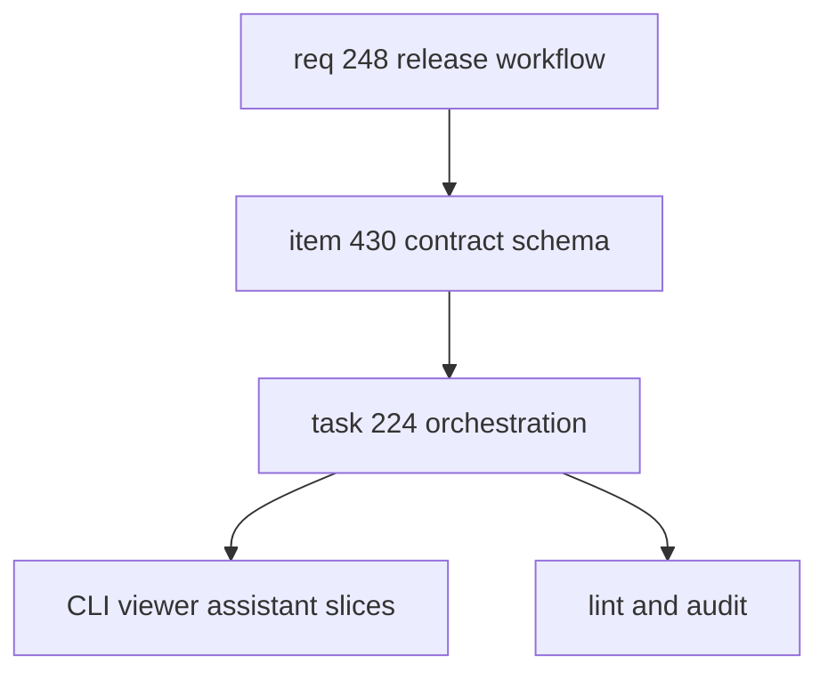

## task_224_define_the_release_workflow_contract_and_schema - Orchestrate release workflow contract and assistant readiness
> From version: 2.8.1
> Schema version: 1.0
> Status: Done
> Understanding: 96%
> Confidence: 91%
> Progress: 100%
> Complexity: High
> Theme: Operator workflow and runtime integration
> Reminder: Update status/understanding/confidence/progress and linked request/backlog references when you edit this doc.

# Definition of Done (DoD)
- [x] The release workflow contract is specified with states, gates, and evidence fields.
- [x] Initial project fixture profiles cover `logics-manager`, `cdx-manager`, and `cp-wc-26` release patterns.
- [x] The follow-up implementation slices have clear boundaries for CLI, viewer, and assistant/MCP surfaces.
- [x] Validation passes for the Logics docs created by this orchestration task.

# Backlog
- `item_430_define_the_release_workflow_contract_and_schema`

# Acceptance criteria
- AC1: Define the first version of the release contract and schema.
- AC2: Define the common release state machine and gate evidence requirements.
- AC3: Keep the implementation split aligned with the request backlog items.
- AC4: Capture the assistant-readiness rule: assistants must inspect release status/evidence before claiming readiness.
- AC5: Validate the request/backlog/task chain after editing.

# AC Traceability
- request-AC1 -> This task. Proof: AC1 defines the project-owned release contract and points implementation to `item_430_define_the_release_workflow_contract_and_schema`.
- request-AC2 -> This task. Proof: AC2 defines the structured release status and leaves implementation to the release status and validation command follow-up slice.
- request-AC3 -> This task. Proof: AC2 and AC3 define the state machine separating preparation, validation, commit/push, CI, GitHub release, and publication checks.
- request-AC4 -> This task. Proof: AC3 keeps the viewer follow-up slice explicit without implementing the viewer in this task.
- request-AC5 -> This task. Proof: AC4 keeps assistant/MCP readiness explicit without implementing the assistant or MCP surface in this task.
- request-AC6 -> This task. Proof: AC1 requires repo-specific fixture profiles rather than hard-coded global release habits.
- request-AC7 -> This task. Proof: AC1 requires initial fixture profiles for `logics-manager`, `cdx-manager`, and `cp-wc-26`.
- request-AC8 -> This task. Proof: AC2 requires evidence fields and stale-proof detection before readiness can be claimed.

# Validation
- Run `python3 -m logics_manager lint --require-status`.
- Run `python3 -m logics_manager audit --legacy-cutoff-version 1.1.0 --group-by-doc`.
- pytest tests/python/test_release_contract_schema.py -vv passed: 2 tests validate the release contract schema and fixture profiles.
- pytest tests/python/test_release_contract_schema.py -vv passed; logics-manager lint --require-status passed; logics-manager audit --legacy-cutoff-version 1.1.0 --group-by-doc passed
- Finish workflow executed on 2026-06-18.
- Linked backlog/request close verification passed.

# Report
- Orchestration task for the release workflow request.
- This task should coordinate the schema slice and keep the sibling backlog items aligned; it should not implement the complete release CLI/viewer/MCP feature by itself.
- Completed the schema slice for item 430. The CLI, viewer, and assistant/MCP implementation boundaries remain in the three sibling follow-up backlog items.
- Finished on 2026-06-18.
- Linked backlog item(s): `item_430_define_the_release_workflow_contract_and_schema`
- Related request(s): `req_248_release_workflow_multi_project_ai_assistants`

# AI Context
- Summary: Orchestrate the release workflow contract and keep assistant-readiness requirements aligned across CLI, viewer, and MCP follow-up slices.
- Keywords: release-workflow, orchestration, assistant-readiness, evidence-model, state-machine
- Use when: You need to coordinate implementation of the release workflow contract or review the initial schema slice.
- Skip when: You are implementing only the viewer or MCP follow-up slice.

# Links
- Request: `req_248_release_workflow_multi_project_ai_assistants`
- Product brief(s): (none yet)
- Architecture decision(s): (none yet)
