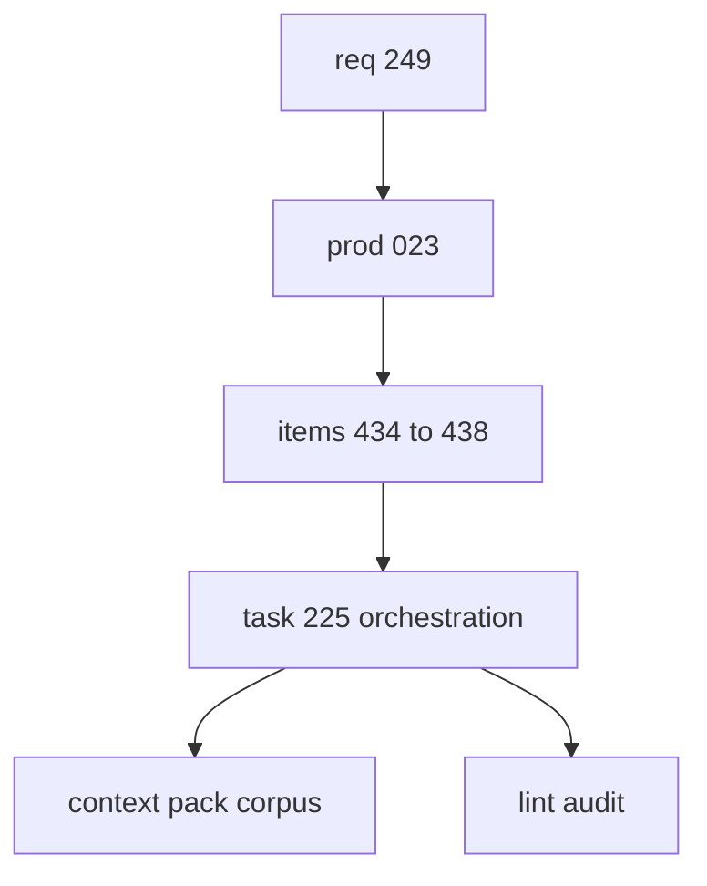

## task_225_add_rich_request_chain_scaffolding_for_development_ready_logics_work - Orchestrate agent-authored Logics workflow scaffolding improvements
> From version: 2.8.1
> Schema version: 1.0
> Status: Ready
> Understanding: 95%
> Confidence: 90%
> Progress: 0%
> Complexity: High
> Theme: Operator workflow and runtime integration
> Reminder: Update status/understanding/confidence/progress and linked request/backlog references when you edit this doc.

# Definition of Done (DoD)
- [ ] The first development slice defines the rich request-chain scaffold interface and fixtures.
- [ ] AC-aware splitting, validation repair, context-pack handoff, and agent ergonomics slices remain explicitly linked.
- [ ] Product brief and context-pack corpus are usable by an implementation agent without transcript context.
- [ ] Logics lint and audit pass after doc changes.

# Backlog
- `item_434_add_rich_request_chain_scaffolding_for_development_ready_logics_work`

# Acceptance criteria
- AC1: Specify the initial `flow scaffold request-chain` behavior and inputs.
- AC2: Keep the implementation split aligned with the five backlog items.
- AC3: Capture required fixtures and validation for the first delivery slice.
- AC4: Produce a context-pack corpus for handoff after the docs are validated.
- AC5: Preserve audit traceability from request ACs to this orchestration task.

# AC Traceability
- request-AC1 -> This task. Proof: AC1 specifies the rich request-chain scaffold behavior and links the implementation to `item_434_add_rich_request_chain_scaffolding_for_development_ready_logics_work`.
- request-AC2 -> This task. Proof: AC2 keeps AC-aware split and orchestration task work linked to `item_435_make_request_splitting_ac_aware_and_task_orchestration_friendly`.
- request-AC3 -> This task. Proof: AC2 keeps deterministic validation and repair work linked to `item_436_add_deterministic_validation_repair_and_fixable_diagnostics`.
- request-AC4 -> This task. Proof: AC4 requires context-pack corpus handoff and links to `item_437_improve_context_pack_corpus_generation_for_implementation_handoff`.
- request-AC5 -> This task. Proof: AC2 keeps agent ergonomics linked to `item_438_improve_agent_ergonomics_for_recent_docs_and_structured_workflow_output`.
- request-AC6 -> This task. Proof: AC3 requires fixtures and guardrails for bounded changes and safe repair behavior.
- request-AC7 -> This task. Proof: AC3 requires validation fixtures and tests for the first delivery slice.
- request-AC8 -> This task. Proof: AC1 and AC4 require CLI/help and context-pack handoff documentation.

# Validation
- Run `python3 -m logics_manager lint --require-status`.
- Run `python3 -m logics_manager audit --legacy-cutoff-version 1.1.0 --group-by-doc`.
- Generate a context pack for `req_249`, `prod_023`, `item_434` through `item_438`, and `task_225`.

# Report
- Orchestration task for the first implementation pass. This task coordinates the scaffold interface and handoff corpus; sibling backlog items own AC-aware splitting, fixable validation, context-pack improvements, and agent-facing command ergonomics.

# AI Context
- Summary: Orchestrate implementation of richer Logics workflow scaffolding and validation for agent-authored docs.
- Keywords: request-chain-scaffold, workflow-corpus, validation-repair, context-pack, agent-ergonomics
- Use when: You need the first implementation task for request-chain scaffold and handoff corpus improvements.
- Skip when: You are working only on a sibling slice such as viewer-free context-pack generation or list-doc filters.

# Links
- Request: `req_249_improve_logics_workflow_scaffolding_validation_agent_docs`
- Product brief(s): `prod_023_agent_authored_logics_workflow_scaffolding_and_validation`
- Architecture decision(s): (none yet)
