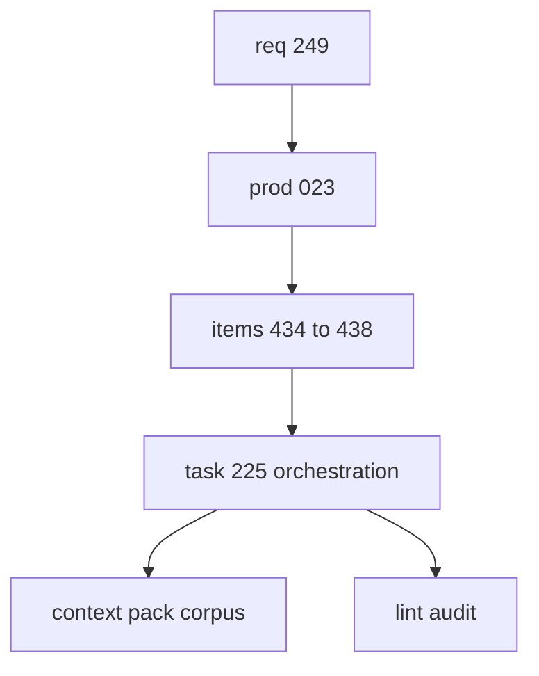

## task_225_add_rich_request_chain_scaffolding_for_development_ready_logics_work - Orchestrate agent-authored Logics workflow scaffolding improvements
> From version: 2.8.1
> Schema version: 1.0
> Status: Done
> Understanding: 96%
> Confidence: 90%
> Progress: 100%
> Complexity: High
> Theme: Operator workflow and runtime integration
> Reminder: Update status/understanding/confidence/progress and linked request/backlog references when you edit this doc.

# Definition of Done (DoD)
- [x] The first development slice defines the rich request-chain scaffold interface and fixtures.
- [x] AC-aware splitting, validation repair, context-pack handoff, and agent ergonomics slices remain explicitly linked.
- [x] Product brief and context-pack corpus are usable by an implementation agent without transcript context.
- [x] Logics lint and audit pass after doc changes.

# Backlog
- `item_434_add_rich_request_chain_scaffolding_for_development_ready_logics_work`

# Acceptance criteria
- AC1: Specify the initial `flow scaffold request-chain` behavior and inputs.
- AC2: Keep the implementation split aligned with the five backlog items.
- AC3: Capture required fixtures and validation for the first delivery slice.
- AC4: Produce a context-pack corpus for handoff after the docs are validated.
- AC5: Preserve audit traceability from request ACs to this orchestration task.

# AC Traceability
- request-AC1 -> This task. Proof: AC1 specifies the rich request-chain scaffold behavior and links the implementation to `item_434_add_rich_request_chain_scaffolding_for_development_ready_logics_work`.
- request-AC2 -> This task. Proof: AC2 keeps the follow-up AC-aware split and orchestration-task slice identified as item 435.
- request-AC3 -> This task. Proof: AC2 keeps the deterministic validation and repair slice identified as item 436.
- request-AC4 -> This task. Proof: AC4 requires context-pack corpus handoff and keeps the handoff slice identified as item 437.
- request-AC5 -> This task. Proof: AC2 keeps the agent ergonomics slice identified as item 438.
- request-AC6 -> This task. Proof: AC3 requires fixtures and guardrails for bounded changes and safe repair behavior.
- request-AC7 -> This task. Proof: AC3 requires validation fixtures and tests for the first delivery slice.
- request-AC8 -> This task. Proof: AC1 and AC4 require CLI/help and context-pack handoff documentation.

# Validation
- Run `python3 -m logics_manager lint --require-status`.
- Run `python3 -m logics_manager audit --legacy-cutoff-version 1.1.0 --group-by-doc`.
- Generate a context pack for `req_249`, `prod_023`, item 434 through item 438, and `task_225`.
- PYTHONPATH=. python3.11 -m pytest tests/python/test_logics_manager_cli.py::test_flow_scaffold_request_chain_creates_docs_context_pack_and_index tests/python/test_logics_manager_cli.py::test_flow_scaffold_request_chain_dry_run_lists_changes_without_writing tests/python/test_logics_manager_cli.py::test_flow_scaffold_request_chain_rejects_invalid_input tests/python/test_logics_manager_cli.py::test_flow_scaffold_request_chain_rejects_existing_ref_collision -vv passed (4 tests).
- PYTHONPATH=. python3.11 -m pytest tests/python/test_logics_manager_cli.py::test_main_runs_native_flow_new_request tests/python/test_logics_manager_cli.py::test_main_runs_native_flow_new_backlog_with_companions tests/python/test_logics_manager_cli.py::test_main_runs_native_flow_deliver_from_product tests/python/test_logics_manager_cli.py::test_main_runs_native_flow_promote_request_to_backlog tests/python/test_logics_manager_cli.py::test_main_runs_native_flow_split_request tests/python/test_logics_manager_cli.py::test_main_runs_native_flow_promote_backlog_to_task tests/python/test_logics_manager_cli.py::test_lint_accepts_changed_workflow_docs_without_mermaid tests/python/test_logics_manager_cli.py::test_main_runs_native_flow_repair_closeout_helpers -vv passed (8 tests).
- PYTHONPATH=. python3.11 -m pytest tests/python/test_release_contract_schema.py tests/python/test_logics_manager_mcp.py::test_mcp_read_list_search_and_context_tools -vv passed (11 tests).
- PYTHONPATH=. python3.11 -m py_compile logics_manager/flow.py logics_manager/cli.py logics_manager/lint.py logics_manager/sync.py logics_manager/mcp.py logics_manager/release.py passed.
- Generated logics/context-packs/scaffold_handoff_249.json with sync context-pack passed.
- PYTHONPATH=. python3.11 -m pytest scaffold request-chain tests passed (4 tests).
- PYTHONPATH=. python3.11 -m pytest targeted flow and Mermaid-free lint tests passed (8 tests).
- PYTHONPATH=. python3.11 -m pytest release/MCP regression tests passed (11 tests).
- Finish workflow executed on 2026-06-18.
- Linked backlog/request close verification passed.
- Post-indicator source lint and audit passed.

# Report
- Orchestration task for the first implementation pass. This task coordinates the scaffold interface and handoff corpus; sibling backlog items own AC-aware splitting, fixable validation, context-pack improvements, and agent-facing command ergonomics.
- Implemented with structured JSON input, request/product/backlog/task generation, dry-run file listing, existing-ref collision checks, index update, and optional workflow context-pack output.
- Implemented flow scaffold request-chain as the rich scaffold entrypoint for structured request-chain generation and handoff.
- Finished on 2026-06-18.
- Linked backlog item(s): `item_434_add_rich_request_chain_scaffolding_for_development_ready_logics_work`
- Related request(s): `req_249_improve_logics_workflow_scaffolding_validation_agent_docs`

# AI Context
- Summary: Orchestrate implementation of richer Logics workflow scaffolding and validation for agent-authored docs.
- Keywords: request-chain-scaffold, workflow-corpus, validation-repair, context-pack, agent-ergonomics
- Use when: You need the first implementation task for request-chain scaffold and handoff corpus improvements.
- Skip when: You are working only on a sibling slice such as viewer-free context-pack generation or list-doc filters.

# Links
- Request: `req_249_improve_logics_workflow_scaffolding_validation_agent_docs`
- Product brief(s): `prod_023_agent_authored_logics_workflow_scaffolding_and_validation`
- Architecture decision(s): (none yet)
