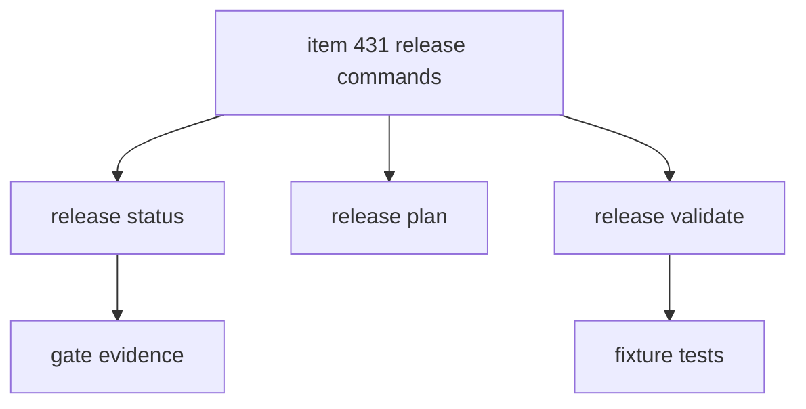

## task_226_implement_release_status_and_validation_commands - Implement release status and validation commands
> From version: 2.8.1
> Schema version: 1.0
> Status: Done
> Understanding: 98%
> Confidence: 92%
> Progress: 100%
> Complexity: Medium
> Theme: Release workflow
> Reminder: Update status/understanding/confidence/progress and linked request/backlog references when you edit this doc.

# Definition of Done (DoD)
- [x] The backlog scope is implemented.
- [x] Acceptance criteria are covered.
- [x] Validation passes.

# Backlog
- `item_431_implement_release_status_and_validation_commands`

# Acceptance criteria
- AC1: `release status` returns configured gates, current state, next action, blocking reasons, and evidence references.
- AC2: `release plan <version>` shows expected version/changelog/git/CI/publication steps without modifying files.
- AC3: `release validate <version>` checks config integrity and local release readiness gates.
- AC4: JSON output is stable enough for assistants and MCP clients to consume.
- AC5: Text output is compact enough for repeated CLI use.
- AC6: Tests cover success, missing config, stale evidence, failed command, and wrong commit/tag target scenarios where applicable.

# Validation
- Run `python3 -m logics_manager lint --require-status`.
- Run `python3 -m logics_manager flow finish task task_226_implement_release_status_and_validation_commands.md` after implementation.
- PYTHONPATH=. pytest tests/python/test_release_contract_schema.py -vv passed: 8 tests cover schema fixtures plus release success, missing config, stale evidence, failed command evidence, wrong commit/tag, plan output, and CLI JSON status.
- PYTHONPATH=. pytest tests/python/test_release_contract_schema.py -vv passed; PYTHONPATH=. python3 -m py_compile logics_manager/release.py logics_manager/cli.py passed; PYTHONPATH=. python3 -m logics_manager release status --format json returned not_configured for missing active release contract as expected
- Finish workflow executed on 2026-06-18.
- Linked backlog/request close verification passed.

# Report
- Implementation complete.
- Implemented logics-manager release plan/status/validate as a bounded, non-destructive CLI surface backed by logics/release/contract.json and release evidence JSONL. Added structured JSON and compact text renderers in logics_manager/release.py and rooted the command through logics_manager/cli.py.
- Finished on 2026-06-18.
- Linked backlog item(s): `item_431_implement_release_status_and_validation_commands`
- Related request(s): `req_248_release_workflow_multi_project_ai_assistants`

# AI Context
- Summary: Implement implement release status and validation commands.
- Keywords: task, implementation, backlog, runtime, python
- Use when: You need a bounded implementation task for a backlog item.
- Skip when: The work is still at the request or backlog shaping stage.

# Links
- Request: `req_248_release_workflow_multi_project_ai_assistants`
- Product brief(s): (none yet)
- Architecture decision(s): (none yet)

# AC Traceability
- request-AC2 -> This task. Proof: `release status` returns configured gates, current state, next action, blocking reasons, and evidence references from `logics/release/contract.json` and evidence JSONL.
- request-AC3 -> This task. Proof: `release plan`, `release status`, and `release validate` separate preparation, local validation, git, CI, GitHub release, and external publication gates without publishing.
- request-AC7 -> This task. Proof: `tests/python/test_release_contract_schema.py` covers fixture profiles for `logics-manager`, `cdx-manager`, and `cp-wc-26` plus CLI behavior.
- request-AC8 -> This task. Proof: release status and validate mark missing, failed, stale, wrong-commit, and wrong-tag evidence as blocking.
