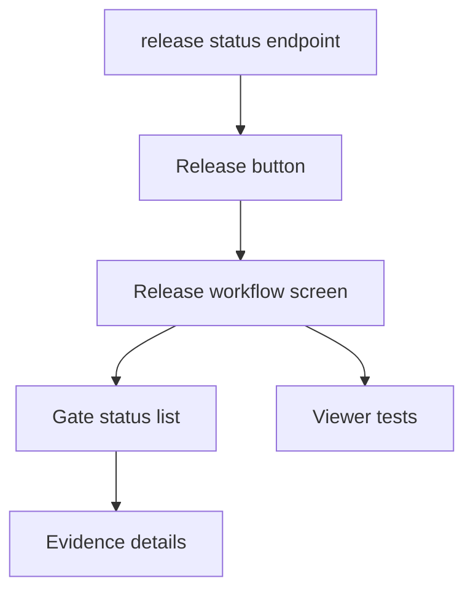

## task_227_expose_release_workflow_state_in_the_logics_viewer - Expose release workflow state in the Logics viewer
> From version: 2.8.1
> Schema version: 1.0
> Status: Done
> Understanding: 98%
> Confidence: 92%
> Progress: 100%
> Complexity: Medium
> Theme: Release workflow
> Reminder: Update status/understanding/confidence/progress and linked request/backlog references when you edit this doc.

# Definition of Done (DoD)
- [x] The backlog scope is implemented.
- [x] Acceptance criteria are covered.
- [x] Validation passes.

# Backlog
- `item_432_expose_release_workflow_state_in_the_logics_viewer`

# Acceptance criteria
- AC1: The viewer displays release state, target version, next action, and blocked gate in the first visible release area.
- AC2: Each gate shows a clear status such as pending, passed, failed, stale, skipped, or not configured.
- AC3: Evidence drill-down exposes the command, timestamp, commit/tag, conclusion, and linked CI/release URL when available.
- AC4: The view works for projects without release configuration by showing `not_configured` with setup guidance.
- AC5: Browser-host and bundled viewer assets stay synchronized and covered by focused tests.

# Validation
- Run `python3 -m logics_manager lint --require-status`.
- Run `python3 -m logics_manager flow finish task task_227_expose_release_workflow_state_in_the_logics_viewer.md` after implementation.
- PYTHONPATH=. python3.11 -m pytest tests/python/test_release_contract_schema.py tests/python/test_logics_manager_cli.py::test_viewer_release_status_endpoint_returns_payload -vv passed; npx vitest run tests/viewer.browser-host.test.ts --testNamePattern 'release workflow screen' passed; node --check clients/viewer/browser-host.js passed; py_compile release/cli/viewer passed.
- PYTHONPATH=. python3.11 -m pytest tests/python/test_release_contract_schema.py tests/python/test_logics_manager_cli.py::test_viewer_release_status_endpoint_returns_payload -vv passed; npx vitest run tests/viewer.browser-host.test.ts --testNamePattern 'release workflow screen' passed; node --check clients/viewer/browser-host.js passed; PYTHONPATH=. python3.11 -m py_compile logics_manager/release.py logics_manager/cli.py logics_manager/viewer.py passed; npm run sync:viewer-assets completed with clients/viewer and viewer_assets synchronized
- Finish workflow executed on 2026-06-18.
- Linked backlog/request close verification passed.

# Report
- Implementation complete.
- Implemented release workflow viewer support: added /api/release-status, a Release topbar action, a compact release workflow screen with state/version/next-action summary, per-gate statuses, and evidence drill-down rows. Synchronized clients/viewer assets into logics_manager/viewer_assets.
- Finished on 2026-06-18.
- Linked backlog item(s): `item_432_expose_release_workflow_state_in_the_logics_viewer`
- Related request(s): `req_248_release_workflow_multi_project_ai_assistants`

# AI Context
- Summary: Implement expose release workflow state in the logics viewer.
- Keywords: task, implementation, backlog, runtime, python
- Use when: You need a bounded implementation task for a backlog item.
- Skip when: The work is still at the request or backlog shaping stage.

# Links
- Request: `req_248_release_workflow_multi_project_ai_assistants`
- Product brief(s): (none yet)
- Architecture decision(s): (none yet)

# AC Traceability
- request-AC4 -> This task. Proof: The local viewer exposes release workflow state through `/api/release-status`, a Release topbar action, first-screen summary cards, gate statuses, and evidence drill-down details.
- request-AC6 -> This task. Proof: The viewer consumes generic release status JSON from `release_status_payload` and does not hard-code project-specific release habits.
- request-AC7 -> This task. Proof: The validation run includes release fixture coverage for `logics-manager`, `cdx-manager`, and `cp-wc-26` before exercising the viewer endpoint and browser-host rendering.
- request-AC8 -> This task. Proof: The viewer surfaces blocked, stale, failed, and missing evidence states instead of hiding them behind a generic ready/not-ready label.
